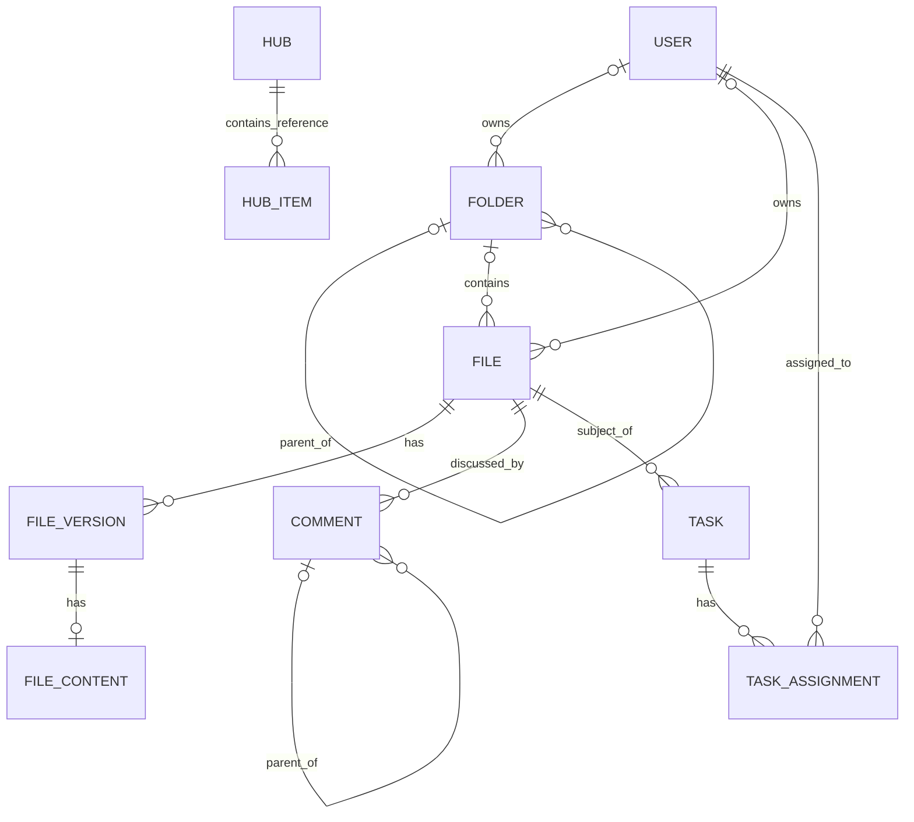

# Box conceptual model

## 1. Scope and vocabulary

Box is modeled as hierarchical content management with versioned files, comments,
file tasks, and content groupings. Users have distinct ownership, authorship, and
assignment relationships to content.

| Term | Meaning in this model |
| --- | --- |
| Item | Conceptual umbrella for a file or folder; not a shared database entity |
| Folder | Container in the content hierarchy |
| File | Persistent identity of a document or other binary asset |
| File version | A particular revision of a file |
| File content | Bytes associated with a version |
| Collection | A grouping referenced by item metadata, separate from folder containment |
| Hub | A curated grouping of referenced items, with its own title and description |
| Task | A review or completion request associated with a file |

## 2. Concept dictionary

| Concept | Kind and identity | Relevant attributes |
| --- | --- | --- |
| User | Entity: user ID | Name, login, status, role, enterprise information |
| Folder | Entity: folder ID | Name, description, item status, tags, ownership, sharing and classification metadata |
| File | Entity: file ID | Name, description, extension, size, checksum, item status, current-version reference, tags |
| File version | Entity: version ID | Version number, name, checksum, size, modification and disposal metadata |
| File content | Dependent content record; conceptually a value of a version | Bytes and content type |
| Comment | Entity: comment ID | Message, tagged message, reply flag, creation/modification times |
| Task | Entity: task ID | Message, action, due date, completion rule, completed flag |
| Task assignment | Association with assignment ID | Assignee, assigner, resolution state, message, assignment/completion times |
| Collection | Entity: collection ID | Name, collection type |
| Hub | Entity: hub ID | Title, description, sharing/configuration flags |
| Hub item | Association with hub-item ID | Referenced item type and ID, display name, position, added time |

Treat identifiers as opaque strings. A file's identity survives changes to its
name, parent folder, or current version. A version number is meaningful in the
context of its file. Names and materialized paths describe location, not identity.

## 3. Relationships

| Relationship | Cardinality and meaning |
| --- | --- |
| Folder hierarchy | Folder has `0..1` parent and `0..*` child folders; root has no parent |
| Folder–file | Folder has `0..*` files; file has `0..1` parent in the schema |
| User–item | Each item has `0..1` owner, creator, and modifier; these roles may be different users |
| File–version | File has `0..*` stored versions; each version belongs to `1` file |
| Version–content | Version has `0..1` content record; each content record belongs to `1` version |
| File–comment | File has `0..*` comments; each comment references `1` underlying file, including replies |
| Comment–parent | Reply references `1` parent comment conceptually; a direct comment has no parent comment |
| File–task | File has `0..*` tasks; each task references `1` file |
| Task–assignment | Task has `0..*` assignments; each assignment has `1` task and `1` assignee, plus `0..1` assigner |
| Hub–item reference | Hub has `0..*` hub items; each entry describes `1` target using type and ID, without a target foreign key |
| Collection–item | Conceptually many-to-many; membership is carried in item JSON rather than a normalized association |

## 4. Value concepts and state dimensions

| Subject | Dimensions or value concepts |
| --- | --- |
| File/folder | Item status: `active`, `trashed`, `deleted`; disposal timestamps are additional facts |
| File version | Trashed, restored, and purged timestamps; distinct from the file's status |
| Task | Action: `review` or `complete`; completed flag; completion rule: `all_assignees` or `any_assignee` |
| Assignment | `incomplete`, `approved`, `rejected`, `completed` as documented by the schema |
| Sharing | Embedded shared-link configuration, allowed access levels, permission data |
| Content description | Tags, classification, metadata, checksum, media type |
| File lock | Embedded lock data, separate from ownership and task assignment |
| Location | Parent reference and derived ancestry path |

State values here do not specify the actions that produce them. In particular,
an assignment's resolution and the parent task's completed flag are separate
facts; their consistency belongs to the behavior model.

## 5. Structural constraints and distinctions

- The content hierarchy is conceptually acyclic. Each non-root item has one
  containing folder in a complete hierarchy; nullable schema parents also permit
  incomplete records. Root folder ID `0` is an implementation convention.
- A file version belongs to one file. The file's current-version reference
  conceptually selects one of its own versions; `file_version_id` is not itself
  declared as a foreign key in the File model.
- A version's bytes are separate from metadata. A version can exist without a
  stored content record, so metadata existence does not establish byte availability.
- Comment replies retain a reference to the underlying file and use
  `item_type`/`item_id` for the parent comment. The reply relationship is logical,
  not enforced by a parent-comment foreign key.
- A task assignment's optional file reference should agree with its task's file;
  the individual foreign keys do not establish that agreement.
- Folder containment, collection membership, and hub membership are different
  relationships. Grouping a reference does not conceptually change the file's parent.
- Owning a file, creating it, commenting on it, and receiving its review task
  are separate user roles.

## 6. Supporting concepts and representation limits

Sharing links, permissions, classification, locks, and custom metadata are
embedded values on items. The schema contains collaboration flags but no
standalone collaboration-grant or group-membership entity. This model therefore
does not invent a complete access-control graph.

Enterprise information is embedded on User rather than modeled as an independent
enterprise entity. Collections lack a normalized user-ownership or item-membership
relationship. Hubs have creator/updater references, while their target references
are polymorphic and not database-enforced.

Folder ancestry paths, file checksums, item size summaries, and cached counts are
representations or summaries of content. They are not additional business entities.
Web links as an independent Box resource are outside this schema's file/folder
core; no standalone web-link entity is assumed.

## 7. Repository grounding

- [Box schema](../backend/src/services/box/database/schema.py): entities,
  relationships, embedded values, root/path conventions, and comment references.
- [Box enumerations](../backend/src/services/box/utils/enums.py): item status,
  task action, and completion-rule vocabulary.
