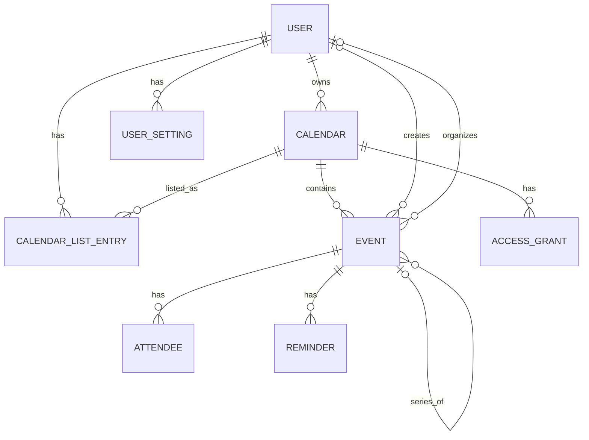

# Calendar conceptual model

## 1. Scope and vocabulary

Calendar is modeled as scheduling: users own calendars containing events, people
or resources participate in events, and calendars carry access grants. A user's
calendar list supplies a personalized view of calendars.

| Term | Meaning in this model |
| --- | --- |
| Calendar | Container of scheduled event resources |
| Calendar-list entry | One user's subscription/listing of a calendar and personal display settings |
| Event | Scheduled item with a time interval and participation information |
| Recurring series | Event carrying a recurrence definition |
| Occurrence | One instance of a recurring series at an original scheduled time |
| Exception | A stored occurrence representation that differs from the series pattern, including cancellation |
| Organizer | Principal responsible for organizing the event; distinct from its creator |
| Attendee | Participation record identified by event and email; can represent a person or resource |
| Access grant | Calendar ACL rule connecting a principal scope to an access role |

## 2. Concept dictionary

| Concept | Kind and identity | Relevant attributes |
| --- | --- | --- |
| User | Entity: user ID; email is unique in the schema | Email, display name |
| Calendar | Entity: calendar ID | Summary, description, location, timezone, deleted flag, resource invitation setting |
| Calendar-list entry | Association: user + calendar; also has entry ID | Access-role value, summary override, colors, hidden/selected/primary/deleted flags, reminder defaults |
| Event | Entity: event ID in repository storage | Summary, description, location, status, event type, interval, visibility, transparency |
| Recurring series | Specialization of Event | Recurrence definition, series event identity |
| Occurrence | Derived or stored event representation | Series reference, original start time, current interval |
| Attendee | Association: event + email; also has record ID | Display name, RSVP, optional/resource/organizer flags, comment, additional guests |
| Access grant | Association with ACL-rule ID | Calendar, scope type/value, access role, deleted flag |
| Reminder | Dependent configuration, represented by records and embedded values | Delivery method and minutes before event |
| User setting | Association: user + setting key | Setting value |

An event's summary is not its identity. The repository uses a globally primary
event ID within the environment; API addressing also supplies the calendar.
`ical_uid` is a separate correlation value and is not declared unique. A recurring
occurrence is conceptually identified by its series and **original** start time,
even when its current scheduled time differs.

## 3. Relationships

| Relationship | Cardinality and meaning |
| --- | --- |
| User–calendar | User owns `0..*` calendars; each calendar has `1` owner |
| User–calendar listing | Many-to-many through entries; each entry references `1` user and `1` calendar |
| Calendar–event | Calendar contains `0..*` events; each stored event belongs to `1` calendar |
| Event–creator/organizer | Each has `0..1` local User reference; email/display information can represent an external principal independently |
| Event–attendee | Event has `0..*` attendee records; each belongs to `1` event; email does not require a local User row |
| Event–reminder | Event has `0..*` reminder records; each record belongs to `1` event |
| Calendar–grant | Calendar has `0..*` grants; each grant belongs to `1` calendar and describes `1` scope |
| Series–occurrence | Occurrence has `1` series conceptually; non-occurrence event has none; series has `0..*` occurrences |
| User–setting | User has `0..*` settings, unique by setting key; each setting belongs to `1` user |

The series relationship is conceptual: `recurring_event_id` is a string rather
than a foreign key. Occurrences can be generated from recurrence data and do not
all need persistent rows. The diagram does not connect attendees or ACL scopes
directly to User because those references can identify external principals.

## 4. Value concepts and state dimensions

| Subject | Dimensions or value concepts |
| --- | --- |
| Event status | `confirmed`, `tentative`, `cancelled` |
| Attendee RSVP | `needsAction`, `declined`, `tentative`, `accepted` |
| Event visibility | `default`, `public`, `private`, `confidential` |
| Event transparency | `opaque`, `transparent`; describes its free/busy treatment |
| Event type | `default`, `outOfOffice`, `focusTime`, `workingLocation`, `fromGmail`, `birthday` |
| Access role | `none`, `freeBusyReader`, `reader`, `writer`, `owner` |
| ACL scope | `default`, `user`, `group`, `domain`, plus an optional scope value |
| Event interval | Timed date-time values with timezone context, or all-day dates |
| Recurrence | Recurrence specification and original occurrence start time |
| Reminder | Method `email` or `popup`, and lead time in minutes |
| Listing state | Hidden, selected, primary, deleted flags; separate from Calendar.deleted |
| Event configuration | Guest settings, locked/private-copy flags, conferencing, attachments, extended properties |

An attendee's tentative response and an event's tentative status are separate
facts. Likewise, private visibility does not by itself describe whether an event
occupies time. State dimensions here do not define legal transitions or effective
permissions.

The interval concept preserves all-day dates rather than treating them as UTC
midnight instants. Interpreting date boundaries, timezones, recurrence rules,
daylight-saving changes, and free/busy computation precisely belongs in the
behavior model; raw datetime columns alone are insufficient for that specification.

## 5. Structural constraints and distinctions

- Calendar ownership, calendar-list subscription, event organization, and event
  attendance are distinct relationships. One does not stand in for the others.
- Each user/calendar pair has at most one list entry. Listing-specific colors,
  summary overrides, and visibility flags describe the user's view of the calendar.
- Each event/email pair has at most one attendee record. An attendee can be an
  external person or resource without a local account record.
- Event creator and organizer can differ. The schema preserves both local user
  references and direct principal information without enforcing agreement.
- A recurring series, one occurrence, and a modified exception are different
  conceptual targets. An occurrence's current start time does not replace its
  original position in the series.
- A conceptual event interval uses a coherent representation: dates for all-day
  events or date-times for timed events. JSON storage does not alone guarantee
  valid interval structure or temporal ordering.
- ACL grants identify a scope, not necessarily an individual user. The schema
  declares uniqueness over calendar, scope type, and scope value; nullable scope
  values mean this should not be treated as an unconditional uniqueness guarantee.
- Reminder defaults on a list entry and event-specific reminder configuration
  are distinct values; the rule for choosing effective reminders is behavioral.

## 6. Supporting concepts and representation limits

| Concept | Representation and qualification |
| --- | --- |
| Conference information | Embedded event/calendar data, not an independent meeting-service entity |
| Event attachment | Embedded reference data; no local attachment-content or Box-file relationship is implied |
| Guest capabilities | Event booleans; conceptual settings, not a complete authorization model |
| User preferences | `Setting` key/value records |
| Watch channel | `Channel` stores resource/callback information; its schema docstring says push support is largely stubbed |
| Synchronization token | `SyncToken` tracks resource and snapshot state; technical synchronization infrastructure |

Watch channels are not Slack conversations. Synchronization tokens and transport
metadata such as ETags are not scheduling entities.

Reminders exist both as embedded event data and EventReminder records. Date/time
data exists both as JSON and denormalized fields. Calendar-list access roles also
coexist with ACL rules. This conceptual model records these representations
without assuming they are synchronized or deciding which is authoritative.

The schema has no separate group, domain, room, or availability entity. Resource
attendance is indicated by flags/email, and free/busy is a derived view of
scheduling information. The existence of special event-type enum values does
not establish complete support for each type's behavior.

## 7. Repository grounding

- [Calendar schema](../backend/src/services/calendar/database/schema.py):
  entities, scopes, state vocabularies, uniqueness, and embedded representations.
- [Calendar operations](../backend/src/services/calendar/database/operations.py):
  occurrence generation and exception references through `recurring_event_id`
  and `original_start_time`.
