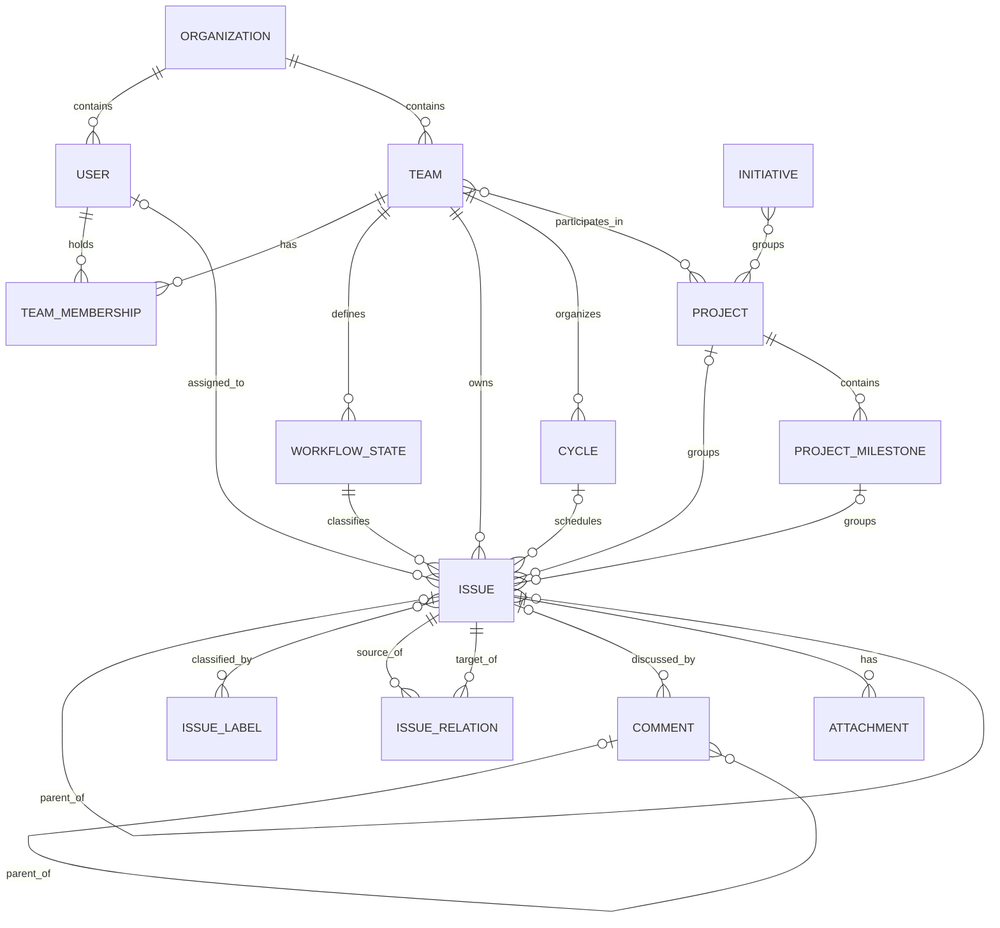

# Linear conceptual model

## 1. Scope and vocabulary

Linear is modeled as work tracking and planning within an organization. Teams
organize issues using workflow states and cycles. Projects group work toward
outcomes, milestones divide project scope, and initiatives group projects.

| Term | Meaning in this model |
| --- | --- |
| Organization | Workspace-level container for users, teams, and shared definitions |
| Team | Organizational unit with its own issues, workflow states, and cycles |
| Issue | Individually tracked unit of work |
| Workflow state | A named, team-specific classification of an issue's progress |
| Cycle | A team's time-bounded planning interval |
| Project | Group of work that can involve multiple teams |
| Milestone | Named subdivision or checkpoint within a project |
| Initiative | Higher-level grouping of projects, optionally hierarchical |
| Label | Classification entity; issue labels and project labels are distinct |

## 2. Concept dictionary

| Concept | Kind and identity | Relevant attributes |
| --- | --- | --- |
| Organization | Entity: organization ID | Name, URL key, configuration, archived time |
| User | Entity: user ID | Name, display name, email, active/admin/guest flags, assignability |
| Team | Entity: team ID | Name, key, description, privacy, timezone, archived time |
| Team membership | Association with membership ID | User, team, owner flag, archived time |
| Issue | Entity: issue ID | Identifier, number, title, description, priority, estimate, due date, ordering, lifecycle timestamps |
| Workflow state | Entity: state ID | Name, type, position, color, archived time |
| Cycle | Entity: cycle ID | Name, number, start/end times, progress, temporal flags |
| Project | Entity: project ID | Name, description, start/target dates, priority, state, health, progress |
| Project status | Entity: status ID | Organization, name, type, position, archived time |
| Project milestone | Entity: milestone ID | Name, description, target date, status, progress |
| Initiative | Entity: initiative ID | Name, description, status, health, target date |
| Issue label | Entity: label ID | Name, description, group flag, color, retired/archived times |
| Project label | Separate entity: label ID | Name, description, group flag, color, retired/archived times |
| Issue relation | Association with relation ID | Source issue, related issue, relation type |
| Comment | Entity: comment ID | Body, edited/resolved/archived times, optional parent |
| Attachment | Entity: attachment ID | Title, URL, source, metadata |
| Document | Entity: document ID | Title, content, hidden/archived times, trashed flag |

Use entity IDs for identity. Issue identifiers such as `ENG-123` are human-facing
references, while titles are descriptions. The schema retains previous issue
identifiers. A workflow-state name alone does not identify its team or state ID.

## 3. Relationships

| Relationship | Cardinality and meaning |
| --- | --- |
| Organization–user/team | Organization has `0..*` users and teams; each user/team belongs to `1` organization |
| Team–user | Many-to-many through membership; a membership references `1` user and `1` team |
| Team–issue/state/cycle | Team has `0..*` of each; each issue, state, and cycle belongs to `1` team |
| Issue–workflow state | Issue has `1` state; a state classifies `0..*` issues |
| Issue–user roles | Issue has `0..1` assignee, creator, and delegate independently; users may occupy those roles on many issues |
| Issue–parent | Issue has `0..1` parent and `0..*` children |
| Issue–cycle/project/milestone | Issue has `0..1` of each independently; each grouping can contain `0..*` issues |
| Project–team/member | Many-to-many with teams and, separately, users; project lead is `0..1` user |
| Project–milestone/status | Project has `0..*` milestones and `0..1` status; each milestone belongs to `1` project; each status belongs to `1` organization |
| Label scope | Issue label has `1` organization and `0..1` team; project label has `1` organization |
| Labels and subscribers | Issues have many-to-many labels and user subscribers; projects have separate many-to-many project labels |
| Initiative–project | Many-to-many; initiative also has `0..1` parent initiative, owner, and organization in the schema |
| Comment–subject/author | Comment can reference an issue, document, project, post, or update through optional links; author can be an internal or external user |
| Document–context | Document has optional project, initiative, and team links; user subscribers are many-to-many |

The comment subject links do not enforce an exclusive choice. The issue–comment
diagram therefore shows an optional issue, rather than assuming every comment
belongs to an issue.

## 4. Value concepts and state dimensions

| Subject | Dimensions |
| --- | --- |
| Issue progress | Referenced WorkflowState, including its name and type; state definitions are data rather than a fixed ORM enum |
| Issue disposition | Archived timestamp and trashed flag; distinct from completion/cancellation timestamps |
| Issue planning | Priority, estimate, due date, assignee, cycle, project, milestone |
| Project progress | `state` string and optional ProjectStatus reference; health and progress are separate values |
| Milestone status | Declared enum: `done`, `next`, `overdue`, `unstarted` |
| Cycle timing | Start/end times and `isActive`, `isFuture`, `isNext`, `isPast`, `isPrevious` flags |
| Initiative | Status string, health, archived timestamp, trashed flag |
| Comment | Edited, resolved, and archived timestamps are independent facts |
| Label | Group classification, optional parent, retirement and archive timestamps |
| User | Active, admin, guest, and assignable flags are distinct dimensions |

No universal ordered workflow is imposed. The model can represent different
teams' named states. Cycle temporal flags and stored progress are summaries whose
agreement with dates and underlying work requires separate behavioral validation.

## 5. Structural constraints and distinctions

- An issue's team and state are mandatory. Conceptually its state should belong
  to that team; separate foreign keys do not enforce their agreement.
- An issue's selected cycle should match its team, and its selected milestone
  should match its project. These are conceptual consistency constraints, not
  combined database constraints in the inspected schema.
- Project membership does not imply team membership, and assigning an issue is
  distinct from subscribing to it.
- Issue parentage is a hierarchy; typed issue relations form a separate graph.
  A related issue is not automatically a child issue. Acyclic parentage is a
  conceptual constraint, not established by the self-reference alone.
- A project can involve multiple teams. It is not simply a child container of
  exactly one team. A cycle, in contrast, belongs to one team.
- Issue labels and project labels have separate identities and association
  tables, even when their names coincide.
- Archive/trash disposition is separate from workflow completion. An issue's
  priority, workflow state, and project membership are independent classifications.

## 6. Supporting concepts and representation limits

| Area | Represented supporting concepts |
| --- | --- |
| Planning relationships | ProjectRelation, InitiativeRelation, hierarchical teams/labels/initiatives, InitiativeToProject |
| Discussion and content | ProjectUpdate, InitiativeUpdate, Post, DocumentContent, Reaction, document/comment subscribers |
| Trace and assistance | IssueHistory, ProjectHistory, InitiativeHistory, IssueSuggestion, CustomerNeed, AgentSession |
| Personal organization | Favorite, Draft, IssueDraft, UserSettings, UserFlag, Notification |
| Organization administration | ExternalUser, OrganizationInvite, OrganizationDomain, Template |
| Integration and configuration | Facet, IntegrationsSettings, TriageResponsibility, Webhook, Integration, PaidSubscription, IssueImport, GitAutomationState |

These concepts vary in completeness. For example, Reaction contains issue/comment
references but no user or emoji fields; the related entities also contain
`reactionData`. Update and history classes are sparse. They do not justify a
complete reaction or audit model without further evidence.

Initiative–project membership is represented both by an association table and
`InitiativeToProject`. Issue/project label IDs also coexist with normalized label
relationships. Project has both a state string and a status reference. Preserve
these as representation ambiguities until an authoritative relationship is
established; do not assume they are always synchronized.

Comment and document contexts are optional and potentially overlapping. The
schema does not establish an exactly-one-subject constraint. Likewise, the
membership table does not declare a unique user/team pair even though conceptual
membership normally denotes one association per pair.

The schema's opening note explicitly describes autogenerated modeling and possible
drift from business logic. This document models its concepts, not guaranteed live
Linear semantics. Git integration references are acknowledged only as peripheral
Linear configuration; no GitHub domain is modeled.

## 7. Repository grounding

- [Linear schema](../backend/src/services/linear/database/schema.py): concepts,
  association tables, mandatory/optional relationships, state representations,
  and the implementation's stated limitations.
- [Local GraphQL schema](../backend/src/services/linear/api/schema/Linear-API.graphql):
  additional vocabulary reference; a declared GraphQL type alone does not prove
  complete persisted or executable support.
