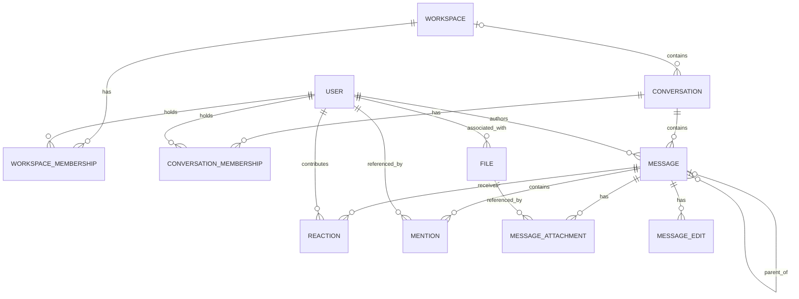

# Slack conceptual model

## 1. Scope and vocabulary

Slack is modeled as workspace communication: users participate in conversations,
author messages, reply to messages, react, mention users, and associate files
with messages. Workspace membership and conversation membership are distinct.

| Term | Meaning in this model |
| --- | --- |
| Workspace | Organizational container; called `Team` in the repository |
| Conversation | Communication container represented by `Channel`, including named channels, direct messages, and group direct messages |
| Named channel | A conversation with a channel name and a public/private classification |
| Thread | A root message and the replies associated with it; a derived concept |
| Member | A user participating in a particular workspace or conversation |
| Author | The user associated with a message; may be a bot account |

Public/private classification describes a conversation, not the full permission
policy. Presence and active-account status are different concepts.

## 2. Concept dictionary

| Concept | Kind and identity | Relevant attributes |
| --- | --- | --- |
| Workspace | Entity: workspace ID | Name |
| User | Entity: user ID | Username, email, real/display name, timezone, title, active status, bot flag |
| Workspace membership | Association: user + workspace | Workspace role: owner, admin, member, guest |
| Conversation | Entity: channel ID | Name, topic, purpose, privacy, DM/group flags, archived status |
| Conversation membership | Association: conversation + user | Joined time |
| Message | Entity: message ID | Text, structured blocks, type, timestamp, creation time |
| Thread | Derived: root message identity | Root and associated replies |
| Reaction | Association: message + user + reaction type | Reaction name, creation time |
| Mention | Association with mention ID | Referenced user, containing message, mentioned time |
| File | Entity: file ID | Name, size, media type, URL, creation time |
| Message attachment | Association with attachment ID | File and message it connects |
| Message edit | Dependent entity: edit ID | Message, edited text, edit time |

Display names are descriptive. The schema additionally makes usernames and emails
unique globally within a Slack environment, and channel names unique within a
workspace. Those storage constraints should not be generalized to other products.

## 3. Relationships

| Relationship | Cardinality and meaning |
| --- | --- |
| Workspace–user | Many-to-many through workspace membership; each membership identifies exactly one of each |
| Workspace–conversation | Workspace has `0..*` conversations; a conversation has `0..1` workspace in the schema |
| Conversation–user | Many-to-many through conversation membership; this does not itself express workspace membership |
| Conversation–message | Conversation has `0..*` messages; each message belongs to `1` conversation |
| User–message | User authors `0..*` messages; each message has `1` author |
| Message–parent | Message has `0..1` parent; a parent can have `0..*` replies |
| Message–reaction | Message has `0..*` reactions; each reaction identifies `1` message and `1` user |
| Message–file | Many-to-many through attachment records; one file can appear in multiple messages |
| Message–mention/edit | Message has `0..*` mentions and edits; each belongs to `1` message |

## 4. Value concepts and state dimensions

| Subject | Dimensions |
| --- | --- |
| User | Active/inactive account; bot/human classification |
| Conversation | Archived/not archived; private/public flag; DM and group flags |
| Message | Parent absent/present distinguishes a root-level message from a reply |
| Membership | Association present/absent; workspace role is a separate value |
| User notification preference | `all`, `mentions`, `none` |
| Message content | Plain text and structured blocks are two content representations |

These dimensions do not imply a transition order. A private conversation can also
be archived; those are separate facts. The schema stores multiple conversation
booleans rather than an exclusive conversation-kind enumeration.

## 5. Structural constraints and distinctions

- A reaction is unique for a particular message, user, and reaction type. Multiple
  users may apply the same reaction, and one user may apply different reactions.
- Workspace and conversation membership each have unique user/container pairs.
- A reply's parent belongs to the same conversation. The message operation
  explicitly checks this; the parent foreign key alone does not.
- A thread is not an independent channel or a separate stored entity. Parent
  references capture its structure. Acyclic, root-oriented threading is the
  conceptual interpretation, not a complete schema-enforced guarantee.
- Message authorship, mentions, and reactions connect users to messages in
  different roles. Mentioning a person does not make them the author or a member.
- A file reference is distinct from the message text that might contain its URL.
- An edit record is distinct from the current message content. The existence of
  an edit table does not establish complete audit-history behavior.

## 6. Supporting concepts and representation limits

| Concept | Repository representation and qualification |
| --- | --- |
| Workspace role definition | `TeamRole`: role ID, workspace, role name |
| Role assignment | `UserRole`: user + role definition; separate from `UserTeam.role` |
| Workspace settings | `TeamSetting`: optional default channel and file-upload setting; at most one settings record per workspace |
| User settings | `UserSetting`: notification preference; at most one record per user |
| Presence | `UserPresence` declares active/away values, but the User model has no corresponding persisted presence field |

The diagram preserves the nullable conversation-to-workspace link. Requiring
every named channel to have a workspace is a reasonable conceptual constraint,
but the database permits an absent workspace. Similarly, the schema does not
guarantee that every conversation member is a member of its workspace.

The two role representations should remain distinct until their intended
relationship is established. Do not infer an effective permission policy by
merging them. File bytes, delivery receipts, unread state, and complete message
deletion history are not represented as core entities in this schema.

## 7. Repository grounding

- [Slack schema](../backend/src/services/slack/database/schema.py): all entity,
  association, attribute, uniqueness, and enumeration observations above.
- [Slack operations](../backend/src/services/slack/database/operations.py):
  `send_message` validates a parent message against the target channel.
- [Slack API methods](../backend/src/services/slack/api/methods.py): boundary
  vocabulary for conversations and messages; action contracts remain future work.
