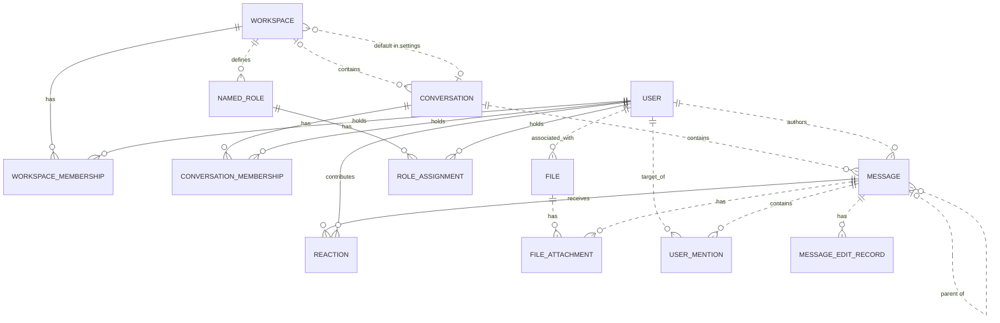

Write one conceptual benchmark scenario with the assigned referent, complete route,
resolution mode and counts. Those are fixed; names, story, identifying values and
request wording are yours to design. A compiler later instantiates the sketch in
an existing environment. You do not write database records, cards or oracle rules.

Work in this order:

1. Choose a downstream operation from the supplied referent-specific menu. Prefer
   a supported write and supply its intended new value or communication purpose.
   For a read, choose an observable answer whose value can distinguish candidates.
   A property being asked about is an answer, not an eligibility requirement:
   “Is this person a member?” can legitimately answer “no.” Identify how the
   supplied capabilities expose each fact needed for selection and the answer.
2. Translate the route backward into an ordinary referring expression, then trace
   it forward. Preserve author/reactor/member/container roles and shared-record
   bindings. Do not equate unrelated locations. List the actual identifying
   conditions briefly, apart from what the downstream action says or changes.
   Keep every chosen condition in the request; ordinary plural wording suffices.
   No candidate menus, emphatic ALL/EVERY, “if any,” test vocabulary or search hints.
3. Plan a distinct competing root for each negative condition before fixing the
   story. If a freely chosen unique name fixes an intermediate record and makes
   a later path condition constant across candidates, remove that shortcut or
   choose a different referring expression. Use the complete relationship to
   identify the target. Do not struggle to vary one person's fixed global facts
   or drop a required negative to preserve your first wording. The assignment is
   fixed; an unsuitable story is replaceable.
4. Build initial roots using only the assigned mode instructions. Label each root
   distinctly and put its related records in its facts. Reusing a person or message
   reuses that record's facts everywhere. Multiple qualifying witnesses for one
   root still give one root. Give multiple matches useful variants, such as extra
   unrelated activity that preserves the full match.
5. Construct each negative as a NEW competing root in the SAME environment. Give
   it facts satisfying the query, then break exactly one requirement while keeping
   shared records unchanged. A different value, missing relationship or broken
   same-record binding can be the one failure: Tom👀 plus Tim👍 breaks the required
   joint reaction. Do not add a wrong witness to an already-qualifying root and
   call that root negative. Give every independently variable identifying value
   a negative, then useful missing-edge/binding negatives. Map each challenged
   condition to its negative row; a missing row requires construction, not an
   assurance. There is no arbitrary condition-count limit.
6. Recompute the distinct qualifying roots across ALL facts, ignoring the table's
   labels. A negative must have no qualifying chain, including through another row.
   Check the assigned count/alternatives and the sole failure of each negative.
   Read the exact request as a user would: could a claimed negative reasonably
   qualify? Keep credible near matches until the failing condition is examined;
   avoid an entirely empty relevant population. Check semantic topics, not keyword
   negation: a canceled meeting can still concern meeting confirmation, and an
   office-move decoy must not also discuss deployment. No answer-revealing text.

Repair concrete defects, changing free story choices when necessary. Once correct,
keep the short request unchanged. If the fixed assignment itself cannot be realized,
state the specific incompatibility rather than silently changing it.

Return Markdown: route and mode; exact user request; one short selection-conditions
line; ONE table headed “Referent | Environment facts | Interpretation.” The final
column names the sole failed condition or binding for each negative. Use human
labels, not database IDs. Positive/alternative rows come first. Include a short
note only for shared facts or a material capability qualification. No hypothetical
full-match rows, JSON, long reasoning, cards or selectors. Follow the examples'
construction principles with a fresh story; follow your assigned mode and counts.

# Slack capabilities for conceptual authoring

This brief qualifies the conceptual model. Stored attributes are not automatically
observable. There is an acting user; use “I/my” for that actor when relevant.

- Supported identifying facts include user names/email and bot status; channel
  name, topic, archived/type flags; message text, author, location and replies;
  reaction emoji and reactor; channel membership and distinct member counts;
  the workspace association displayed on a user's profile and its admin/owner
  flags. Do not distinguish ordinary members from guests using unexposed flags.
- Public channels and users in the actor's selected workspace can be discovered;
  channel histories, members and reactions can be read with appropriate access.
  A compiler can arrange required read access in the environment. Do not supply
  a menu of candidate answers as a discovery shortcut.
- General workspace enumeration, workspace-name lookup and switching list/search
  to a different workspace are unavailable. Visible profile/channel associations
  can supply workspace IDs. For workspace-membership roots, limit the population
  to the association displayed on discoverable users' profiles; do not assume
  every stored workspace membership is exposed. Do not invent human job titles,
  private intentions, last-login times, membership join times or edit history as
  observable selection criteria.
- Supported writes: post/reply to a message, edit/delete a message, add a reaction;
  create/archive/unarchive/rename a channel, set its topic; invite/remove a channel
  member; open a DM and message a user. Arrange actor-owned messages for edits or
  deletion when needed. Supply the intended new content or communication purpose.
- A reaction can be removed only by its own reactor: “remove my reactions” is
  supported; removing another person's reaction is not. A reaction referent is
  one person–message–emoji identity, not just its message. Supported emoji writes
  include thumbsup, thumbsdown, eyes, raised_hands, tada, rocket, heart, fire,
  check and x. Do not assume an arbitrary readable emoji is writable.
- Workspace changes, workspace-role changes, user-profile changes and named-role
  management have no supported write API. For roots requiring those operations,
  use an explicit read fallback about observable facts and state the limitation
  briefly. Do not replace the assigned root with another entity to obtain a write.

The compiler will check the full existing seed, access and concrete capabilities.
This stage designs the story; it does not claim a validated runnable test.

# Adopted conceptual domain model

# Slack conceptual model

## 1. Scope

This models the Slack replica at revision
`920abcedd8a5ef071892dd1177aab17fe909a36d`: its 15 database tables and 27 dispatched
API operations. It follows the [meta-model](conceptual-meta-model.md) and
[Slack contextualization](slack-contextualization.md). Evidence identifiers below
refer to the [coverage ledger](slack-coverage-ledger.md).

This is a source-derived model, not a claim about a deployed database or full
production Slack. Tables without an API path remain in scope. Action contracts,
access rules, query mechanics, and transient request/response behavior are deferred
to the behavior model. Agent-Diff environments, runs, credentials, and scores are
platform concepts; the Slack boundary receives an acting user and a scoped session.

## 2. Vocabulary

| Term | Meaning in this model |
|---|---|
| Workspace | Organizational context, called `Team` in storage. |
| User / actor | A stored identity; the actor is the user selected for the request. A bot is a classification of User. |
| Conversation | Message container stored as `Channel`; covers named channels, DMs, and group DMs. |
| Membership | A user's association with a workspace or conversation. These are distinct relationships. |
| Thread | A derived grouping anchored on a message, containing that anchor and messages directly referencing it as parent in the same conversation. |
| Reaction | One user's emoji reaction to one message. |
| Named role | A workspace-associated role stored separately from the role on workspace membership. |
| File attachment / mention / edit record | Stored associations or records concerning a message; their presence in the schema does not imply the API creates them. |
| Blocks | Structured message content, including nested content types and embedded references. |

## 3. Entity–relationship model

### Entities, identity, and attributes

`?` means the stored value may be null. Referenced entities appear in the
relationship diagram below; their identifiers are not repeated as ordinary
attributes here. Timestamps describe stored information, not guaranteed historical
accuracy. D-codes map every stored field and constraint in the ledger.

| Entity | Identity | Attributes | Evidence |
|---|---|---|---|
| Workspace | Workspace ID; name also unique | Name, creation time?, optional settings containing file-upload flag? and a default-conversation reference? | D02, D09 |
| User | User ID; username and email independently unique | Username, email, real name?, display name?, timezone?, title?, creation time?, last login?, active flag?, bot flag?, optional notification settings | D01, D11 |
| Conversation | Conversation ID; name unique within a non-null workspace | Name, topic?, purpose?, private/DM/group-DM flags, archived flag, creation time? | D03 |
| Workspace membership | User + workspace | Membership role? | D13 |
| Conversation membership | User + conversation | Join time? | D05 |
| Message | Message ID; exposed as API `ts` | Text?, stored type?, separate stored timestamp string?, blocks?, creation time? | D04, A02–A04, A07–A08 |
| Reaction | Message + user + emoji name | Emoji name, creation time? | D07 |
| Named role | Role ID | Role name? | D08 |
| Role assignment | User + named role | Assignment time? | D06 |
| File | File ID | Name?, size?, type?, URL?, creation time? | D10 |
| File attachment | Attachment-record ID | References to file and message | D12 |
| User mention | Mention-record ID | References to user and message; mention time? | D14 |
| Message edit record | Edit-record ID | Edited text?, edit time? | D15 |

Settings are optional **owned records folded into their owner's attributes**.
Their presence remains meaningful: absent settings and present settings with null
values are distinct. This removes two diagram nodes without losing their meaning.

### Relationships and cardinalities

The diagram describes stored relationships. `||` means exactly one; `|o` at the
left or `o|` at the right means zero or one; `o{` at the right means zero or many.
Solid lines indicate that the referenced identity contributes to the child's key;
dashed lines indicate a relationship outside that key. Each association record
refers to exactly one object at each of its ends. Identity rules above determine
whether repeated pairs are allowed.

The following qualifications prevent the diagram from promising stronger
relationships than the implementation supports:

- **Workspace links:** a conversation's workspace is nullable. Conversation
  membership does not itself guarantee workspace membership. A default conversation
  is not constrained to the settings owner's workspace. Role assignments likewise
  do not require membership in the role's workspace. (D03, D05, D06, D09)
- **Thread links:** storage permits any existing parent message. Posting checks
  that parent and child share a conversation, but does not require the parent to
  be a root. Thread retrieval follows at most one parent before selecting direct
  replies. Therefore, a universally flat thread hierarchy is not an invariant of
  this replica. (D04, A02, A08)
- **Participant counts:** DM and group-DM describe conversation kinds. Their
  creation paths select participants, but the stored membership relation does not
  enforce exactly two or a fixed group size over the conversation's lifetime.
  (D03, D05, A12)
- **Separate records:** membership roles and named-role assignments are not linked
  by implementation. File attachments and mentions allow multiple records for the
  same pair because their identities are separate IDs. (D06, D08, D12–D14)

The File–User link establishes an associated user. The schema and active API do not
establish that this user performed an upload, so the diagram does not assign that
stronger role. (D10)

### Structured content and derived representations

The chat API validates blocks as an ordered list of structured values owned by a
message. The underlying JSONB column has no constraint enforcing that shape or
its type vocabulary; data written outside these API checks can differ. Validated
content can include text and style, nested elements, user/channel identifiers, links, emoji,
image/file descriptors, labels, fields, accessories, and rows. Embedded identifiers
are not foreign keys. Uninterpreted nested content is retained as data, rather than
expanded into speculative entities. A block mentioning a user does not imply a
`UserMention` record; a file descriptor does not imply a `FileAttachment`. (H03)

| Representation | Conceptual meaning and limit | Evidence |
|---|---|---|
| Thread and reply count | Derived from an anchor and direct parent references within its conversation | A08 |
| Reaction summary | Group reactions by message and emoji; derive user list and count | A22 |
| Conversation member count | Derived from membership records | H01 |
| Latest DM message | A selected message in that conversation, ordered by creation time then ID | H01 |
| User profile | View of user attributes with fallbacks, generated fields, and constants; no independent profile entity | H02 |
| Search match | View of an existing message, author, and conversation; highlighting and generated result IDs do not change message identity | A26–A27 |

The API's message `ts` comes from `message_id`, while `thread_ts` represents a parent
or selected thread anchor. The separate database `Message.ts` is retained as a
stored attribute without assuming these are synchronized. Names and display text
are descriptions or lookup forms, not replacements for identity. (D04, H04)

Attachments echoed by chat operations are transient values, not stored file
attachments. Conversation `creator`, topic author/time, read markers, subscription
flags, sharing flags, and avatar URLs are not evidence of independently maintained
facts: their provenance is qualified in H01–H02 and A08. Named roles, role
assignments, settings, files, file attachments, mentions, and edits have no direct
access in dispatched Slack handlers or their operations at this revision. Their
foreign keys and ORM cascades still matter: deleting a message cascades to its
edit records, although updating it does not write an edit record.
(D06, D08–D12, D14–D15, H05)

## 4. States and classifications

| Subject | Stored or derived classification | Meaning and qualification | Evidence |
|---|---|---|---|
| User | Stored active and bot flags, each nullable | Active/inactive and bot/non-bot; null is unrecorded. The API supplies fallback values rather than exposing every null distinction. | D01, H02 |
| Workspace membership | Stored role, nullable | `owner`, `admin`, `member`, `guest`; API owner/admin flags derive from this role, not named-role assignments. | D13, H02 |
| Conversation | Stored `is_dm`, `is_gc`, `is_private` | Conventional types are public channel, private channel, DM (`im`), group DM (`mpim`). Keep the flags: no database constraint forbids conflicting combinations, and serializer/filter interpretations differ for such combinations. | D03, H01, A06 |
| Conversation | Stored archived flag | Archived/unarchived; independent of kind. API `is_open` is a derived value or constant, not a separate lifecycle. | D03, H01 |
| Membership | Derived existence | Present/absent; no stored pending-invitation state | D05, D13, A11 |
| Message | Derived parent presence; stored type string? | Parentless/reply; stored type is open-ended, while API message payloads commonly hard-code `message`. | D04, A02, A07–A08 |
| Reaction | Stored emoji name | Database string; API add/remove use `COMMON_REACTIONS` and normalize spelling. The finite API vocabulary does not restrict all possible seeded database values. | D07, A20–A21 |
| User settings | Stored notification level, nullable | `all`, `mentions`, `none`; no dispatched API reads it | D11 |
| Workspace settings | Stored file-upload flag, nullable | True/false/unrecorded; no dispatched API enforces it | D09 |
| Named role / file | Stored role name? / file type? | Open strings, not enumerated role permissions or a validated file taxonomy | D08, D10 |
| Message blocks | Stored type tags, checked at API boundary | Block, rich-text container, and inner-element vocabularies below; validation depth varies | H03 |

The implemented block vocabulary is `rich_text`, `markdown`, `section`, `header`,
`divider`, `image`, `context`, `actions`, `input`, `file`, `video`, `table`, and
`context_actions`. Rich-text containers are `rich_text_section`, `rich_text_list`,
`rich_text_preformatted`, and `rich_text_quote`. Inner-element tags are `text`,
`emoji`, `link`, `user`, `usergroup`, `channel`, `broadcast`, `color`, and `date`.
Accepted tags do not imply separate operational capabilities such as user-group
management or video handling. Text generation interprets only part of this vocabulary.
It also distinguishes `plain_text` from `mrkdwn` section text, ordered from other
list styles, and bold/italic/strike/code text styles; these remain content attributes.

`UserPresence` declares `active` and `away` in the source but is neither mapped to a
column nor used by dispatched handlers. It therefore adds no presence state to
this model. State transitions and validation limits belong in the behavior model.
