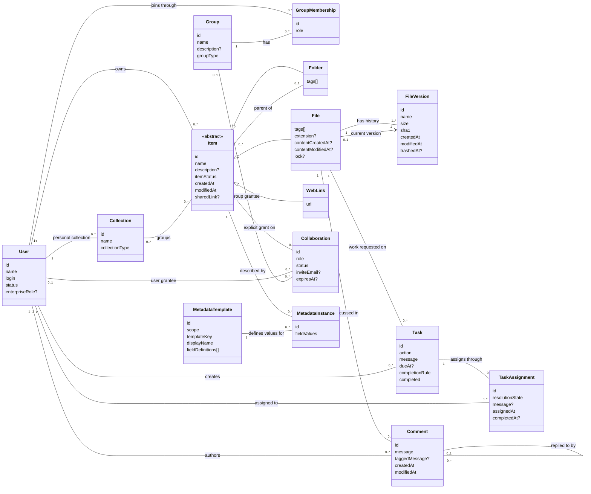

# Box — conceptual entity–relationship model

Grounded in Box's public content and collaboration API documentation, consulted 2026-09-08. Scope: files/folders/web links, versions, users/groups, sharing, comments, tasks, collections, and custom metadata. This describes the public service contract; it makes no claim about Agent-Diff's implemented endpoint coverage. No implementation code or database was consulted.

Cards retain identity, meaningful content, and lifecycle attributes. Relationships carry references rather than repeating them as foreign-key attributes. `?` means optional or conditional; `[]` means a collection; `0..*` means zero or more. Compound values have no independent identity. Item is a conceptual common type; its three concrete kinds are disjoint. Cardinalities describe domain relationships, not the caller's visible subset.

## Entity cards and relationships

**Item** identity includes kind and ID; names and paths can change. The parent association is restricted to folders as containers. An active non-root item has one parent; a root folder has none. A live file has one current version from its history. File size/hash are properties of content versions; their appearance on File is a projection of the current version. Item creator/modifier, version modifier, collaboration inviter, and assignment assigner are additional User provenance roles. [Files](https://developer.box.com/reference/files-resources), [folders](https://developer.box.com/reference/folders-resources), [versions](https://developer.box.com/reference/resources/file-version)

**Collaboration** applies to File or Folder in this scope, not WebLink. Its grantee is a user **or** group; pending email invitations may not yet resolve to a user. **MetadataInstance** likewise attaches only to File or Folder and is unique per (item, template scope, template key). These subtype restrictions narrow the Item associations drawn above. [Collaborations](https://developer.box.com/reference/user-collaborations-resources), [metadata instances](https://developer.box.com/reference/file-metadata-resources)

`sharedLink` is an optional item-owned value: URL, access audience, permissions, password-enabled flag, and expiry. `lock` is a file-owned value: locking user, expiry, and download restriction. Template field definitions contain key, display name, type, and allowed options; instance field values conform to those definitions. [File fields](https://developer.box.com/reference/files-resources), [metadata templates](https://developer.box.com/reference/resources/metadata-template)

## CRUD evidence and modeling consequences

Paths are relative to `https://api.box.com/2.0`, except uploads at `https://upload.box.com/api/2.0`. `{id}` stands for the relevant resource identifier. `—` means no operation in the cited family. Grouped resource rows use the same verbs on each named resource, subject to each endpoint's restrictions.

| Noun | Create | Read | Update | Delete / lifecycle | Consequence |
|---|---|---|---|---|---|
| File | `POST /files/content` (upload host) | `GET /files/{id}`; `/content` downloads | `PUT /files/{id}` edits metadata/moves | `DELETE /files/{id}` trashes; `POST /files/{id}` restores; `DELETE /files/{id}/trash` purges | Identity survives metadata edits and movement. [Upload](https://developer.box.com/reference/post-files-content), [update](https://developer.box.com/reference/put-files-id), [file/trash families](https://developer.box.com/reference) |
| Folder; WebLink | `POST /folders`, `/web_links` | `GET /folders/{id}`, `/folders/{id}/items`, `/web_links/{id}` | `PUT /folders/{id}`, `/web_links/{id}` | Delete, restore, and purge through corresponding item/trash routes | WebLink is a stored bookmark; Folder is a container. [Folders](https://developer.box.com/reference/folders-resources), [web links](https://developer.box.com/reference/web-links-resources) |
| FileVersion | `POST /files/{id}/content` uploads new version | `GET /files/{id}/versions`; `/versions/{versionId}` | `POST /files/{id}/versions/current` promotes an older version | `DELETE /files/{id}/versions/{versionId}`; `PUT` restores | Promotion creates a new copy of old content. [Promote](https://developer.box.com/reference/post-files-id-versions-current), [restore](https://developer.box.com/reference/put-files-id-versions-id) |
| User; Group; GroupMembership | `POST /users`, `/groups`, `/group_memberships` | Corresponding get/list routes | `PUT /users/{id}`, `/groups/{id}`, `/group_memberships/{id}` | Corresponding `DELETE` routes | Group membership carries its own role. User provisioning/deletion has administrative constraints. [Users](https://developer.box.com/reference/users-resources), [groups](https://developer.box.com/reference/resources/group--full), [membership](https://developer.box.com/reference/resources/group-membership) |
| Collaboration | `POST /collaborations` | `GET /collaborations/{id}`; item/group collaboration lists | `PUT /collaborations/{id}` | `DELETE /collaborations/{id}` | Invitation acceptance, role changes, and revocation belong to the grant. [Collaboration operations](https://developer.box.com/reference/user-collaborations-resources) |
| SharedLink; file lock | Set through item `PUT`; file `PUT` for lock | Read with item | Update owned value | Set value to `null` through item update | No extra identity is needed for these item-owned settings. [File update](https://developer.box.com/reference/put-files-id) |
| Comment | `POST /comments` targets file or parent comment | `GET /comments/{id}`, `/files/{id}/comments` | `PUT /comments/{id}` | `DELETE /comments/{id}` | A reply is still a comment on the same file. [Comment methods](https://developer.box.com/reference/post-comments) |
| Task | `POST /tasks` | `GET /tasks/{id}`, `/files/{id}/tasks` | `PUT /tasks/{id}` | `DELETE /tasks/{id}` | Work request is distinct from each assignee's response. [Task](https://developer.box.com/reference/resources/task), [update](https://developer.box.com/reference/put-tasks-id) |
| TaskAssignment | `POST /task_assignments` | `GET /task_assignments/{id}`, `/tasks/{id}/assignments` | `PUT /task_assignments/{id}` | `DELETE /task_assignments/{id}` | Completion/approval is recorded per assigned user. [Assignment operations](https://developer.box.com/reference/put-task-assignments-id) |
| Collection membership | Add collection in item update | `GET /collections`, `/collections/{id}/items` | Replace item's collection associations | Remove association in item update | Favorites membership does not move the item. The API does not create arbitrary collections. [Collections](https://developer.box.com/reference/get-collections), [item update](https://developer.box.com/reference/put-files-id) |
| MetadataTemplate | `POST /metadata_templates/schema` | Template get/list routes | `PUT /metadata_templates/{scope}/{key}/schema` | Corresponding `DELETE` | A reusable field vocabulary is distinct from item-specific values. [Templates](https://developer.box.com/reference/resources/metadata-template) |
| MetadataInstance | `POST /files/{id}/metadata/{scope}/{key}`; folder equivalent | Corresponding `GET`; item metadata list | Corresponding `PUT` with JSON Patch operations | Corresponding `DELETE` | Custom metadata has a lifecycle independent of file content versions. [Instances](https://developer.box.com/reference/file-metadata-resources) |

## Requirements inferred from the contract

- **Preserve containment identity.** Moving changes parent; copying creates another item. A folder tree cannot contain itself. Trash/restore/purge are distinct from removing a personal collection association. Root-folder and recursive-folder operations have special restrictions. [Folder API](https://developer.box.com/reference/folders-resources), [file update](https://developer.box.com/reference/put-files-id)
- **Distinguish explicit grants from effective access.** Folder access flows down to descendants; group membership and shared links provide additional access routes. Revoking one grant does not prove that all access is gone. [Permission inheritance](https://support.box.com/hc/en-us/articles/360043697254-Understanding-Item-Permissions), [collaborations](https://developer.box.com/guides/collaborations)
- **Keep review state per assignee.** Task action distinguishes review from completion; assignment resolution distinguishes incomplete, approved/rejected, or completed outcomes. The task completion rule determines how assignments combine, so a single file-level “approved” attribute would lose meaning. [Task](https://developer.box.com/reference/resources/task), [assignment updates](https://developer.box.com/reference/put-task-assignments-id)
- **Version restoration is content restoration.** Promoting an old version creates a new current version; it does not restore comments to their old values. Comments, tasks, and metadata therefore attach to the enduring File/Item in this scope. [Promote version](https://developer.box.com/reference/post-files-id-versions-current)

Boundary: enterprise governance, retention/legal holds, e-signatures, Hubs, AI, metadata cascade/taxonomy administration, file requests, and workflow automation are adjacent subdomains excluded here. Search results, activity feeds, thumbnails, previews, and download/upload sessions are projections or transfer mechanisms, not additional content entities.
