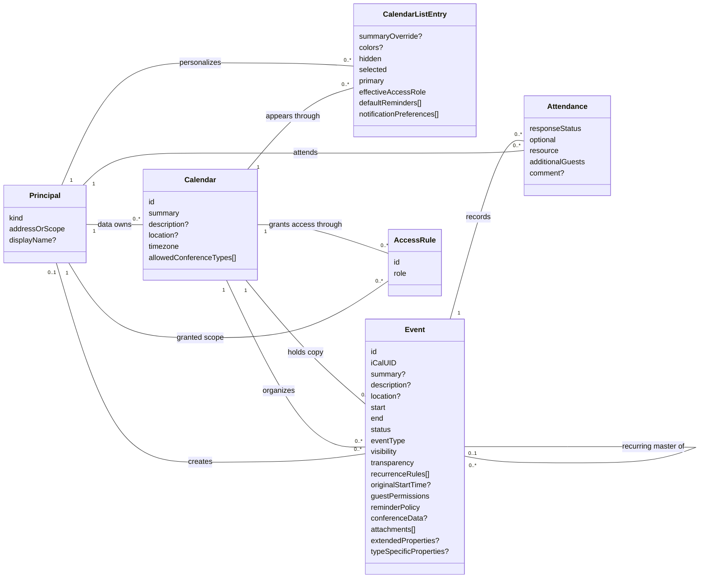

# Google Calendar — conceptual entity–relationship model

Grounded in the public Calendar API v3 documentation, consulted 2026-09-08. Scope: calendars, personal calendar lists, events, attendance, recurrence, and sharing. This describes the public service contract; it makes no claim about Agent-Diff's implemented endpoint coverage. No implementation code or database was consulted.

Cards retain identity, meaningful content, and lifecycle attributes. Relationships carry references rather than repeating them as foreign-key attributes. `?` means optional or conditional; `[]` means a collection; `0..*` means zero or more. Compound values have no independent identity. Cardinalities describe the domain, not the caller's visible subset.

## Entity cards and relationships

**Principal** is a conceptual reference, not an account-management resource in this API. Its kind/address represents a user, resource, group, domain, or public scope. Only user principals own personal list entries; only attendee-capable addresses participate. A public scope has no address value. [ACL scopes](https://developers.google.com/workspace/calendar/api/v3/reference/acl)

**CalendarListEntry** is unique per (user, calendar). It holds the user's preferences and effective access projection. Removing this entry does not delete its calendar. A calendar's single data owner is distinct from ACL `owner` roles, which multiple users may hold. [CalendarList](https://developers.google.com/workspace/calendar/api/v3/reference/calendarList), [Calendars](https://developers.google.com/workspace/calendar/api/v3/reference/calendars)

**Event** represents a calendar-scoped event copy, identified by **(calendar, event ID)**. An organizer calendar holds the main copy; attendee calendars can hold related copies. `iCalUID` links calendar-system representations; occurrences in a recurring series share it. It is not an occurrence identifier. [Calendars and events](https://developers.google.com/workspace/calendar/api/concepts/events-calendars), [Event resource](https://developers.google.com/workspace/calendar/api/v3/reference/events)

**Attendance** is the event–principal association, identified conceptually by (event copy, attendee address). Invitation and RSVP belong here; they are not global user status. **AccessRule** has calendar-scoped identity and grants a role to one scope. Invitation to an event and access to an entire calendar are separate relationships. [Event creation](https://developers.google.com/workspace/calendar/api/guides/create-events), [calendar sharing](https://developers.google.com/workspace/calendar/api/concepts/sharing)

## CRUD evidence and modeling consequences

Names below are API resource methods. Writes remain subject to calendar role and event-type restrictions.

| Noun / association | Create | Read | Update | Delete / lifecycle | Consequence |
|---|---|---|---|---|---|
| Calendar | `calendars.insert` creates a secondary calendar | `calendars.get` | `patch/update`; restricted `transferOwnership` | `delete` secondary calendars; `clear` primary-calendar events | Calendar deletion and deleting its contents are different operations. [Calendar methods](https://developers.google.com/workspace/calendar/api/v3/reference/calendars) |
| CalendarListEntry | `calendarList.insert` adds an existing calendar | `get/list` | `patch/update` | `delete` removes the list entry | Subscription/preferences have their own lifecycle. [CalendarList](https://developers.google.com/workspace/calendar/api/v3/reference/calendarList) |
| Event | `events.insert/quickAdd`; `import` adds a private copy | `get/list/instances` | `patch/update`; `move` changes organizer | `delete`; cancelled occurrences can remain as exceptions | Copies, organizer changes, and recurrence must remain distinguishable. [API methods](https://developers.google.com/workspace/calendar/api/v3/reference), [recurrence](https://developers.google.com/workspace/calendar/api/guides/recurringevents) |
| Attendance and event values | Included in event creation | Included in event reads | Event writes invite/remove attendees, record RSVP, and change reminders/conferencing | Removed through event update or event lifecycle | They have no standalone CRUD endpoint. [Create events](https://developers.google.com/workspace/calendar/api/guides/create-events), [Event resource](https://developers.google.com/workspace/calendar/api/v3/reference/events) |
| AccessRule | `acl.insert` | `get/list` | `patch/update` | `delete` revokes the explicit rule | Sharing is a first-class relationship, not a calendar boolean. [ACL](https://developers.google.com/workspace/calendar/api/v3/reference/acl) |
| Availability; settings; colors | — | `freebusy.query`; `settings.get/list`; `colors.get` | — in these families | — | Busy intervals are computed results; settings and colors are values. [Free/busy](https://developers.google.com/workspace/calendar/api/v3/reference/freebusy/query), [API reference](https://developers.google.com/workspace/calendar/api/v3/reference) |

## Requirements inferred from the contract

- **Preserve temporal meaning.** `start/end` are either all-day dates or date-times with timezone information; the end is exclusive. Recurrence rules are values on the master. An occurrence points to that master and retains its original start even after rescheduling. Cancelled exceptions must remain distinguishable from a series-wide deletion. [Event resource](https://developers.google.com/workspace/calendar/api/v3/reference/events), [recurring events](https://developers.google.com/workspace/calendar/api/guides/recurringevents)
- **Preserve personal versus shared state.** Default reminders belong to a user's CalendarListEntry; an event copy can use defaults or supply overrides. RSVP values distinguish needs-action, accepted, tentative, and declined. Neither reminders nor RSVP justify a separate global entity. [Event inputs](https://developers.google.com/workspace/calendar/api/v3/reference/events/insert), [invitations](https://developers.google.com/workspace/calendar/api/concepts/inviting-attendees-to-events)
- **Treat embedded collections as replaceable values.** An event patch replaces any supplied array, so changing one attendee requires preserving the others as appropriate. This write behavior does not make attendance an attribute of the person. [Event patch](https://developers.google.com/workspace/calendar/api/v3/reference/events/patch)
- **Separate visibility from occupancy.** Event visibility controls exposed details; transparency affects whether time is occupied. Free/busy access can expose occupied intervals without exposing event content. [Calendar sharing](https://developers.google.com/workspace/calendar/api/concepts/sharing), [free/busy query](https://developers.google.com/workspace/calendar/api/v3/reference/freebusy/query)

Compound values: reminders contain method/minutes; guest permissions govern inviting/modifying/seeing guests; conference data contains solution, meeting identifier, and entry points; attachments contain external file references. Specialized event types use conditional properties rather than separate entities. Calendar API does not manage the underlying Drive files or room directory. [Event inputs](https://developers.google.com/workspace/calendar/api/v3/reference/events/insert)

Boundary: push-notification channels and sync tokens are integration infrastructure, excluded from this scheduling model. Watches report changes to existing resources; they are not additional calendars or events. [API reference](https://developers.google.com/workspace/calendar/api/v3/reference)
