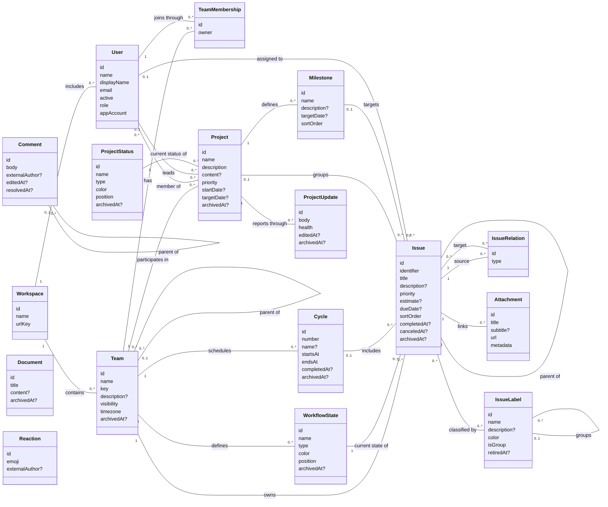

# Linear — conceptual entity–relationship model

Grounded in Linear's public GraphQL documentation and published API type/operation contract, consulted 2026-09-08. Scope: teams, issues, project delivery, and their collaboration content. This describes the public service contract; it makes no claim about Agent-Diff's implemented endpoint coverage. No implementation code or database was consulted. The published GraphQL schema was used only as API documentation, including field descriptions and query/mutation signatures. [API guide](https://linear.app/developers/graphql), [public API contract](https://github.com/linear/linear/blob/master/packages/sdk/src/schema.graphql)

Cards retain identity, meaningful content, and lifecycle attributes. Relationships carry references rather than repeating them as foreign-key attributes. `?` means optional or conditional; `[]` means a collection; `0..*` means zero or more. All identified entities have creation/update timestamps; these common provenance attributes are omitted from the cards. `archivedAt?` is retained where archival affects normal work. Cardinalities describe domain relationships, not a paginated response.

## Entity cards and relationships

The following associations complete the cards without crowding the diagram. They are conceptual role names over the documented references; unmentioned reverse multiplicities are `0..*`.

| Entity | Additional relationships |
|---|---|
| WorkflowState; Cycle | Each can inherit from `0..1` corresponding state/cycle. Team hierarchy must not be flattened into unrelated workspaces. |
| IssueLabel; ProjectStatus | Each has `0..1` team scope; an absent team denotes workspace scope. A scoped definition can have an inherited source. |
| Issue | `0..1` creator and `0..1` delegated agent user; many subscribed users. Assignment, creation, delegation, and subscription are different roles. |
| Document | `0..1` owner and `0..1` creator; optional context references to a team, issue, cycle, or project in this scope. Do not infer an exclusive-parent rule merely from nullable fields. |
| Comment | `0..1` workspace author, with external/bot author information when applicable. In scope, comments concern an issue, project, project update, or document content; replies reference a parent comment. A document-content reference is modeled as an anchor within the owning content. |
| ProjectUpdate | Exactly one project and one author. |
| Reaction | One target, here an issue, comment, or project update; `0..1` workspace author, with an external author alternative. |
| Attachment | `0..1` workspace creator; its external URL identifies linked material. |

Entity fields, optional references, and inheritance are grounded in the [published API contract](https://github.com/linear/linear/blob/master/packages/sdk/src/schema.graphql). The cards retain `ProjectStatus` separately from team issue `WorkflowState`: both are independently managed vocabularies. `Workspace` is API `Organization`; `Milestone` is `ProjectMilestone`. Priority is 0 (unset), 1 (urgent), 2 (high), 3 (medium), or 4 (low); an estimate expresses complexity in the team's estimation system.

## CRUD evidence and modeling consequences

All operations use `POST https://api.linear.app/graphql`; HTTP POST alone does not indicate creation. Queries read; named mutations change state. In the table, `{Create,Update}` expands to separately named mutations, and `x/xs` denotes singular/collection queries. [GraphQL guide](https://linear.app/developers/graphql)

| Noun / association | Read | Create / update | Delete / lifecycle | Consequence |
|---|---|---|---|---|
| Workspace; User | `organization`; `viewer`, `user/users` | `organizationUpdate`; `organizationInviteCreate`, `userUpdate`, `userChangeRole` | `userSuspend/Unsuspend` | User invitation/activation differs from creating work items. |
| Team; TeamMembership | `team/teams`; `teamMembership/teamMemberships` | `team{Create,Update}`; `teamMembership{Create,Update}` | `teamDelete`; `teamMembershipDelete` | Membership is an identified association carrying team ownership. |
| Issue | `issue/issues` | `issue{Create,Update}` | `issueDelete`; `issueArchive/Unarchive` | Delete, archive, and a completed workflow state express different transitions. |
| WorkflowState; Cycle | `workflowState/workflowStates`; `cycle/cycles` | `workflowState{Create,Update}`; `cycle{Create,Update}` | `workflowStateArchive`; `cycleArchive` | Do not invent symmetric delete/unarchive operations from naming patterns. |
| Project; ProjectStatus; Milestone | Corresponding singular/plural queries | `project{Create,Update}`; `projectStatus{Create,Update}`; `projectMilestone{Create,Update,Move}` | `projectDelete`, `projectArchive/Unarchive`; `projectStatusArchive/Unarchive`; `projectMilestoneDelete` | Projects span teams; milestones are project-specific, ordered targets. |
| IssueLabel; classification | `issueLabel/issueLabels`; issue labels | `issueLabel{Create,Update}`; `issueAddLabel` | `issueLabelDelete/Retire/Restore`; `issueRemoveLabel` | Removing a label from an issue does not delete the label definition. |
| IssueRelation | `issueRelation/issueRelations` | `issueRelation{Create,Update}` | `issueRelationDelete` | A typed dependency/reference is independently mutable. |
| Comment; Reaction | `comment/comments`; target's `reactions` | `comment{Create,Update}`; `reactionCreate` | `commentDelete`, `commentResolve/Unresolve`; `reactionDelete` | Resolution preserves discussion; reactions have add/remove semantics. |
| Attachment; Document; ProjectUpdate | Corresponding singular/plural queries | `attachment{Create,Update}`; `document{Create,Update}`; `projectUpdate{Create,Update}` | `attachmentDelete`; `documentDelete`; `projectUpdateDelete/Archive/Unarchive` | Linked material, authored documents, and status reports have distinct identities. |
| Subscription; project membership | Issue subscribers; project members | `issueSubscribe`; `projectUpdate(memberIds: ...)` | `issueUnsubscribe`; membership removed by project update | Plain associations need no extra card when they carry no modeled attributes. |

Operation names and supported lifecycle asymmetries were checked against the [public Query, Mutation, and input definitions](https://github.com/linear/linear/blob/master/packages/sdk/src/schema.graphql). `projectUpdate` edits a Project, while `projectUpdateUpdate` edits a ProjectUpdate report.

## Requirements inferred from the contract

- **Team supplies issue context.** An issue has one team and one workflow state; cycle, project, milestone, and assignee are optional. Omitting state on creation still assigns a team default. The model requires applicable state/cycle/label scope and milestone–project consistency; exact validation and inheritance rules are service policy. [Issue creation guide](https://linear.app/developers/graphql), [API inputs](https://github.com/linear/linear/blob/master/packages/sdk/src/schema.graphql)
- **Separate decomposition from dependency.** A sub-issue has at most one parent. An IssueRelation has one source, one target, and a relation type; direction matters for blocking, while “related” has symmetric meaning. Neither relation implies that deleting one issue deletes another. [IssueRelation and IssueRelationType](https://github.com/linear/linear/blob/master/packages/sdk/src/schema.graphql)
- **Attachment is a link, not owned file content.** Attachment creation can update an existing attachment with the same issue/URL combination. Deleting that attachment therefore unlinks material; it does not imply deleting the external resource. [Attachment API](https://linear.app/developers/attachments)

Boundary: initiatives/portfolio planning, releases, customers, project labels/relations, templates, agents' execution sessions, notifications, and administrative/integration configuration are adjacent subdomains excluded here. Search results, pagination connections, progress statistics, and rich-text encodings are projections or values, not additional entities. The model is complete for the stated core issue/project scope, not the entire evolving GraphQL schema.
