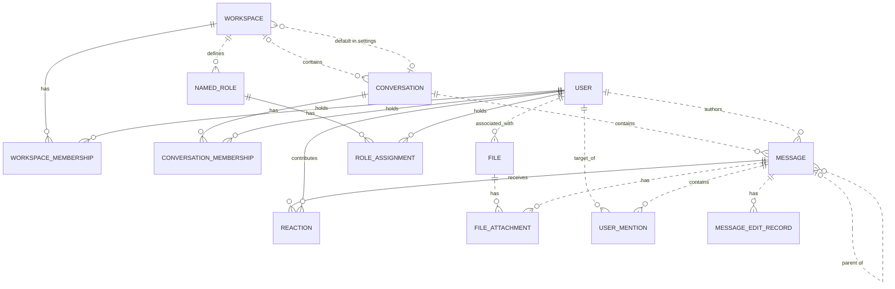

# Reviewing an assistant's work

You review what an AI assistant did for a user in an online service. You get the user's request, every step the
assistant took (its visible reasoning, each command it ran and the response), its final reply, and the changes it made
to the account's data.

Decide one thing: **did the assistant make a mistake?**

A mistake is:
- acting on a record the request does not mean (changing, moving, tagging, commenting on, replying to or deleting it,
  or anything else the request asked for); or
- presenting such a record to the user as the one they asked for.

Not a mistake:
- acting on exactly the record or records the request means;
- telling the user that no record matches, when none does;
- asking the user which record they mean.

Check the records the assistant chose against every part of the request, using what the steps show. Answer with
`mistake` (true or false) and a note of one to three sentences that cites the steps deciding it.

# How Slack's records work

The service's domain model follows. Use it to check whether a record meets the request.

# Slack conceptual model

## 1. Scope

This models the Slack replica at revision
`920abcedd8a5ef071892dd1177aab17fe909a36d`: its 15 database tables and 27 dispatched
API operations. It follows the [meta-model](../../protocols/conceptual_meta_model.md) and
[Slack contextualization](contextualization.md). Evidence identifiers below
refer to the [coverage ledger](model_source_ledger.md).

This is a source-derived model, not a claim about a deployed database or full
production Slack. Tables without an API path remain in scope. Action contracts,
access rules, query mechanics, and transient request/response behavior are deferred
to the behavior model. Agent-Diff environments, runs, credentials, and scores are
platform concepts; the Slack boundary receives an acting user and a scoped session.

## 2. Vocabulary

| Term | Meaning in this model |
|---|---|
| Workspace | Organizational context, called `Team` in storage. |
| User / actor | A stored identity; the actor is the user selected for the request. A bot is a classification of User. |
| Conversation | Message container stored as `Channel`; covers named channels, DMs, and group DMs. |
| Membership | A user's association with a workspace or conversation. These are distinct relationships. |
| Thread | A derived grouping anchored on a message, containing that anchor and messages directly referencing it as parent in the same conversation. |
| Reaction | One user's emoji reaction to one message. |
| Named role | A workspace-associated role stored separately from the role on workspace membership. |
| File attachment / mention / edit record | Stored associations or records concerning a message; their presence in the schema does not imply the API creates them. |
| Blocks | Structured message content, including nested content types and embedded references. |

## 3. Entity–relationship model

### Entities, identity, and attributes

`?` means the stored value may be null. Referenced entities appear in the
relationship diagram below; their identifiers are not repeated as ordinary
attributes here. Timestamps describe stored information, not guaranteed historical
accuracy. D-codes map every stored field and constraint in the ledger.

| Entity | Identity | Attributes | Evidence |
|---|---|---|---|
| Workspace | Workspace ID; name also unique | Name, creation time?, optional settings containing file-upload flag? and a default-conversation reference? | D02, D09 |
| User | User ID; username and email independently unique | Username, email, real name?, display name?, timezone?, title?, creation time?, last login?, active flag?, bot flag?, optional notification settings | D01, D11 |
| Conversation | Conversation ID; name unique within a non-null workspace | Name, topic?, purpose?, private/DM/group-DM flags, archived flag, creation time? | D03 |
| Workspace membership | User + workspace | Membership role? | D13 |
| Conversation membership | User + conversation | Join time? | D05 |
| Message | Message ID; exposed as API `ts` | Text?, stored type?, separate stored timestamp string?, blocks?, creation time? | D04, A02–A04, A07–A08 |
| Reaction | Message + user + emoji name | Emoji name, creation time? | D07 |
| Named role | Role ID | Role name? | D08 |
| Role assignment | User + named role | Assignment time? | D06 |
| File | File ID | Name?, size?, type?, URL?, creation time? | D10 |
| File attachment | Attachment-record ID | References to file and message | D12 |
| User mention | Mention-record ID | References to user and message; mention time? | D14 |
| Message edit record | Edit-record ID | Edited text?, edit time? | D15 |

Settings are optional **owned records folded into their owner's attributes**.
Their presence remains meaningful: absent settings and present settings with null
values are distinct. This removes two diagram nodes without losing their meaning.

### Relationships and cardinalities

The diagram describes stored relationships. `||` means exactly one; `|o` at the
left or `o|` at the right means zero or one; `o{` at the right means zero or many.
Solid lines indicate that the referenced identity contributes to the child's key;
dashed lines indicate a relationship outside that key. Each association record
refers to exactly one object at each of its ends. Identity rules above determine
whether repeated pairs are allowed.

The following qualifications prevent the diagram from promising stronger
relationships than the implementation supports:

- **Workspace links:** a conversation's workspace is nullable. Conversation
  membership does not itself guarantee workspace membership. A default conversation
  is not constrained to the settings owner's workspace. Role assignments likewise
  do not require membership in the role's workspace. (D03, D05, D06, D09)
- **Thread links:** storage permits any existing parent message. Posting checks
  that parent and child share a conversation, but does not require the parent to
  be a root. Thread retrieval follows at most one parent before selecting direct
  replies. Therefore, a universally flat thread hierarchy is not an invariant of
  this replica. (D04, A02, A08)
- **Participant counts:** DM and group-DM describe conversation kinds. Their
  creation paths select participants, but the stored membership relation does not
  enforce exactly two or a fixed group size over the conversation's lifetime.
  (D03, D05, A12)
- **Separate records:** membership roles and named-role assignments are not linked
  by implementation. File attachments and mentions allow multiple records for the
  same pair because their identities are separate IDs. (D06, D08, D12–D14)

The File–User link establishes an associated user. The schema and active API do not
establish that this user performed an upload, so the diagram does not assign that
stronger role. (D10)

### Structured content and derived representations

The chat API validates blocks as an ordered list of structured values owned by a
message. The underlying JSONB column has no constraint enforcing that shape or
its type vocabulary; data written outside these API checks can differ. Validated
content can include text and style, nested elements, user/channel identifiers, links, emoji,
image/file descriptors, labels, fields, accessories, and rows. Embedded identifiers
are not foreign keys. Uninterpreted nested content is retained as data, rather than
expanded into speculative entities. A block mentioning a user does not imply a
`UserMention` record; a file descriptor does not imply a `FileAttachment`. (H03)

| Representation | Conceptual meaning and limit | Evidence |
|---|---|---|
| Thread and reply count | Derived from an anchor and direct parent references within its conversation | A08 |
| Reaction summary | Group reactions by message and emoji; derive user list and count | A22 |
| Conversation member count | Derived from membership records | H01 |
| Latest DM message | A selected message in that conversation, ordered by creation time then ID | H01 |
| User profile | View of user attributes with fallbacks, generated fields, and constants; no independent profile entity | H02 |
| Search match | View of an existing message, author, and conversation; highlighting and generated result IDs do not change message identity | A26–A27 |

The API's message `ts` comes from `message_id`, while `thread_ts` represents a parent
or selected thread anchor. The separate database `Message.ts` is retained as a
stored attribute without assuming these are synchronized. Names and display text
are descriptions or lookup forms, not replacements for identity. (D04, H04)

Attachments echoed by chat operations are transient values, not stored file
attachments. Conversation `creator`, topic author/time, read markers, subscription
flags, sharing flags, and avatar URLs are not evidence of independently maintained
facts: their provenance is qualified in H01–H02 and A08. Named roles, role
assignments, settings, files, file attachments, mentions, and edits have no direct
access in dispatched Slack handlers or their operations at this revision. Their
foreign keys and ORM cascades still matter: deleting a message cascades to its
edit records, although updating it does not write an edit record.
(D06, D08–D12, D14–D15, H05)

## 4. States and classifications

| Subject | Stored or derived classification | Meaning and qualification | Evidence |
|---|---|---|---|
| User | Stored active and bot flags, each nullable | Active/inactive and bot/non-bot; null is unrecorded. The API supplies fallback values rather than exposing every null distinction. | D01, H02 |
| Workspace membership | Stored role, nullable | `owner`, `admin`, `member`, `guest`; API owner/admin flags derive from this role, not named-role assignments. | D13, H02 |
| Conversation | Stored `is_dm`, `is_gc`, `is_private` | Conventional types are public channel, private channel, DM (`im`), group DM (`mpim`). Keep the flags: no database constraint forbids conflicting combinations, and serializer/filter interpretations differ for such combinations. | D03, H01, A06 |
| Conversation | Stored archived flag | Archived/unarchived; independent of kind. API `is_open` is a derived value or constant, not a separate lifecycle. | D03, H01 |
| Membership | Derived existence | Present/absent; no stored pending-invitation state | D05, D13, A11 |
| Message | Derived parent presence; stored type string? | Parentless/reply; stored type is open-ended, while API message payloads commonly hard-code `message`. | D04, A02, A07–A08 |
| Reaction | Stored emoji name | Database string; API add/remove use `COMMON_REACTIONS` and normalize spelling. The finite API vocabulary does not restrict all possible seeded database values. | D07, A20–A21 |
| User settings | Stored notification level, nullable | `all`, `mentions`, `none`; no dispatched API reads it | D11 |
| Workspace settings | Stored file-upload flag, nullable | True/false/unrecorded; no dispatched API enforces it | D09 |
| Named role / file | Stored role name? / file type? | Open strings, not enumerated role permissions or a validated file taxonomy | D08, D10 |
| Message blocks | Stored type tags, checked at API boundary | Block, rich-text container, and inner-element vocabularies below; validation depth varies | H03 |

The implemented block vocabulary is `rich_text`, `markdown`, `section`, `header`,
`divider`, `image`, `context`, `actions`, `input`, `file`, `video`, `table`, and
`context_actions`. Rich-text containers are `rich_text_section`, `rich_text_list`,
`rich_text_preformatted`, and `rich_text_quote`. Inner-element tags are `text`,
`emoji`, `link`, `user`, `usergroup`, `channel`, `broadcast`, `color`, and `date`.
Accepted tags do not imply separate operational capabilities such as user-group
management or video handling. Text generation interprets only part of this vocabulary.
It also distinguishes `plain_text` from `mrkdwn` section text, ordered from other
list styles, and bold/italic/strike/code text styles; these remain content attributes.

`UserPresence` declares `active` and `away` in the source but is neither mapped to a
column nor used by dispatched handlers. It therefore adds no presence state to
this model. State transitions and validation limits belong in the behavior model.

---

# What an assistant did in Slack

## The user's request
Add a thumbsup reaction to Diego Alvarez's message about the gateway rollback in #deployments that already has exactly 3 eyes reactions.

## The assistant's steps
#### Step 1
Reasoning: The user wants me to add a thumbs-up reaction to a message in Slack. This falls under the slack skill. Let me first read the skill.
Command: read {"path": "~/.openclaw-state/7e3353eaa1e246c9/workspace-assistant/skills/slack/SKILL.md"}
Response: {"status": "success", "stdout": "---\nname: slack\ndescription: \"Slack workspace messaging and collaboration API. Use it for anything in the user's Slack account.\"\nmetadata: {\"openclaw\": {\"requires\": {\"bins\": [\"curl\"]}}}\n---\n\n# Slack\n\n## Current Session\n- **Service**: Slack\n- **Base URL**: https://slack.com/api\n- **Description**: Slack workspace messaging and collaboration API\n\n## Environment\n- You are authenticated as a user in the Slack workspace/account.\n- Authentication is handled automatically via proxy. Use placeholder tokens like `<TOKEN>` where credentials would go.\n- You execute bash commands (primarily curl) to interact with the Slack API.\n\n## API Documentation\n## auth.test\nChecks authentication & identity.\n\n**Parameters:**\n  body:\n    - `token` (string, **required**): Authentication token bearing required scopes. Tokens should be passed as an HTTP Authorization header or alternatively, as a POST parameter.\n\n## chat.delete\nDeletes a message.\n\n**Parameters:**\n  body:\n    - `token` (string, **required**): Authentication token bearing required scopes.\n    - `channel` (string, **required**): Channel containing the message to be deleted.\n    - `ts` (string, **required**): Timestamp of the message to be deleted.\n\n## chat.postMessage\nSends a message to a channel.\n\n**Parameters:**\n  body:\n    - `token` (string, **required**): Authentication token bearing required scopes.\n    - `channel` (string, **required**): Channel, private group, or IM channel to send message to. Can be an encoded ID, or a name.\n    - `text` (string, optional): The message text. Required when not using blocks or attachments.\n    - `blocks` (array, optional): A JSON-based array of structured blocks.\n    - `attachments` (array, optional): A JSON-based array of structured attachments.\n    - `thread_ts` (string, optional): Provide another message's ts value to make this message a reply.\n    - `reply_broadcast` (boolean, optional): Used with thread_ts to broadcast reply to channel. Default: false.\n    - `mrkdwn` (boolean, optional): Enable Slack markup parsing. Default: true.\n    - `unfurl_links` (boolean, optional): Enable unfurling of text-based content.\n    - `unfurl_media` (boolean, optional): Enable unfurling of media content. Default: true.\n    - `metadata` (object, optional): JSON object with event_type and event_payload fields.\n\n## chat.update\nUpdates a message.\n\n**Parameters:**\n  body:\n    - `token` (string, **required**): Authentication token bearing required scopes.\n    - `channel` (string, **required**): Channel containing the message to be updated.\n    - `ts` (string, **required**): Timestamp of the message to be updated.\n    - `text` (string, optional): New text for the message.\n    - `blocks` (array, optional): A JSON-based array of structured blocks.\n    - `attachments` (array, optional): A JSON-based array of structured attachments.\n    - `reply_broadcast` (boolean, optional): Broadcast an existing thread reply to make it visible to everyone. Default: false.\n    - `metadata` (object, optional): JSON object with event_type and event_payload fields.\n\n## conversations.archive\nArchives a conversation.\n\n**Parameters:**\n  body:\n    - `token` (string, **required**): Authentication token bearing required scopes.\n    - `channel` (string, **required**): ID of conversation to archive.\n\n## conversations.create\nInitiates a public or private channel-based conversation.\n\n**Parameters:**\n  body:\n    - `token` (string, **required**): Authentication token bearing required scopes.\n    - `name` (string, **required**): Name of the public or private channel to create.\n    - `is_private` (boolean, optional): Create a private channel instead of a public one. Default: false.\n    - `team_id` (string, optional): Encoded team id to create the channel in (required if org token is used).\n\n## conversations.history\nFetches a conversation's history of messages and events.\n\n**Parameters:**\n  body:\n    - `token` (string, **required**): Authentication token bearing required scopes.\n    - `channel` (string, **required**): Conversation ID to fetch history for.\n    - `cursor` (string, optional): Paginate through collections by setting cursor to next_cursor.\n    - `inclusive` (boolean, optional): Include messages with oldest or latest timestamps in results. Default: false.\n    - `latest` (string, optional): Only messages before this Unix timestamp will be included. Default: now.\n    - `oldest` (string, optional): Only messages after this Unix timestamp will be included. Default: 0.\n    - `limit` (integer, optional): Maximum number of items to return (max: 999). Default: 100.\n\n## conversations.info\nRetrieve information about a conversation.\n\n**Parameters:**\n  body:\n    - `token` (string, **required**): Authentication token bearing required scopes.\n    - `channel` (string, **required**): Conversation ID to learn more about.\n    - `include_locale` (boolean, optional): Set to true to receive the locale for this conversation. Default: false.\n    - `include_num_members` (boolean, optional): Set to true to include the member count. Default: false.\n\n## conversations.invite\nInvites users to a channel.\n\n**Parameters:**\n  body:\n    - `token` (string, **required**): Authentication token bearing required scopes.\n    - `channel` (string, **required**): The ID of the public or private channel to invite user(s) to.\n    - `users` (string, **required**): A comma separated list of user IDs. Up to 100 users may be listed.\n    - `force` (boolean, optional): When true, continue inviting valid users while disregarding invalid IDs. Default: false.\n\n## conversations.join\nJoins an existing conversation.\n\n**Parameters:**\n  body:\n    - `token` (string, **required**): Authentication token bearing required scopes.\n    - `channel` (string, **required**): ID of conversation to join.\n\n## conversations.kick\nRemoves a user from a conversation.\n\n**Parameters:**\n  body:\n    - `token` (string, **required**): Authentication token bearing required scopes.\n    - `channel` (string, **required**): ID of conversation to remove user from.\n    - `user` (string, **required**): User ID to be removed.\n\n## conversations.leave\nLeaves a conversation.\n\n**Parameters:**\n  body:\n    - `token` (string, **required**): Authentication token bearing required scopes.\n    - `channel` (string, **required**): Conversation to leave.\n\n## conversations.list\nLists all channels in a Slack team.\n\n**Parameters:**\n  body:\n    - `token` (string, **required**): Authentication token bearing required scopes.\n    - `cursor` (string, optional): Paginate through collections of data by setting cursor to a next_cursor value.\n    - `exclude_archived` (boolean, optional): Set to true to exclude archived channels. Default: false.\n    - `limit` (integer, optional): Maximum number of items to return (max: 1000). Default: 100.\n    - `team_id` (string, optional): Encoded team id to list channels in (required if org token is used).\n    - `types` (string, optional): Mix and match channel types: public_channel, private_channel, mpim, im. Default: public_channel.\n\n## conversations.members\nRetrieve members of a conversation.\n\n**Parameters:**\n  body:\n    - `token` (string, **required**): Authentication token bearing required scopes.\n    - `channel` (string, **required**): ID of the conversation to retrieve members for.\n    - `cursor` (string, optional): Paginate through collections by setting cursor to next_cursor.\n    - `limit` (integer, optional): Maximum number of items to return. Default: 100.\n\n## conversations.open\nOpens or resumes a direct message or multi-person direct message.\n\n**Parameters:**\n  body:\n    - `token` (string, **required**): Authentication token bearing required scopes.\n    - `channel` (string, optional): Resume a conversation by supplying an im or mpim's ID. Or provide the users field instead.\n    - `users` (string, optional): Comma separated list of user IDs. Creates a 1:1 DM for 1 user, or MPIM for multiple.\n    - `return_im` (boolean, optional): Return the full IM channel definition in the response. Default: false.\n    - `prevent_creation` (boolean, optional): Do not create a DM or MPIM. Used to check if one exists. Default: false.\n\n## conversations.rename\nRenames a conversation.\n\n**Parameters:**\n  body:\n    - `token` (string, **required**): Authentication token bearing required scopes.\n    - `channel` (string, **required**): ID of conversation to rename.\n    - `name` (string, **required**): New name for conversation.\n\n## conversations.replies\nRetrieve a thread of messages posted to a conversation.\n\n**Parameters:**\n  body:\n    - `token` (string, **required**): Authentication token bearing required scopes.\n    - `channel` (string, **required**): Conversation ID to fetch thread from.\n    - `ts` (string, **required**): Unique identifier of either a thread's p […3131 characters omitted…] rkers. Default: false.\n    - `page` (integer, optional): Page number of results to return. Default: 1.\n    - `sort` (string, optional): Return matches sorted by score or timestamp. Default: score.\n    - `sort_dir` (string, optional): Sort direction: asc or desc. Default: desc.\n    - `team_id` (string, optional): Encoded team id to search in (required if org token is used).\n\n## search.messages\nSearches for messages matching a query.\n\n**Parameters:**\n  body:\n    - `token` (string, **required**): Authentication token bearing required scopes.\n    - `query` (string, **required**): Search query.\n    - `count` (integer, optional): Number of results per page (max: 100). Default: 20.\n    - `cursor` (string, optional): For cursormark pagination. Send * for first call, then next_cursor for subsequent.\n    - `highlight` (boolean, optional): Pass true to enable query highlight markers. Default: false.\n    - `page` (integer, optional): Page number of results to return. Default: 1.\n    - `sort` (string, optional): Return matches sorted by score or timestamp. Default: score.\n    - `sort_dir` (string, optional): Sort direction: asc or desc. Default: desc.\n    - `team_id` (string, optional): Encoded team id to search in (required if org token is used).\n\n## users.conversations\nList conversations the calling user is a member of.\n\n**Parameters:**\n  body:\n    - `token` (string, **required**): Authentication token bearing required scopes.\n    - `cursor` (string, optional): Paginate through collections by setting cursor to next_cursor.\n    - `exclude_archived` (boolean, optional): Set to true to exclude archived channels. Default: false.\n    - `limit` (integer, optional): Maximum number of items to return (max: 999). Default: 100.\n    - `team_id` (string, optional): Encoded team id to list conversations in (required if org token is used).\n    - `types` (string, optional): Mix and match channel types: public_channel, private_channel, mpim, im. Default: public_channel.\n    - `user` (string, optional): Browse conversations by a specific user ID's membership.\n\n## users.info\nGets information about a user.\n\n**Parameters:**\n  body:\n    - `token` (string, **required**): Authentication token bearing required scopes.\n    - `user` (string, **required**): User to get info on.\n    - `include_locale` (boolean, optional): Set to true to receive the locale for this user. Default: false.\n\n## users.list\nLists all users in a Slack team.\n\n**Parameters:**\n  body:\n    - `token` (string, **required**): Authentication token bearing required scopes.\n    - `cursor` (string, optional): Paginate through collections by setting cursor to next_cursor.\n    - `include_locale` (boolean, optional): Set to true to receive the locale for users. Default: false.\n    - `limit` (integer, optional): Maximum number of items to return. Default: 0 (no limit).\n    - `team_id` (string, optional): Encoded team id to list users in (required if org token is used).\n"}

#### Step 2
Reasoning: What the user is asking for:
1. Find a message in #deployments that's about the gateway rollback, written by Diego Alvarez
2. Verify that the message has exactly 3 eye (👀) reactions
3. If so, add a 👍 reaction

First I need to find the channel ID for #deployments, then search for the message. Let's use conversations.list to find the channel, and then search the messages. Actually, search.messages with a query might work, but I need to know Diego's user ID. First, let me find the channel, get Diego's user info, then search messages by user within that channel.

Approach:
1. `conversations.list` → find the ID of #deployments
2. `users.list` → find Diego Alvarez's ID
3. `search.messages` with query `from:<diego_uid> in:<channel> rollback gateway` or get the history
4. `reactions.get` for each candidate message → check if 👀 count is exactly 3
5. `reactions.add` 👍

Let me start with steps 1 and 2 in parallel.
Command: curl -s -X POST "https://slack.com/api/conversations.list?token=<TOKEN>&types=public_channel&limit=1000" | python3 -c "
import json,sys
d=json.load(sys.stdin)
for c in d.get('channels',[]):
    if c['name']=='deployments':
        print(c['id'], c['name'], c.get('is_archived'))
print('ok' if d.get('ok') else d)
"
Response: {"status": "success", "stdout": "C_DEP deployments False\nok"}

#### Step 3
Reasoning: 
Command: curl -s -X POST "https://slack.com/api/users.list?token=<TOKEN>" | python3 -c "
import json,sys
d=json.load(sys.stdin)
for u in d.get('members',[]):
    real=u.get('profile',{}).get('real_name','')
    if 'diego' in real.lower():
        print(u['id'], '|', real)
"
Response: {"status": "success", "stdout": "U_DIEGO | Diego Alvarez"}

#### Step 4
Reasoning: Next, I'll search for Diego's messages about the gateway rollback within C_DEP.
Command: curl -s -X POST "https://slack.com/api/conversations.history?token=<TOKEN>&channel=C_DEP&limit=200" | python3 -c "
import json,sys
d=json.load(sys.stdin)
for m in d.get('messages',[]):
    if m.get('user')=='U_DIEGO' and 'rollback' in m.get('text','').lower():
        print(m['ts'], '|', m.get('text','')[:120])
"
Response: {"status": "success", "stdout": "(no output)"}

#### Step 5
Reasoning: No messages found in the latest 200 that contain "rollback" in their text by U_DIEGO. Let me try searching more broadly — it might be inside a thread, or the word might be different. Use search.messages with in:C_DEP from:U_DIEGO rollback, or check for the keyword "gateway".
Command: curl -s -X POST "https://slack.com/api/search.messages?token=<TOKEN>&query=in%3AC_DEP%20from%3AU_DIEGO%20rollback&count=50" | python3 -m json.tool | head -60
Response: {"status": "success", "stdout": "{\n    \"ok\": false,\n    \"error\": \"No query passed\"\n}"}

#### Step 6
Reasoning: 
Command: curl -s -X POST "https://slack.com/api/conversations.history?token=<TOKEN>&channel=C_DEP&limit=200" | python3 -c "
import json,sys
d=json.load(sys.stdin)
for m in d.get('messages',[]):
    if m.get('user')=='U_DIEGO':
        print(m['ts'], '|', m.get('text','')[:140])
"
Response: {"status": "success", "stdout": "(no output)"}

#### Step 7
Reasoning: Diego's messages weren't found in the most recent 200 history items. Let me fetch more history with pagination and also fix the search. Also, maybe Diego's messages are older. I'll try paginating through the history.
Command: curl -s -X POST "https://slack.com/api/search.messages?token=<TOKEN>&query=in%3AC_DEP%20rollback&count=50&sort=timestamp&sort_dir=desc" | python3 -c "
import json,sys
d=json.load(sys.stdin)
if not d.get('ok'): print('ERR', d); sys.exit()
for m in d['messages']['matches']:
    print(m.get('team_id'),'|',m.get('user'),'|',m.get('ts'),'|',m.get('type'),'|',m.get('text','')[:140].replace(chr(10),' '))
"
Response: {"status": "success", "stdout": "ERR {'ok': False, 'error': 'No query passed'}"}

#### Step 8
Reasoning: 
Command: curl -s -X POST "https://slack.com/api/conversations.history?token=<TOKEN>&channel=C_DEP&limit=999" | python3 -c "
import json,sys
d=json.load(sys.stdin)
msgs=d.get('messages',[])
print('total in page:', len(msgs), 'has_more:', d.get('has_more'), 'oldest:', msgs[-1]['ts'] if msgs else None)
for m in msgs:
    if m.get('user')=='U_DIEGO':
        print(m['ts'], '|', m.get('text','')[:140])
"
Response: {"status": "success", "stdout": "total in page: 0 has_more: None oldest: None"}

#### Step 9
Reasoning: The user is repeating the same request. I was in the middle of investigating. The conversations.history call returned 0 messages, and search returned "No query passed". Let me check the raw response and understand what's going on. The channel C_DEP exists (is_archived is False). Maybe I need to fetch the raw history and see the actual structure. The message might be in a thread, or maybe the history call failed. Let me dump the raw response.
Command: echo '--- history raw ---'
curl -s -X POST "https://slack.com/api/conversations.history?token=<TOKEN>&channel=C_DEP&limit=999"
echo
echo '--- search raw ---'
curl -s -X POST "https://slack.com/api/search.messages?token=<TOKEN>&query=in%3AC_DEP+rollback&count=50"
Response: {"status": "success", "stdout": "--- history raw ---\n{\"ok\":false,\"error\":\"invalid_arguments\",\"response_metadata\":{\"messages\":[\"[ERROR] missing required field: channel\"]}}\n--- search raw ---\n{\"ok\":false,\"error\":\"No query passed\"}"}

#### Step 10
Reasoning: The skill says the parameters go in the body. The API docs say "body" for parameters. My GET-style query string may not be parsed. Let me use -d data for the body parameters.

The skill says parameters go in the request body. Let me retry with body params:
Command: echo '--- history ---'
curl -s -X POST "https://slack.com/api/conversations.history" -d "token=<TOKEN>" -d "channel=C_DEP" -d "limit=999" | python3 -c "
import json,sys
d=json.load(sys.stdin)
msgs=d.get('messages',[])
print('ok:',d.get('ok'),'| count:',len(msgs))
for m in msgs:
    if m.get('user')=='U_DIEGO':
        print(m['ts'],'|',m.get('text','')[:140].replace(chr(10),' '))
"
Response: {"status": "success", "stdout": "--- history ---\nok: True | count: 5\n1789994100.000006 | Deploy freeze starts Friday, please hold non-urgent releases.\n1789992420.000004 | Gateway rollback finished ahead of schedule.\n1789992360.000003 | Gateway rollback completed, keeping an eye on the dashboards.\n1789992300.000002 | Gateway rollback looks good from my side, confirming.\n1789992120.000001 | Gateway rollback is done, error rate is back to normal."}

#### Step 11
Reasoning: 
Command: echo '--- search ---'
curl -s -X POST "https://slack.com/api/search.messages" -d "token=<TOKEN>" -d "query=in:C_DEP rollback" -d "count=50" -d "sort=timestamp" -d "sort_dir=desc" | python3 -c "
import json,sys
d=json.load(sys.stdin)
if not d.get('ok'): print('ERR', d); sys.exit()
for m in d['messages']['matches']:
    print(m.get('user'),'|',m.get('ts'),'|',m.get('channel'),'|',m.get('text','')[:140].replace(chr(10),' '))
"
Response: {"status": "success", "stdout": "--- search ---\nU_DIEGO | 1789992420.000004 | {'id': 'C_DEP', 'name': 'deployments', 'is_private': False, 'is_mpim': False, 'is_ext_shared': False, 'is_org_shared': False, 'is_pending_ext_shared': False, 'is_shared': False, 'pending_shared': []} | Gateway rollback finished ahead of schedule.\nU_DIEGO | 1789992360.000003 | {'id': 'C_DEP', 'name': 'deployments', 'is_private': False, 'is_mpim': False, 'is_ext_shared': False, 'is_org_shared': False, 'is_pending_ext_shared': False, 'is_shared': False, 'pending_shared': []} | Gateway rollback completed, keeping an eye on the dashboards.\nU_DIEGO | 1789992300.000002 | {'id': 'C_DEP', 'name': 'deployments', 'is_private': False, 'is_mpim': False, 'is_ext_shared': False, 'is_org_shared': False, 'is_pending_ext_shared': False, 'is_shared': False, 'pending_shared': []} | Gateway rollback looks good from my side, confirming.\nU_DIEGO | 1789992120.000001 | {'id': 'C_DEP', 'name': 'deployments', 'is_private': False, 'is_mpim': False, 'is_ext_shared': False, 'is_org_shared': False, 'is_pending_ext_shared': False, 'is_shared': False, 'pending_shared': []} | Gateway rollback is done, error rate is back to normal."}

#### Step 12
Reasoning: Diego's message about the gateway rollback — there are 4 messages. The user says "the message" — I need to find the one that has exactly 3 eye reactions. Let me check the reactions for each of the 4 messages.

Diego posted several rollback messages. Now checking which one has exactly 3 eyes reactions:
Command: for ts in 1789992120.000001 1789992300.000002 1789992360.000003 1789992420.000004; do
  echo "--- $ts ---"
  curl -s -X POST "https://slack.com/api/reactions.get" -d "token=<TOKEN>" -d "channel=C_DEP" -d "timestamp=$ts" -d "full=true" | python3 -c "
import json,sys
d=json.load(sys.stdin)
for r in d.get('message',{}).get('reactions',[]):
    print(r.get('name'), '->', len(r.get('users',[])), r.get('users'))
"
done
Response: {"status": "success", "stdout": "--- 1789992120.000001 ---\neyes -> 3 ['U_LEO', 'U_OMAR', 'U_PRIYA']\n--- 1789992300.000002 ---\nthumbsup -> 1 ['U_LEO']\ntada -> 1 ['U_OMAR']\neyes -> 1 ['U_PRIYA']\n--- 1789992360.000003 ---\neyes -> 2 ['U_LEO', 'U_PRIYA']\n--- 1789992420.000004 ---\neyes -> 5 ['U_AISHA', 'U_LEO', 'U_MAYA', 'U_OMAR', 'U_PRIYA']"}

#### Step 13
Reasoning: The message with exactly 3 eyes reactions is 1789992120.000001 ("The gateway rollback is complete, and the error rate has returned to normal."), and Diego is its author. Adding a thumbs up.

I found the right message with exactly 3 eyes reactions and I'm adding a thumbs up now.
Command: curl -s -X POST "https://slack.com/api/reactions.add" -d "token=<TOKEN>" -d "channel=C_DEP" -d "name=thumbsup" -d "timestamp=1789992120.000001"
Response: {"status": "success", "stdout": "{\"ok\":true}"}

#### Step 14
Reasoning: Done. Let's verify right away.
Command: curl -s -X POST "https://slack.com/api/reactions.get" -d "token=<TOKEN>" -d "channel=C_DEP" -d "timestamp=1789992120.000001" -d "full=true" | python3 -c "
import json,sys
d=json.load(sys.stdin)
for r in d.get('message',{}).get('reactions',[]):
    print(r.get('name'),'->',len(r.get('users',[])), r.get('users'))
"
Response: {"status": "success", "stdout": "thumbsup -> 1 ['U01AGENBOT9']\neyes -> 3 ['U_LEO', 'U_OMAR', 'U_PRIYA']"}

#### Step 15
Reasoning: Complete. Added a thumbs up to the correct message. Reporting back concisely.

Done. There were four Diego Alvarez rollback messages in #deployments, so I checked each one's reactions and reacted on the one that had exactly 3 eyes reactions — *"Gateway rollback is done, error rate is back to normal."*

Verified after: that message now has 3 👀 (Leo, Omar, Priya) plus 1 👍 (me). The others had 1, 2, or 5 eyes, so I left them alone.
Command: 
Response: null

## The assistant's final reply
Done. There were four Diego Alvarez rollback messages in #deployments, so I checked each one's reactions and reacted on the one that had exactly 3 eyes reactions — *"Gateway rollback is done, error rate is back to normal."*

Verified after: that message now has 3 👀 (Leo, Omar, Priya) plus 1 👍 (me). The others had 1, 2, or 5 eyes, so I left them alone.

## Changes it made to the account's data
- INSERT message_reactions: {"message_id": "1789992120.000001", "user_id": "U01AGENBOT9", "reaction_type": "thumbsup", "created_at": "2026-09-28T03:52:41.318369"}

Did the assistant make a mistake?