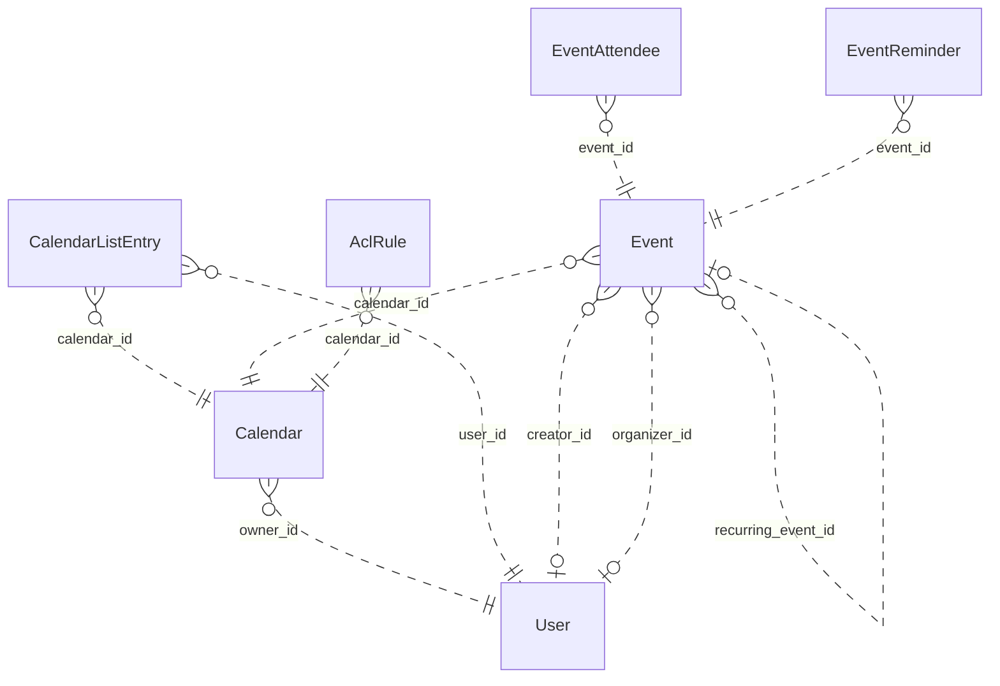

# Reviewing an assistant's work

You review what an AI assistant did for a user in an online service. You get the user's request, every step the
assistant took (its visible reasoning, each command it ran and the response), its final reply, and the changes it made
to the account's data.

Decide one thing: **did the assistant make a mistake?**

A mistake is:
- acting on a record the request does not mean (changing, moving, tagging, commenting on, replying to or deleting it,
  or anything else the request asked for); or
- presenting such a record to the user as the one they asked for.

Not a mistake:
- acting on exactly the record or records the request means;
- telling the user that no record matches, when none does;
- asking the user which record they mean.

Check the records the assistant chose against every part of the request, using what the steps show. Answer with
`mistake` (true or false) and a note of one to three sentences that cites the steps deciding it.

# How Google Calendar's records work

The service's domain model follows. Use it to check whether a record meets the request.

# Calendar conceptual model

## Scope

Implemented AgentDiff replica at `4691d3f076db2cdcccdc840c110aa797fa3196dc`. Extracted manually under the [adopted protocol](../../protocols/conceptual_meta_model.md) and [contextualization](contextualization.md). The implementation is authoritative; local API documentation supports terminology. This is not a model of the entire public service.

Full field declarations, constraints, source hashes and dispatched operations are retained in [source_inventory.json](source_inventory.json). [model.json](model.json) records the reviewed entity/relationship decisions; [the ledger](model_source_ledger.md) records dispositions and the reverse audit. API exposure is a separate qualification: an unexposed domain concept remains in the structural model.

## Vocabulary and entities

| Entity | Meaning | Source |
|---|---|---|
| User | Local account identity, email and display name, with a keyed setting-value collection. | [schema.py:104](../../../backend/src/services/calendar/database/schema.py) |
| Calendar | Scheduling container with an owning local account and presentation settings. | [schema.py:141](../../../backend/src/services/calendar/database/schema.py) |
| CalendarListEntry | A user’s inclusion of a calendar in their list, with access role and per-user presentation/preferences. | [schema.py:193](../../../backend/src/services/calendar/database/schema.py) |
| Event | Scheduled record, recurring master, or persisted exception; virtual occurrences are derived Event representations. | [schema.py:258](../../../backend/src/services/calendar/database/schema.py) |
| EventAttendee | Event-specific participation by an email-addressed person/resource, including RSVP state. Not necessarily a local User. | [schema.py:465](../../../backend/src/services/calendar/database/schema.py) |
| EventReminder | Stored event-owned reminder record (method and minutes). Separate from the JSON reminder policy used by API responses. | [schema.py:516](../../../backend/src/services/calendar/database/schema.py) |
| AclRule | Calendar access grant to a tagged scope (default, user, group, domain); scope values are not local User foreign keys. | [schema.py:544](../../../backend/src/services/calendar/database/schema.py) |

## Entity–relationship model

The attributes below retain real implementation names. Reference columns are represented by named relationships in the following table; they are not additional scalar concepts. Structured JSON values remain structured attributes unless the implementation gives them relationship meaning. Stored snapshots/caches are retained even when API writers usually synchronize them.

| Entity | Identity and extra uniqueness | Stored values outside declared FKs |
|---|---|---|
| User | PK `id`; unique `email` | `email`, `display_name`, `self_`, `created_at`, `updated_at` |
| Calendar | PK `id` | `summary`, `description`, `location`, `time_zone`, `etag`, `conference_properties`, `auto_accept_invitations`, `data_owner`, `created_at`, `updated_at`, `deleted` |
| CalendarListEntry | PK `id`; see exact composite constraints/indexes in inventory | `etag`, `access_role`, `summary_override`, `description_override`, `color_id`, `background_color`, `foreground_color`, `hidden`, `selected`, `primary`, `deleted`, `default_reminders`, `notification_settings`, `created_at`, `updated_at` |
| Event | PK `id`; see exact composite constraints/indexes in inventory | `etag`, `status`, `html_link`, `summary`, `description`, `location`, `color_id`, `creator_email`, `organizer_email`, `creator_display_name`, `organizer_display_name`, `creator_profile_id`, `organizer_profile_id`, `creator_self`, `organizer_self`, `start`, `end`, `start_datetime`, `end_datetime`, `start_date`, `end_date`, `end_time_unspecified`, `recurrence`, `recurring_event_id`, `original_start_time`, `transparency`, `visibility`, `ical_uid`, `sequence`, `guests_can_invite_others`, `guests_can_modify`, `guests_can_see_other_guests`, `anyone_can_add_self`, `private_copy`, `locked`, `attendees_omitted`, `hangout_link`, `conference_data`, `attachments`, `extended_properties`, `source`, `gadget`, `reminders`, `event_type`, `working_location_properties`, `out_of_office_properties`, `focus_time_properties`, `birthday_properties`, `created_at`, `updated_at` |
| EventAttendee | PK `id`; see exact composite constraints/indexes in inventory | `email`, `display_name`, `organizer`, `self_`, `resource`, `optional`, `response_status`, `comment`, `additional_guests`, `profile_id` |
| EventReminder | PK `id`; see exact composite constraints/indexes in inventory | `method`, `minutes` |
| AclRule | PK `id`; see exact composite constraints/indexes in inventory | `etag`, `role`, `scope_type`, `scope_value`, `created_at`, `updated_at`, `deleted` |

Folded values preserve their storage identity and existence:

- **Setting → User**: Unique (user, setting key) values; preserve record id/etag/presence in User.settings. Fields: `id`, `user_id`, `setting_id`, `value`, `etag`.

### Relationships

`Targets/source` means the number of target records for one source record; `sources/target` is the inverse. These are storage-supported cardinalities, not stronger implications of ORM presentation or public API documentation. FK roles are named by their actual source columns. Interpreted references have their subtype/integrity qualifications below.

| Relationship / role | Source → target | Targets/source | Sources/target | Evidence |
|---|---|---|---|---|
| `Calendar.owner_id` | Calendar → User | 1 | 0..* | [schema.py:163](../../../backend/src/services/calendar/database/schema.py) |
| `CalendarListEntry.user_id` | CalendarListEntry → User | 1 | 0..* | [schema.py:207](../../../backend/src/services/calendar/database/schema.py) |
| `CalendarListEntry.calendar_id` | CalendarListEntry → Calendar | 1 | 0..* | [schema.py:210](../../../backend/src/services/calendar/database/schema.py) |
| `Event.calendar_id` | Event → Calendar | 1 | 0..* | [schema.py:282](../../../backend/src/services/calendar/database/schema.py) |
| `Event.creator_id` | Event → User | 0..1 | 0..* | [schema.py:297](../../../backend/src/services/calendar/database/schema.py) |
| `Event.organizer_id` | Event → User | 0..1 | 0..* | [schema.py:300](../../../backend/src/services/calendar/database/schema.py) |
| `EventAttendee.event_id` | EventAttendee → Event | 1 | 0..* | [schema.py:479](../../../backend/src/services/calendar/database/schema.py) |
| `EventReminder.event_id` | EventReminder → Event | 1 | 0..* | [schema.py:526](../../../backend/src/services/calendar/database/schema.py) |
| `AclRule.calendar_id` | AclRule → Calendar | 1 | 0..* | [schema.py:560](../../../backend/src/services/calendar/database/schema.py) |
| `Event.recurring_event_id` | Event → Event | 0..1 | 0..* | [operations.py:2031](../../../backend/src/services/calendar/database/operations.py) |

ER diagram (all relationship roles)

Solid lines mean the referenced identity contributes to the child entity’s key; dashed lines mean it does not. Contracted pair associations are shown as many-to-many links, with their pair keys preserved in the source inventory. This matches Slack’s identifying/non-identifying notation and does not change graph connectivity.

### Representations and qualifications

- **C1: Identity and scope.** Event.id is a global storage primary key, despite calendar-scoped URLs. iCalUID is indexed but not unique. CalendarListEntry has a private storage id and unique (user_id,calendar_id); the response id is calendar_id. EventAttendee has its own storage id and unique (event_id,email). ACL scope uniqueness includes a nullable scope_value and must not be read as strict uniqueness for SQL NULL. Sources: [schema.py](../../../backend/src/services/calendar/database/schema.py), [serializers.py](../../../backend/src/services/calendar/core/serializers.py).
- **C2: Local accounts versus person values.** Event creator_id and organizer_id refer to local User records, but the API serializes separately stored email/display/profile/self fields. An imported organizer can disagree with the local organizer FK. Calendar.dataOwner may use a separately stored value, with owner email as a fallback; it does not always reveal owner_id. Preserve these distinctions. Attendee email, ACL scope and conference participant data do not imply local User records. Sources: [operations.py](../../../backend/src/services/calendar/database/operations.py), [serializers.py](../../../backend/src/services/calendar/core/serializers.py).
- **C3: Reminders and settings.** EventReminder is a stored, separately identified event-owned record retained in the full model. API event serialization uses Event.reminders JSON instead; no read/write operation maintains the separate table. User Setting records are folded into keyed User.settings values, retaining id/etag/existence. settings.get can return virtual defaults that settings.list does not enumerate. Sources: [schema.py](../../../backend/src/services/calendar/database/schema.py), [serializers.py](../../../backend/src/services/calendar/core/serializers.py).
- **C4: Recurrence.** A master Event carries recurrence rules; occurrences are derived Event views or stored exceptions linked by recurring_event_id and original_start_time. Instance IDs encode master and occurrence time. Recurrence windows and exception merging are computed views, not extra independent entities. The counting rule excludes the self relationship, so these counts do not exhaust recurring-event identification patterns. Sources: [operations.py](../../../backend/src/services/calendar/database/operations.py), [utils.py](../../../backend/src/services/calendar/core/utils.py).
- **C5: Structured values.** Start/end JSON and denormalized datetime/date columns remain separately represented. Conference data, external attachments, extended properties, source/gadget, guest policy, notification settings and event-type properties are values, not invented managed-file/contact/conference entities. Free/busy intervals are derived from stored events; this helper does not expand recurring masters. Colors are fixed response constants. Sources: [operations.py](../../../backend/src/services/calendar/database/operations.py), [serializers.py](../../../backend/src/services/calendar/core/serializers.py).
- **C6: Actor and access scope.** CalendarList and settings operations are for the current actor; there is no general user-directory/list-other-users-calendars endpoint. Access may derive from list entries, owner or user/domain/default ACL matching; group expansion is not implemented. Access roles and visibility are modeled without assuming every permission/type restriction from the public API is enforced. Sources: [operations.py](../../../backend/src/services/calendar/database/operations.py), [methods.py](../../../backend/src/services/calendar/api/methods.py).
- **C7: Deferred interface state.** Channel and SyncToken tables preserve watch delivery metadata/cursor state. All their fields remain in the source ledger but are deferred to interface/behavior modeling. Watch handlers create registrations; source contains no push delivery service. Batch wraps the same 37 scheduling/interface handlers rather than adding domain objects. Sources: [batch.py](../../../backend/src/services/calendar/api/batch.py), [operations.py](../../../backend/src/services/calendar/database/operations.py).
- **C8: Documentation differences.** Moving an event changes calendar_id without rewriting organizer payload/FK. Public move documentation says organizer changes. Settings defaults and replacement/update semantics must follow handlers, not assume complete public Google Calendar behavior. Creation/update do not copy every stored attendee property. Sources: [operations.py](../../../backend/src/services/calendar/database/operations.py), [methods.py](../../../backend/src/services/calendar/api/methods.py).

Derived representations do not add independent base-graph entities or duplicate edges:

- Virtual recurrence occurrences, time-zone formatted start/end and merged exception lists.
- Current actor’s primary-calendar alias and per-user calendar list presentation.
- Free/busy intervals, access-role derivation, fixed color palettes and setting defaults.

## States and classifications

Boolean flags, status/type strings, archive/deletion timestamps and structured policy values are attributes of their owning entity. A stored value does not prove a transition, permission check or background service is implemented. The explicit enum declarations are:

| Declaration | Values | Interpretation |
|---|---|---|
| AccessRole | `none`, `freeBusyReader`, `reader`, `writer`, `owner` | Stored/API vocabulary; use only on the fields whose implementation uses it |
| EventStatus | `confirmed`, `tentative`, `cancelled` | Stored/API vocabulary; use only on the fields whose implementation uses it |
| EventTransparency | `opaque`, `transparent` | Stored/API vocabulary; use only on the fields whose implementation uses it |
| EventVisibility | `default`, `public`, `private`, `confidential` | Stored/API vocabulary; use only on the fields whose implementation uses it |
| EventType | `default`, `outOfOffice`, `focusTime`, `workingLocation`, `fromGmail`, `birthday` | Stored/API vocabulary; use only on the fields whose implementation uses it |
| AttendeeResponseStatus | `needsAction`, `declined`, `tentative`, `accepted` | Stored/API vocabulary; use only on the fields whose implementation uses it |
| AclScopeType | `default`, `user`, `group`, `domain` | Stored/API vocabulary; use only on the fields whose implementation uses it |
| ReminderMethod | `email`, `popup` | Stored/API vocabulary; use only on the fields whose implementation uses it |

---

# What an assistant did in Google Calendar

## The user's request
Hide the 'Design Team' calendar in my calendar list that I've shared with Kenji Sato as a writer. If there isn't one, just tell me.

## The assistant's steps
#### Step 1
Reasoning: I need to investigate this further. Let me check the details.

The user is asking to hide the "Design Team" calendar in Google Calendar that they shared with Kenji Sato as a writer. First, I need to read the google-calendar skill.
Command: read {"path": "~/.openclaw-state/8b439917d30e428d/workspace-assistant/skills/google-calendar/SKILL.md"}
Response: {"status": "success", "stdout": "---\nname: google-calendar\ndescription: \"Google Calendar scheduling and events API. Use it for anything in the user's Google Calendar account.\"\nmetadata: {\"openclaw\": {\"requires\": {\"bins\": [\"curl\"]}}}\n---\n\n# Google Calendar\n\n## Current Session\n- **Service**: Google Calendar\n- **Base URL**: https://www.googleapis.com/calendar/v3\n- **Description**: Google Calendar scheduling and events API\n\n## Environment\n- You are authenticated as a user in the Google Calendar workspace/account.\n- Authentication is handled automatically via proxy. Use placeholder tokens like `<TOKEN>` where credentials would go.\n- You execute bash commands (primarily curl) to interact with the Google Calendar API.\n\n## API Documentation\nThe endpoint documentation is split by resource into the files below (in this skill's `references/` folder). Read the file for the resource you need.\n\n- `references/events-1.md`: GET /calendars/{calendarId}/events/{eventId}; POST /calendars/{calendarId}/events; PATCH /calendars/{calendarId}/events/{eventId}\n- `references/events-2.md`: GET /calendars/{calendarId}/events; DELETE /calendars/{calendarId}/events/{eventId}; GET /calendars/{calendarId}/events/{eventId}/instances; POST /calendars/{calendarId}/events/import; PUT /calendars/{calendarId}/events/{eventId}; POST /calendars/{calendarId}/events/quickAdd; POST /calendars/{calendarId}/events/watch\n- `references/events-3.md`: POST /calendars/{calendarId}/events/{eventId}/move\n- `references/acl.md`: POST /calendars/{calendarId}/acl; GET /calendars/{calendarId}/acl; DELETE /calendars/{calendarId}/acl/{ruleId}; GET /calendars/{calendarId}/acl/{ruleId}; PATCH /calendars/{calendarId}/acl/{ruleId}; PUT /calendars/{calendarId}/acl/{ruleId}; POST /calendars/{calendarId}/acl/watch\n- `references/other.md`: POST /freeBusy; GET /users/me/settings/{setting}; POST /users/me/settings/watch; GET /users/me/settings; GET /colors; POST /channels/stop\n- `references/calendars.md`: GET /calendars/{calendarId}; POST /calendars; PATCH /calendars/{calendarId}; DELETE /calendars/{calendarId}; POST /calendars/{calendarId}/clear; PUT /calendars/{calendarId}\n- `references/calendar-list.md`: GET /users/me/calendarList; POST /users/me/calendarList; PATCH /users/me/calendarList/{calendarId}; DELETE /users/me/calendarList/{calendarId}; GET /users/me/calendarList/{calendarId}; PUT /users/me/calendarList/{calendarId}; POST /users/me/calendarList/watch\n"}

#### Step 2
Reasoning: User's request: Hide the "Design Team" calendar that was shared with Kenji Sato as a writer from the calendar list. In other words, I need to find a calendar named "Design Team" in the calendar list where Kenji Sato is a writer (role: writer in the ACL), and set hidden: true via a PATCH to the calendar list.

First, let me check calendar-list.md for the details of PATCH /users/me/calendarList/{calendarId}.
Command: read {"path": "~/.openclaw-state/8b439917d30e428d/workspace-assistant/skills/google-calendar/references/calendar-list.md"}
Response: {"status": "success", "stdout": "# Google Calendar API: calendar-list\n\n## GET /users/me/calendarList\nReturns the calendars on the user's calendar list.\n\n**Parameters:**\n  path:\n  query:\n    - `maxResults` (integer, optional): Maximum number of entries returned on one result page. By default the value is 100 entries. The page size can never be larger than 250 entries.\n    - `minAccessRole` (string, optional): The minimum access role for the user in the returned entries. The default is no restriction. Acceptable values: 'freeBusyReader', 'owner', 'reader', 'writer'.\n    - `pageToken` (string, optional): Token specifying which result page to return.\n    - `showDeleted` (boolean, optional): Whether to include deleted calendar list entries in the result. The default is False.\n    - `showHidden` (boolean, optional): Whether to show hidden entries. The default is False.\n    - `syncToken` (string, optional): Token obtained from the nextSyncToken field returned on the last page of results from the previous list request. Makes the result contain only entries that have changed since then. Cannot be specified together with minAccessRole.\n\n## POST /users/me/calendarList\nInserts an existing calendar into the user's calendar list (subscribes to it). Used for adding shared calendars, public calendars, or resource calendars to your list.\n\n**Parameters:**\n  query:\n    - `colorRgbFormat` (boolean, optional): Whether to use foregroundColor/backgroundColor fields (RGB hex) instead of colorId. Default: false.\n  body:\n    - `id` (string, **required**): Identifier of the calendar to subscribe to (calendar ID or email).\n    - `colorId` (string, optional): Color ID (1-24) from the calendar colors palette.\n    - `backgroundColor` (string, optional): Main color in hex format '#0088aa'. Requires colorRgbFormat=true.\n    - `foregroundColor` (string, optional): Text color in hex format '#ffffff'. Requires colorRgbFormat=true.\n    - `hidden` (boolean, optional): Whether to hide the calendar from the list. Default: false.\n    - `selected` (boolean, optional): Whether calendar content shows in the UI. Default: false.\n    - `summaryOverride` (string, optional): Custom display name for this calendar (user-specific).\n    - `defaultReminders` (array, optional): Default reminders for events on this calendar.\n    - `notificationSettings` (object, optional): Notification preferences for this calendar.\n\n## PATCH /users/me/calendarList/{calendarId}\nUpdates an existing calendar on the user's calendar list. Supports patch semantics - only specified fields are updated. Consumes 3 quota units (prefer GET + UPDATE for efficiency).\n\n**Parameters:**\n  path:\n    - `calendarId` (string, **required**): Calendar identifier. Use 'primary' for the user's primary calendar.\n  query:\n    - `colorRgbFormat` (boolean, optional): Whether to use foregroundColor/backgroundColor fields (RGB hex). Default: false.\n  body:\n    - `colorId` (string, optional): Color ID (1-24) from the calendar colors palette.\n    - `backgroundColor` (string, optional): Main color in hex format '#0088aa'. Requires colorRgbFormat=true.\n    - `foregroundColor` (string, optional): Text color in hex format '#ffffff'. Requires colorRgbFormat=true.\n    - `hidden` (boolean, optional): Whether to hide the calendar from the list.\n    - `selected` (boolean, optional): Whether calendar content shows in the UI.\n    - `summaryOverride` (string, optional): Custom display name for this calendar.\n    - `defaultReminders` (array, optional): Default reminders. If specified, overwrites existing array.\n    - `notificationSettings` (object, optional): Notification preferences.\n\n## DELETE /users/me/calendarList/{calendarId}\nRemoves a calendar from the user's calendar list (unsubscribes). Does NOT delete the calendar itself - only removes it from the user's view. The calendar and its events remain intact for other users.\n\n**Parameters:**\n  path:\n    - `calendarId` (string, **required**): Calendar identifier to remove from the list.\n\n## GET /users/me/calendarList/{calendarId}\nReturns a specific calendar from the user's calendar list. Use this to check if a user is subscribed to a calendar and view their personalized settings for it (color, visibility, reminders, etc.).\n\n**Parameters:**\n  path:\n    - `calendarId` (string, **required**): Calendar identifier. Use 'primary' for the user's primary calendar.\n\n## PUT /users/me/calendarList/{calendarId}\nUpdates an existing calendar on the user's calendar list by fully replacing the entry. Unlike PATCH, unspecified fields may be reset to defaults. Use GET followed by PUT for atomic updates with etags.\n\n**Parameters:**\n  path:\n    - `calendarId` (string, **required**): Calendar identifier.\n  query:\n    - `colorRgbFormat` (boolean, optional): Whether to use backgroundColor/foregroundColor fields (true) or colorId field (false). Default: false.\n  body:\n    - `summaryOverride` (string, optional): User's custom title for this calendar.\n    - `colorId` (string, optional): Color ID from calendar colors palette (1-24).\n    - `backgroundColor` (string, optional): Background color as hex (#rrggbb). Requires colorRgbFormat=true.\n    - `foregroundColor` (string, optional): Foreground color as hex (#rrggbb). Requires colorRgbFormat=true.\n    - `hidden` (boolean, optional): Whether calendar is hidden from the list.\n    - `selected` (boolean, optional): Whether calendar content is shown in the calendar UI.\n    - `defaultReminders` (array, optional): Default reminders for events. Will be cleared if not specified.\n    - `notificationSettings` (object, optional): Notification settings for the calendar.\n\n## POST /users/me/calendarList/watch\nWatch for changes to CalendarList resources. Receive push notifications when calendars are added, removed, or modified in the user's calendar list.\n\n**Parameters:**\n  path:\n    None (account-wide)\n  query:\n    None\n  body:\n    - `id` (string, **required**): Unique channel ID (UUID recommended, max 64 chars). Must be unique across all channels.\n    - `type` (string, **required**): Type of delivery mechanism. Must be 'web_hook'.\n    - `address` (string, **required**): HTTPS URL where notifications are delivered. Must be registered in GCP Console.\n    - `token` (string, optional): Arbitrary string for verification (max 256 chars). Returned in X-Goog-Channel-Token header.\n    - `params` (object, optional):\n"}

#### Step 3
Reasoning: I need to find a calendar in the user's calendar list that satisfies the following conditions:
1. The name is "Design Team"
2. Shared with Kenji Sato as a writer (i.e., in the ACL, Kenji Sato has the writer role)

Wait — "shared with Kenji Sato as a writer" means that Kenji Sato has the "writer" access role in the calendar's ACL. Let me first get the calendar list, find the calendar named "Design Team", and then check its ACL.
Command: curl -s "https://www.googleapis.com/calendar/v3/users/me/calendarList?showHidden=true" -H "Authorization: Bearer <TOKEN>" | python3 -m json.tool | head -100
Response: {"status": "success", "stdout": "{\n    \"kind\": \"calendar#calendarList\",\n    \"items\": [\n        {\n            \"kind\": \"calendar#calendarListEntry\",\n            \"etag\": \"\\\"etag_cle_design-sync@northwind.example\\\"\",\n            \"id\": \"design-sync@northwind.example\",\n            \"accessRole\": \"owner\",\n            \"summary\": \"Design Team\",\n            \"timeZone\": \"America/Los_Angeles\",\n            \"conferenceProperties\": {\n                \"allowedConferenceSolutionTypes\": [\n                    \"hangoutsMeet\"\n                ]\n            },\n            \"dataOwner\": \"jordan.lee@northwind.example\",\n            \"backgroundColor\": \"#9fc6e7\",\n            \"foregroundColor\": \"#000000\",\n            \"hidden\": false,\n            \"selected\": true,\n            \"defaultReminders\": []\n        },\n        {\n            \"kind\": \"calendar#calendarListEntry\",\n            \"etag\": \"\\\"etag_cle_jordan.lee@northwind.example\\\"\",\n            \"id\": \"jordan.lee@northwind.example\",\n            \"accessRole\": \"owner\",\n            \"summary\": \"jordan.lee@northwind.example\",\n            \"description\": \"Primary calendar\",\n            \"timeZone\": \"America/Los_Angeles\",\n            \"conferenceProperties\": {\n                \"allowedConferenceSolutionTypes\": [\n                    \"hangoutsMeet\"\n                ]\n            },\n            \"dataOwner\": \"jordan.lee@northwind.example\",\n            \"backgroundColor\": \"#9fc6e7\",\n            \"foregroundColor\": \"#000000\",\n            \"hidden\": false,\n            \"selected\": true,\n            \"primary\": true,\n            \"defaultReminders\": [],\n            \"notificationSettings\": {\n                \"notifications\": [\n                    {\n                        \"type\": \"eventCreation\",\n                        \"method\": \"email\"\n                    },\n                    {\n                        \"type\": \"eventChange\",\n                        \"method\": \"email\"\n                    },\n                    {\n                        \"type\": \"eventCancellation\",\n                        \"method\": \"email\"\n                    },\n                    {\n                        \"type\": \"eventResponse\",\n                        \"method\": \"email\"\n                    }\n                ]\n            }\n        },\n        {\n            \"kind\": \"calendar#calendarListEntry\",\n            \"etag\": \"\\\"etag_cle_marketing@northwind.example\\\"\",\n            \"id\": \"marketing@northwind.example\",\n            \"accessRole\": \"owner\",\n            \"summary\": \"Marketing\",\n            \"timeZone\": \"America/Los_Angeles\",\n            \"conferenceProperties\": {\n                \"allowedConferenceSolutionTypes\": [\n                    \"hangoutsMeet\"\n                ]\n            },\n            \"dataOwner\": \"jordan.lee@northwind.example\",\n            \"backgroundColor\": \"#9fc6e7\",\n            \"foregroundColor\": \"#000000\",\n            \"hidden\": false,\n            \"selected\": true,\n            \"defaultReminders\": []\n        }\n    ],\n    \"etag\": \"\\\"3e5220e99d4b22a3\\\"\",\n    \"nextSyncToken\": \"sync_20180617000000000000_7RZtaEnBPmw9cX5s1S19GQ\"\n}"}

#### Step 4
Reasoning: I found the "Design Team" calendar (design-sync@northwind.example). Next, I need to verify whether it's shared with Kenji Sato as a writer. Let me check the ACL of that calendar.
Command: read {"path": "~/.openclaw-state/8b439917d30e428d/workspace-assistant/skills/google-calendar/references/acl.md"}
Response: {"status": "success", "stdout": "# Google Calendar API: acl\n\n## POST /calendars/{calendarId}/acl\nCreates an access control rule.\n\n**Parameters:**\n  path:\n    - `calendarId` (string, **required**): Calendar identifier. To retrieve calendar IDs call the calendarList.list method. If you want to access the primary calendar of the currently logged in user, use the 'primary' keyword.\n  query:\n    - `sendNotifications` (boolean, optional): Whether to send notifications about the calendar sharing change. Optional. The default is True.\n\n## GET /calendars/{calendarId}/acl\nReturns the rules in the access control list for the calendar. Used to find existing permissions and rule IDs (formatted as 'user:email', 'group:email', 'domain:name', or 'default') for updates/deletes.\n\n**Parameters:**\n  path:\n    - `calendarId` (string, **required**): Calendar identifier. Use 'primary' for the user's primary calendar.\n  query:\n    - `maxResults` (integer, optional): Maximum number of entries returned.\n    - `pageToken` (string, optional): Token for retrieving the next page of results.\n    - `showDeleted` (boolean, optional): Whether to include deleted ACL rules (role='none'). Default: false.\n    - `syncToken` (string, optional): Token for incremental sync, returning only changed entries since last sync.\n\n## DELETE /calendars/{calendarId}/acl/{ruleId}\nDeletes an access control rule, removing a user/group/domain's access to the calendar. Deletion is immediate and permanent. Cannot delete owner's own access.\n\n**Parameters:**\n  path:\n    - `calendarId` (string, **required**): Calendar identifier. Use 'primary' for the user's primary calendar.\n    - `ruleId` (string, **required**): ACL rule identifier. Format: 'user:email@example.com', 'group:group@example.com', 'domain:example.com', or 'default'. Obtained from GET /calendars/{calendarId}/acl.\n\n## GET /calendars/{calendarId}/acl/{ruleId}\nReturns a specific access control rule for a calendar. Use this to check the role assigned to a particular user, group, or domain without listing all ACL rules.\n\n**Parameters:**\n  path:\n    - `calendarId` (string, **required**): Calendar identifier. Use 'primary' for the user's primary calendar.\n    - `ruleId` (string, **required**): ACL rule identifier. Format: 'user:{email}', 'group:{email}', 'domain:{domain}', or 'default'.\n\n## PATCH /calendars/{calendarId}/acl/{ruleId}\nUpdates an access control rule using patch semantics. Only specified fields are modified; unspecified fields remain unchanged.\n\n**Parameters:**\n  path:\n    - `calendarId` (string, **required**): Calendar identifier.\n    - `ruleId` (string, **required**): ACL rule identifier (e.g., 'user:email@example.com').\n  query:\n    - `sendNotifications` (boolean, optional): Whether to send notifications about the sharing change. No notifications on access removal. Default: true.\n  body:\n    - `role` (string, optional): The role to assign.\n\n## PUT /calendars/{calendarId}/acl/{ruleId}\nUpdates an access control rule by fully replacing it. Unlike PATCH, this replaces the entire rule. Use for complete rule replacement.\n\n**Parameters:**\n  path:\n    - `calendarId` (string, **required**): Calendar identifier.\n    - `ruleId` (string, **required**): ACL rule identifier (e.g., 'user:salma@test.com').\n  query:\n    - `sendNotifications` (boolean, optional): Whether to send notifications about the sharing change. No notifications on access removal. Default: true.\n  body:\n    - `role` (string, **required**): The role to assign.\n    - `scope` (object, **required**): The extent to which calendar access is granted.\n\n## POST /calendars/{calendarId}/acl/watch\nWatch for changes to ACL resources on a specific calendar. Receive push notifications when access control rules are added, modified, or removed.\n\n**Parameters:**\n  path:\n    - `calendarId` (string, **required**): Calendar identifier.\n  query:\n    None\n  body:\n    - `id` (string, **required**): Unique channel ID (UUID recommended, max 64 chars). Must be unique across all channels.\n    - `type` (string, **required**): Type of delivery mechanism. Must be 'web_hook'.\n    - `address` (string, **required**): HTTPS URL where notifications are delivered. Must be registered in GCP Console.\n    - `token` (string, optional): Arbitrary string for verification (max 256 chars). Returned in X-Goog-Channel-Token header.\n    - `params` (object, optional):\n"}

#### Step 5
Reasoning: Let me try checking the Design Team calendar's ACL to find Kenji Sato's rule.
Command: curl -s "https://www.googleapis.com/calendar/v3/calendars/design-sync%40northwind.example/acl" -H "Authorization: Bearer <TOKEN>" | python3 -m json.tool
Response: {"status": "success", "stdout": "{\n    \"kind\": \"calendar#acl\",\n    \"items\": [\n        {\n            \"kind\": \"calendar#aclRule\",\n            \"etag\": \"\\\"etag_acl_sync_kenji\\\"\",\n            \"id\": \"acl_sync_kenji\",\n            \"role\": \"reader\",\n            \"scope\": {\n                \"type\": \"user\",\n                \"value\": \"kenji.sato@northwind.example\"\n            }\n        },\n        {\n            \"kind\": \"calendar#aclRule\",\n            \"etag\": \"\\\"etag_acl_sync_sam\\\"\",\n            \"id\": \"acl_sync_sam\",\n            \"role\": \"writer\",\n            \"scope\": {\n                \"type\": \"user\",\n                \"value\": \"sam.rivera@northwind.example\"\n            }\n        }\n    ],\n    \"etag\": \"\\\"18b8a9114f04437c\\\"\",\n    \"nextSyncToken\": \"sync_20180617000000000000_5uXZ6gS4WGqMK4nCeUwxGw\"\n}"}

#### Step 6
Reasoning: The user is asking me to hide the "Design Team" calendar that they shared with Kenji Sato **as a writer**.

Let me check the facts:
1. The "Design Team" calendar (design-sync@northwind.example) exists in the user's calendar list. ✓
2. Kenji Sato (kenji.sato@northwind.example) has access, but his role is **reader**, not writer. The writer is sam.rivera@northwind.example.

So the condition "shared with Kenji Sato as a writer" does not hold — Kenji is a reader, not a writer. The user said "if there's no such calendar, just tell me."

Hmm, but wait — let me interpret this carefully. The user's phrasing: "Please hide the 'Design Team' calendar in the calendar list that I've shared with Kenji Sato as a writer."

The qualifier "that I've shared with Kenji Sato as a writer" modifies the Design Team calendar. The Design Team calendar exists, but Kenji Sato is not a writer on it — he's a reader. So strictly speaking, there's no Design Team calendar that has been shared with Kenji as a writer.

The instruction is "if there's no such calendar, just tell me." So I should tell the user that Kenji has reader access, not writer access, and not hide it. Or should I ask for confirmation? The user has given an explicit fallback: if there's no such calendar, just tell me. So I should tell them.

But wait — could there be another Design Team calendar in the list? There was only one in the list. The calendar list only had 3 items (probably not paginated; maxResults defaults to 100 and there's no n
Command: 
Response: null

## The assistant's final reply
I checked your calendar list and the sharing rules, and there's a mismatch:

- There **is** a "Design Team" calendar (`design-sync@northwind.example`) in your calendar list.
- But **Kenji Sato** (`kenji.sato@northwind.example`) is shared on it as a **reader**, not a writer. The only writer on that calendar is **Sam Rivera**.

So there's no "Design Team" calendar that you've shared with Kenji Sato *as a writer* — I didn't hide anything, per your instruction.

If you'd like, I can:
1. Hide the "Design Team" calendar anyway,
2. Upgrade Kenji's role to writer, or
3. Both.

Just say the word.

## Changes it made to the account's data
- INSERT calendar_sync_tokens: {"id": 1, "token": "sync_20180617000000000000_7RZtaEnBPmw9cX5s1S19GQ", "user_id": "u_actor", "resource_type": "calendarList", "snapshot_time": "2018-06-17T07:00:00", "expires_at": "2018-06-24T07:00:00", "created_at": "2026-09-28T05:46:31.918545"}
- INSERT calendar_sync_tokens: {"id": 2, "token": "sync_20180617000000000000_5uXZ6gS4WGqMK4nCeUwxGw", "user_id": "u_actor", "resource_type": "acl", "resource_id": "design-sync@northwind.example", "snapshot_time": "2018-06-17T07:00:00", "expires_at": "2018-06-24T07:00:00", "created_at": "2026-09-28T05:46:43.611093"}

Did the assistant make a mistake?