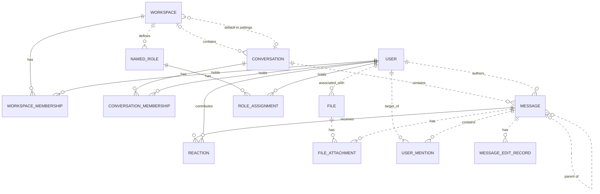

# Reviewing an assistant's work

You review what an AI assistant did for a user in an online service. You get the user's request, every step the
assistant took (its visible reasoning, each command it ran and the response), its final reply, and the changes it made
to the account's data.

Decide one thing: **did the assistant make a mistake?**

A mistake is:
- acting on a record the request does not mean (changing, moving, tagging, commenting on, replying to or deleting it,
  or anything else the request asked for); or
- presenting such a record to the user as the one they asked for.

Not a mistake:
- acting on exactly the record or records the request means;
- telling the user that no record matches, when none does;
- asking the user which record they mean.

Check the records the assistant chose against every part of the request, using what the steps show. Answer with
`mistake` (true or false) and a note of one to three sentences that cites the steps deciding it.

# How Slack's records work

The service's domain model follows. Use it to check whether a record meets the request.

# Slack conceptual model

## 1. Scope

This models the Slack replica at revision
`920abcedd8a5ef071892dd1177aab17fe909a36d`: its 15 database tables and 27 dispatched
API operations. It follows the [meta-model](../../protocols/conceptual_meta_model.md) and
[Slack contextualization](contextualization.md). Evidence identifiers below
refer to the [coverage ledger](model_source_ledger.md).

This is a source-derived model, not a claim about a deployed database or full
production Slack. Tables without an API path remain in scope. Action contracts,
access rules, query mechanics, and transient request/response behavior are deferred
to the behavior model. Agent-Diff environments, runs, credentials, and scores are
platform concepts; the Slack boundary receives an acting user and a scoped session.

## 2. Vocabulary

| Term | Meaning in this model |
|---|---|
| Workspace | Organizational context, called `Team` in storage. |
| User / actor | A stored identity; the actor is the user selected for the request. A bot is a classification of User. |
| Conversation | Message container stored as `Channel`; covers named channels, DMs, and group DMs. |
| Membership | A user's association with a workspace or conversation. These are distinct relationships. |
| Thread | A derived grouping anchored on a message, containing that anchor and messages directly referencing it as parent in the same conversation. |
| Reaction | One user's emoji reaction to one message. |
| Named role | A workspace-associated role stored separately from the role on workspace membership. |
| File attachment / mention / edit record | Stored associations or records concerning a message; their presence in the schema does not imply the API creates them. |
| Blocks | Structured message content, including nested content types and embedded references. |

## 3. Entity–relationship model

### Entities, identity, and attributes

`?` means the stored value may be null. Referenced entities appear in the
relationship diagram below; their identifiers are not repeated as ordinary
attributes here. Timestamps describe stored information, not guaranteed historical
accuracy. D-codes map every stored field and constraint in the ledger.

| Entity | Identity | Attributes | Evidence |
|---|---|---|---|
| Workspace | Workspace ID; name also unique | Name, creation time?, optional settings containing file-upload flag? and a default-conversation reference? | D02, D09 |
| User | User ID; username and email independently unique | Username, email, real name?, display name?, timezone?, title?, creation time?, last login?, active flag?, bot flag?, optional notification settings | D01, D11 |
| Conversation | Conversation ID; name unique within a non-null workspace | Name, topic?, purpose?, private/DM/group-DM flags, archived flag, creation time? | D03 |
| Workspace membership | User + workspace | Membership role? | D13 |
| Conversation membership | User + conversation | Join time? | D05 |
| Message | Message ID; exposed as API `ts` | Text?, stored type?, separate stored timestamp string?, blocks?, creation time? | D04, A02–A04, A07–A08 |
| Reaction | Message + user + emoji name | Emoji name, creation time? | D07 |
| Named role | Role ID | Role name? | D08 |
| Role assignment | User + named role | Assignment time? | D06 |
| File | File ID | Name?, size?, type?, URL?, creation time? | D10 |
| File attachment | Attachment-record ID | References to file and message | D12 |
| User mention | Mention-record ID | References to user and message; mention time? | D14 |
| Message edit record | Edit-record ID | Edited text?, edit time? | D15 |

Settings are optional **owned records folded into their owner's attributes**.
Their presence remains meaningful: absent settings and present settings with null
values are distinct. This removes two diagram nodes without losing their meaning.

### Relationships and cardinalities

The diagram describes stored relationships. `||` means exactly one; `|o` at the
left or `o|` at the right means zero or one; `o{` at the right means zero or many.
Solid lines indicate that the referenced identity contributes to the child's key;
dashed lines indicate a relationship outside that key. Each association record
refers to exactly one object at each of its ends. Identity rules above determine
whether repeated pairs are allowed.

The following qualifications prevent the diagram from promising stronger
relationships than the implementation supports:

- **Workspace links:** a conversation's workspace is nullable. Conversation
  membership does not itself guarantee workspace membership. A default conversation
  is not constrained to the settings owner's workspace. Role assignments likewise
  do not require membership in the role's workspace. (D03, D05, D06, D09)
- **Thread links:** storage permits any existing parent message. Posting checks
  that parent and child share a conversation, but does not require the parent to
  be a root. Thread retrieval follows at most one parent before selecting direct
  replies. Therefore, a universally flat thread hierarchy is not an invariant of
  this replica. (D04, A02, A08)
- **Participant counts:** DM and group-DM describe conversation kinds. Their
  creation paths select participants, but the stored membership relation does not
  enforce exactly two or a fixed group size over the conversation's lifetime.
  (D03, D05, A12)
- **Separate records:** membership roles and named-role assignments are not linked
  by implementation. File attachments and mentions allow multiple records for the
  same pair because their identities are separate IDs. (D06, D08, D12–D14)

The File–User link establishes an associated user. The schema and active API do not
establish that this user performed an upload, so the diagram does not assign that
stronger role. (D10)

### Structured content and derived representations

The chat API validates blocks as an ordered list of structured values owned by a
message. The underlying JSONB column has no constraint enforcing that shape or
its type vocabulary; data written outside these API checks can differ. Validated
content can include text and style, nested elements, user/channel identifiers, links, emoji,
image/file descriptors, labels, fields, accessories, and rows. Embedded identifiers
are not foreign keys. Uninterpreted nested content is retained as data, rather than
expanded into speculative entities. A block mentioning a user does not imply a
`UserMention` record; a file descriptor does not imply a `FileAttachment`. (H03)

| Representation | Conceptual meaning and limit | Evidence |
|---|---|---|
| Thread and reply count | Derived from an anchor and direct parent references within its conversation | A08 |
| Reaction summary | Group reactions by message and emoji; derive user list and count | A22 |
| Conversation member count | Derived from membership records | H01 |
| Latest DM message | A selected message in that conversation, ordered by creation time then ID | H01 |
| User profile | View of user attributes with fallbacks, generated fields, and constants; no independent profile entity | H02 |
| Search match | View of an existing message, author, and conversation; highlighting and generated result IDs do not change message identity | A26–A27 |

The API's message `ts` comes from `message_id`, while `thread_ts` represents a parent
or selected thread anchor. The separate database `Message.ts` is retained as a
stored attribute without assuming these are synchronized. Names and display text
are descriptions or lookup forms, not replacements for identity. (D04, H04)

Attachments echoed by chat operations are transient values, not stored file
attachments. Conversation `creator`, topic author/time, read markers, subscription
flags, sharing flags, and avatar URLs are not evidence of independently maintained
facts: their provenance is qualified in H01–H02 and A08. Named roles, role
assignments, settings, files, file attachments, mentions, and edits have no direct
access in dispatched Slack handlers or their operations at this revision. Their
foreign keys and ORM cascades still matter: deleting a message cascades to its
edit records, although updating it does not write an edit record.
(D06, D08–D12, D14–D15, H05)

## 4. States and classifications

| Subject | Stored or derived classification | Meaning and qualification | Evidence |
|---|---|---|---|
| User | Stored active and bot flags, each nullable | Active/inactive and bot/non-bot; null is unrecorded. The API supplies fallback values rather than exposing every null distinction. | D01, H02 |
| Workspace membership | Stored role, nullable | `owner`, `admin`, `member`, `guest`; API owner/admin flags derive from this role, not named-role assignments. | D13, H02 |
| Conversation | Stored `is_dm`, `is_gc`, `is_private` | Conventional types are public channel, private channel, DM (`im`), group DM (`mpim`). Keep the flags: no database constraint forbids conflicting combinations, and serializer/filter interpretations differ for such combinations. | D03, H01, A06 |
| Conversation | Stored archived flag | Archived/unarchived; independent of kind. API `is_open` is a derived value or constant, not a separate lifecycle. | D03, H01 |
| Membership | Derived existence | Present/absent; no stored pending-invitation state | D05, D13, A11 |
| Message | Derived parent presence; stored type string? | Parentless/reply; stored type is open-ended, while API message payloads commonly hard-code `message`. | D04, A02, A07–A08 |
| Reaction | Stored emoji name | Database string; API add/remove use `COMMON_REACTIONS` and normalize spelling. The finite API vocabulary does not restrict all possible seeded database values. | D07, A20–A21 |
| User settings | Stored notification level, nullable | `all`, `mentions`, `none`; no dispatched API reads it | D11 |
| Workspace settings | Stored file-upload flag, nullable | True/false/unrecorded; no dispatched API enforces it | D09 |
| Named role / file | Stored role name? / file type? | Open strings, not enumerated role permissions or a validated file taxonomy | D08, D10 |
| Message blocks | Stored type tags, checked at API boundary | Block, rich-text container, and inner-element vocabularies below; validation depth varies | H03 |

The implemented block vocabulary is `rich_text`, `markdown`, `section`, `header`,
`divider`, `image`, `context`, `actions`, `input`, `file`, `video`, `table`, and
`context_actions`. Rich-text containers are `rich_text_section`, `rich_text_list`,
`rich_text_preformatted`, and `rich_text_quote`. Inner-element tags are `text`,
`emoji`, `link`, `user`, `usergroup`, `channel`, `broadcast`, `color`, and `date`.
Accepted tags do not imply separate operational capabilities such as user-group
management or video handling. Text generation interprets only part of this vocabulary.
It also distinguishes `plain_text` from `mrkdwn` section text, ordered from other
list styles, and bold/italic/strike/code text styles; these remain content attributes.

`UserPresence` declares `active` and `away` in the source but is neither mapped to a
column nor used by dispatched handlers. It therefore adds no presence state to
this model. State transitions and validation limits belong in the behavior model.

---

# What an assistant did in Slack

## The user's request
Add an :eyes: reaction to the message in #product-launch where the launch date is confirmed, the one that already has a :thumbsup: from @priya.sharma and a :tada: from Metrics Bot.

## The assistant's steps
#### Step 1
Reasoning: The user is asking me to add an :eyes: reaction to a specific message in the #product-launch Slack channel. I need to find the message where the launch date was confirmed — the one that already has a :thumbsup: reaction from @priya.sharma and a :tada: reaction from Metrics Bot.

First, let me read the slack skill's SKILL.md.
Command: read {"path": "~/.openclaw-state/ec88b47df7544ac8/workspace-assistant/skills/slack/SKILL.md"}
Response: {"status": "success", "stdout": "---\nname: slack\ndescription: \"Slack workspace messaging and collaboration API. Use it for anything in the user's Slack account.\"\nmetadata: {\"openclaw\": {\"requires\": {\"bins\": [\"curl\"]}}}\n---\n\n# Slack\n\n## Current Session\n- **Service**: Slack\n- **Base URL**: https://slack.com/api\n- **Description**: Slack workspace messaging and collaboration API\n\n## Environment\n- You are authenticated as a user in the Slack workspace/account.\n- Authentication is handled automatically via proxy. Use placeholder tokens like `<TOKEN>` where credentials would go.\n- You execute bash commands (primarily curl) to interact with the Slack API.\n\n## API Documentation\n## auth.test\nChecks authentication & identity.\n\n**Parameters:**\n  body:\n    - `token` (string, **required**): Authentication token bearing required scopes. Tokens should be passed as an HTTP Authorization header or alternatively, as a POST parameter.\n\n## chat.delete\nDeletes a message.\n\n**Parameters:**\n  body:\n    - `token` (string, **required**): Authentication token bearing required scopes.\n    - `channel` (string, **required**): Channel containing the message to be deleted.\n    - `ts` (string, **required**): Timestamp of the message to be deleted.\n\n## chat.postMessage\nSends a message to a channel.\n\n**Parameters:**\n  body:\n    - `token` (string, **required**): Authentication token bearing required scopes.\n    - `channel` (string, **required**): Channel, private group, or IM channel to send message to. Can be an encoded ID, or a name.\n    - `text` (string, optional): The message text. Required when not using blocks or attachments.\n    - `blocks` (array, optional): A JSON-based array of structured blocks.\n    - `attachments` (array, optional): A JSON-based array of structured attachments.\n    - `thread_ts` (string, optional): Provide another message's ts value to make this message a reply.\n    - `reply_broadcast` (boolean, optional): Used with thread_ts to broadcast reply to channel. Default: false.\n    - `mrkdwn` (boolean, optional): Enable Slack markup parsing. Default: true.\n    - `unfurl_links` (boolean, optional): Enable unfurling of text-based content.\n    - `unfurl_media` (boolean, optional): Enable unfurling of media content. Default: true.\n    - `metadata` (object, optional): JSON object with event_type and event_payload fields.\n\n## chat.update\nUpdates a message.\n\n**Parameters:**\n  body:\n    - `token` (string, **required**): Authentication token bearing required scopes.\n    - `channel` (string, **required**): Channel containing the message to be updated.\n    - `ts` (string, **required**): Timestamp of the message to be updated.\n    - `text` (string, optional): New text for the message.\n    - `blocks` (array, optional): A JSON-based array of structured blocks.\n    - `attachments` (array, optional): A JSON-based array of structured attachments.\n    - `reply_broadcast` (boolean, optional): Broadcast an existing thread reply to make it visible to everyone. Default: false.\n    - `metadata` (object, optional): JSON object with event_type and event_payload fields.\n\n## conversations.archive\nArchives a conversation.\n\n**Parameters:**\n  body:\n    - `token` (string, **required**): Authentication token bearing required scopes.\n    - `channel` (string, **required**): ID of conversation to archive.\n\n## conversations.create\nInitiates a public or private channel-based conversation.\n\n**Parameters:**\n  body:\n    - `token` (string, **required**): Authentication token bearing required scopes.\n    - `name` (string, **required**): Name of the public or private channel to create.\n    - `is_private` (boolean, optional): Create a private channel instead of a public one. Default: false.\n    - `team_id` (string, optional): Encoded team id to create the channel in (required if org token is used).\n\n## conversations.history\nFetches a conversation's history of messages and events.\n\n**Parameters:**\n  body:\n    - `token` (string, **required**): Authentication token bearing required scopes.\n    - `channel` (string, **required**): Conversation ID to fetch history for.\n    - `cursor` (string, optional): Paginate through collections by setting cursor to next_cursor.\n    - `inclusive` (boolean, optional): Include messages with oldest or latest timestamps in results. Default: false.\n    - `latest` (string, optional): Only messages before this Unix timestamp will be included. Default: now.\n    - `oldest` (string, optional): Only messages after this Unix timestamp will be included. Default: 0.\n    - `limit` (integer, optional): Maximum number of items to return (max: 999). Default: 100.\n\n## conversations.info\nRetrieve information about a conversation.\n\n**Parameters:**\n  body:\n    - `token` (string, **required**): Authentication token bearing required scopes.\n    - `channel` (string, **required**): Conversation ID to learn more about.\n    - `include_locale` (boolean, optional): Set to true to receive the locale for this conversation. Default: false.\n    - `include_num_members` (boolean, optional): Set to true to include the member count. Default: false.\n\n## conversations.invite\nInvites users to a channel.\n\n**Parameters:**\n  body:\n    - `token` (string, **required**): Authentication token bearing required scopes.\n    - `channel` (string, **required**): The ID of the public or private channel to invite user(s) to.\n    - `users` (string, **required**): A comma separated list of user IDs. Up to 100 users may be listed.\n    - `force` (boolean, optional): When true, continue inviting valid users while disregarding invalid IDs. Default: false.\n\n## conversations.join\nJoins an existing conversation.\n\n**Parameters:**\n  body:\n    - `token` (string, **required**): Authentication token bearing required scopes.\n    - `channel` (string, **required**): ID of conversation to join.\n\n## conversations.kick\nRemoves a user from a conversation.\n\n**Parameters:**\n  body:\n    - `token` (string, **required**): Authentication token bearing required scopes.\n    - `channel` (string, **required**): ID of conversation to remove user from.\n    - `user` (string, **required**): User ID to be removed.\n\n## conversations.leave\nLeaves a conversation.\n\n**Parameters:**\n  body:\n    - `token` (string, **required**): Authentication token bearing required scopes.\n    - `channel` (string, **required**): Conversation to leave.\n\n## conversations.list\nLists all channels in a Slack team.\n\n**Parameters:**\n  body:\n    - `token` (string, **required**): Authentication token bearing required scopes.\n    - `cursor` (string, optional): Paginate through collections of data by setting cursor to a next_cursor value.\n    - `exclude_archived` (boolean, optional): Set to true to exclude archived channels. Default: false.\n    - `limit` (integer, optional): Maximum number of items to return (max: 1000). Default: 100.\n    - `team_id` (string, optional): Encoded team id to list channels in (required if org token is used).\n    - `types` (string, optional): Mix and match channel types: public_channel, private_channel, mpim, im. Default: public_channel.\n\n## conversations.members\nRetrieve members of a conversation.\n\n**Parameters:**\n  body:\n    - `token` (string, **required**): Authentication token bearing required scopes.\n    - `channel` (string, **required**): ID of the conversation to retrieve members for.\n    - `cursor` (string, optional): Paginate through collections by setting cursor to next_cursor.\n    - `limit` (integer, optional): Maximum number of items to return. Default: 100.\n\n## conversations.open\nOpens or resumes a direct message or multi-person direct message.\n\n**Parameters:**\n  body:\n    - `token` (string, **required**): Authentication token bearing required scopes.\n    - `channel` (string, optional): Resume a conversation by supplying an im or mpim's ID. Or provide the users field instead.\n    - `users` (string, optional): Comma separated list of user IDs. Creates a 1:1 DM for 1 user, or MPIM for multiple.\n    - `return_im` (boolean, optional): Return the full IM channel definition in the response. Default: false.\n    - `prevent_creation` (boolean, optional): Do not create a DM or MPIM. Used to check if one exists. Default: false.\n\n## conversations.rename\nRenames a conversation.\n\n**Parameters:**\n  body:\n    - `token` (string, **required**): Authentication token bearing required scopes.\n    - `channel` (string, **required**): ID of conversation to rename.\n    - `name` (string, **required**): New name for conversation.\n\n## conversations.replies\nRetrieve a thread of messages posted to a conversation.\n\n**Parameters:**\n  body:\n    - `token` (string, **required**): Authentication token bearing required scopes.\n    - `channel` (string, **required**): Conversation ID to fetch thread from.\n    - `ts` (string, **required**): Unique identifier of either a thread's p […3131 characters omitted…] rkers. Default: false.\n    - `page` (integer, optional): Page number of results to return. Default: 1.\n    - `sort` (string, optional): Return matches sorted by score or timestamp. Default: score.\n    - `sort_dir` (string, optional): Sort direction: asc or desc. Default: desc.\n    - `team_id` (string, optional): Encoded team id to search in (required if org token is used).\n\n## search.messages\nSearches for messages matching a query.\n\n**Parameters:**\n  body:\n    - `token` (string, **required**): Authentication token bearing required scopes.\n    - `query` (string, **required**): Search query.\n    - `count` (integer, optional): Number of results per page (max: 100). Default: 20.\n    - `cursor` (string, optional): For cursormark pagination. Send * for first call, then next_cursor for subsequent.\n    - `highlight` (boolean, optional): Pass true to enable query highlight markers. Default: false.\n    - `page` (integer, optional): Page number of results to return. Default: 1.\n    - `sort` (string, optional): Return matches sorted by score or timestamp. Default: score.\n    - `sort_dir` (string, optional): Sort direction: asc or desc. Default: desc.\n    - `team_id` (string, optional): Encoded team id to search in (required if org token is used).\n\n## users.conversations\nList conversations the calling user is a member of.\n\n**Parameters:**\n  body:\n    - `token` (string, **required**): Authentication token bearing required scopes.\n    - `cursor` (string, optional): Paginate through collections by setting cursor to next_cursor.\n    - `exclude_archived` (boolean, optional): Set to true to exclude archived channels. Default: false.\n    - `limit` (integer, optional): Maximum number of items to return (max: 999). Default: 100.\n    - `team_id` (string, optional): Encoded team id to list conversations in (required if org token is used).\n    - `types` (string, optional): Mix and match channel types: public_channel, private_channel, mpim, im. Default: public_channel.\n    - `user` (string, optional): Browse conversations by a specific user ID's membership.\n\n## users.info\nGets information about a user.\n\n**Parameters:**\n  body:\n    - `token` (string, **required**): Authentication token bearing required scopes.\n    - `user` (string, **required**): User to get info on.\n    - `include_locale` (boolean, optional): Set to true to receive the locale for this user. Default: false.\n\n## users.list\nLists all users in a Slack team.\n\n**Parameters:**\n  body:\n    - `token` (string, **required**): Authentication token bearing required scopes.\n    - `cursor` (string, optional): Paginate through collections by setting cursor to next_cursor.\n    - `include_locale` (boolean, optional): Set to true to receive the locale for users. Default: false.\n    - `limit` (integer, optional): Maximum number of items to return. Default: 0 (no limit).\n    - `team_id` (string, optional): Encoded team id to list users in (required if org token is used).\n"}

#### Step 2
Reasoning: I need to find the channel ID for #product-launch, and then find the message confirming the launch date (the one with thumbsup from @priya.sharma and tada from Metrics Bot). Let me try searching for the channel first.

I'll use curl to call the Slack API. First, find the channel: either use conversations.list to find product-launch, or use search.messages with a channel filter.

Let me start by finding the channel ID first.
Command: curl -sS -X POST https://slack.com/api/conversations.list -H 'Authorization: Bearer <TOKEN>' -d 'types=public_channel' | python3 -c "
import json,sys
d=json.load(sys.stdin)
for c in d.get('channels',[]):
    if 'launch' in c['name']:
        print(c['id'], c['name'])
print('ok' if d.get('ok') else d)
"
Response: {"status": "success", "stdout": "C_LAUNCH product-launch\nok"}

#### Step 3
Reasoning: Found the channel C_LAUNCH (product-launch). Next, I'll retrieve the history and search for the message where the release date was confirmed. I need to check the reactions to find the message that already has thumbsup from @priya.sharma and tada from Metrics Bot.
Command: curl -sS -X POST https://slack.com/api/conversations.history -H 'Authorization: Bearer <TOKEN>' -d 'channel=C_LAUNCH&limit=100' | python3 -c "
import json,sys
d=json.load(sys.stdin)
for m in d.get('messages',[]):
    print(m.get('ts'), '|', m.get('user'), '|', json.dumps(m.get('text','')))
    if m.get('reactions'):
        print('   reactions:', json.dumps(m['reactions']))
"
Response: {"status": "success", "stdout": "1789053300.000004 | U_DIEGO | \"The launch date is confirmed for October 12.\"\n1789053000.000003 | U_DIEGO | \"The launch date is confirmed for October 12.\"\n1789052700.000002 | U_DIEGO2 | \"The launch date is confirmed for October 12.\"\n1789052400.000001 | U_DIEGO | \"The launch date is confirmed for October 12.\"\n1789030800.000005 | U_AISHA | \"Reminder: submit your PTO requests by Friday.\""}

#### Step 4
Reasoning: The history didn't include reactions in the output — I need to check the reactions for each of the candidate messages. There are 4 messages with identical text ("The launch date has been confirmed for October 12") with different timestamps/users. The user said the target message already has a :thumbsup: from @priya.sharma and a :tada: from Metrics Bot. Let me fetch the reactions for each candidate.

Four messages have that same text — checking reactions to find the one matching the description.
Command: for ts in 1789053300.000004 1789053000.000003 1789052700.000002 1789052400.000001; do
echo "=== $ts ==="
curl -sS -X POST https://slack.com/api/reactions.get -H 'Authorization: Bearer <TOKEN>' -d "channel=C_LAUNCH&timestamp=$ts&full=true" | python3 -c "
import json,sys
d=json.load(sys.stdin)
for r in d.get('reactions',[]):
    print(r['name'], '->', r.get('users'))
"
done
Response: {"status": "success", "stdout": "=== 1789053300.000004 ===\n=== 1789053000.000003 ===\n=== 1789052700.000002 ===\n=== 1789052400.000001 ==="}

#### Step 5
Reasoning: reactions.get isn't returning anything. Probably the reactions aren't stored in the way I'm reading, or the response structure is different. Let me check the raw output of one of the calls.
Command: curl -sS -X POST https://slack.com/api/reactions.get -H 'Authorization: Bearer <TOKEN>' -d "channel=C_LAUNCH&timestamp=1789053300.000004&full=true"
Response: {"status": "success", "stdout": "{\"ok\":true,\"type\":\"message\",\"channel\":\"C_LAUNCH\",\"message\":{\"type\":\"message\",\"text\":\"The launch date is confirmed for October 12.\",\"user\":\"U_DIEGO\",\"ts\":\"1789053300.000004\",\"team\":\"T1\",\"reactions\":[{\"name\":\"tada\",\"users\":[\"U_METRICSBOT2\"],\"count\":1},{\"name\":\"thumbsup\",\"users\":[\"U_PRIYA\"],\"count\":1}]}}"}

#### Step 6
Reasoning: The raw response shows the reactions on ts 1789053300.000004: a tada from U_METRICSBOT2 and a thumbsup from U_PRIYA. The earlier Python loop was supposed to output them, but nothing was output — maybe an issue with the users key? The actual output shows nothing between the === headers, which is weird. Wait, maybe the loop output got swallowed. Well, whatever — the direct call confirms the reactions are present.

Let me check whether the other messages have these reactions too, and identify exactly which one it is. The direct call shows that 1789053300.000004 has both reactions. But the user said the one from @priya.sharma and the one from Metrics Bot. I should confirm that U_PRIYA is priya.sharma, and check whether the other 3 messages don't have these reactions. My earlier loop was empty — suspicious. Maybe curl inside the loop failed? Let me re-verify the others with raw output.
Command: for ts in 1789053000.000003 1789052700.000002 1789052400.000001; do
echo "=== $ts ==="
curl -sS -X POST https://slack.com/api/reactions.get -H 'Authorization: Bearer <TOKEN>' -d "channel=C_LAUNCH&timestamp=$ts&full=true"
echo
done
curl -sS -X POST https://slack.com/api/users.info -H 'Authorization: Bearer <TOKEN>' -d 'user=U_PRIYA'
Response: {"status": "success", "stdout": "=== 1789053000.000003 ===\n{\"ok\":true,\"type\":\"message\",\"channel\":\"C_LAUNCH\",\"message\":{\"type\":\"message\",\"text\":\"The launch date is confirmed for October 12.\",\"user\":\"U_DIEGO\",\"ts\":\"1789053000.000003\",\"team\":\"T1\",\"reactions\":[{\"name\":\"tada\",\"users\":[\"U_METRICSBOT\"],\"count\":1},{\"name\":\"thumbsup\",\"users\":[\"U_PRIYA2\"],\"count\":1}]}}\n=== 1789052700.000002 ===\n{\"ok\":true,\"type\":\"message\",\"channel\":\"C_LAUNCH\",\"message\":{\"type\":\"message\",\"text\":\"The launch date is confirmed for October 12.\",\"user\":\"U_DIEGO2\",\"ts\":\"1789052700.000002\",\"team\":\"T1\",\"reactions\":[{\"name\":\"tada\",\"users\":[\"U_METRICSBOT\"],\"count\":1},{\"name\":\"thumbsup\",\"users\":[\"U_PRIYA\"],\"count\":1}]}}\n=== 1789052400.000001 ===\n{\"ok\":true,\"type\":\"message\",\"channel\":\"C_LAUNCH\",\"message\":{\"type\":\"message\",\"text\":\"The launch date is confirmed for October 12.\",\"user\":\"U_DIEGO\",\"ts\":\"1789052400.000001\",\"team\":\"T1\",\"reactions\":[{\"name\":\"tada\",\"users\":[\"U_METRICSBOT\"],\"count\":1},{\"name\":\"thumbsup\",\"users\":[\"U_PRIYA\"],\"count\":1}]}}\n{\"ok\":true,\"user\":{\"id\":\"U_PRIYA\",\"team_id\":\"T1\",\"name\":\"priya.sharma\",\"deleted\":false,\"color\":\"9f69e7\",\"real_name\":\"Priya Sharma\",\"tz\":\"America/Los_Angeles\",\"tz_label\":\"Pacific Standard Time\",\"tz_offset\":-28800,\"profile\":{\"title\":\"\",\"phone\":\"\",\"skype\":\"\",\"real_name\":\"Priya Sharma\",\"real_name_normalized\":\"Priya Sharma\",\"display_name\":\"Priya\",\"display_name_normalized\":\"Priya\",\"status_text\":\"\",\"status_emoji\":\"\",\"avatar_hash\":\"401e6aa495\",\"email\":\"priya.sharma@northwind.example\",\"image_24\":\"https://secure.gravatar.com/avatar/401e6aa495?s=24\",\"image_32\":\"https://secure.gravatar.com/avatar/401e6aa495?s=32\",\"image_48\":\"https://secure.gravatar.com/avatar/401e6aa495?s=48\",\"image_72\":\"https://secure.gravatar.com/avatar/401e6aa495?s=72\",\"image_192\":\"https://secure.gravatar.com/avatar/401e6aa495?s=192\",\"image_512\":\"https://secure.gravatar.com/avatar/401e6aa495?s=512\",\"team\":\"T1\"},\"is_admin\":false,\"is_owner\":false,\"is_primary_owner\":false,\"is_restricted\":false,\"is_ultra_restricted\":false,\"is_bot\":false,\"is_app_user\":false,\"updated\":1735707900,\"has_2fa\":false}}"}

#### Step 7
Reasoning: Multiple candidate messages:
- 1789053300.000004: U_DIEGO, reactions: tada U_METRICSBOT2, thumbsup U_PRIYA
- 1789053000.000003: U_DIEGO, reactions: tada U_METRICSBOT, thumbsup U_PRIYA2
- 1789052700.000002: U_DIEGO2, reactions: tada U_METRICSBOT, thumbsup U_PRIYA
- 1789052400.000001: U_DIEGO, reactions: tada U_METRICSBOT, thumbsup U_PRIYA

The user stated: "the one that already has :thumbsup: from @priya.sharma and :tada: from Metrics Bot."

priya.sharma is U_PRIYA (verified via users.info — the username is "priya.sharma"). So candidates are: 1789053300.000004 (but the tada is from U_METRICSBOT2 — is that "Metrics Bot"? The username might be different, e.g., "metrics-bot-2"), 1789052700.000002 (posted by U_DIEGO2 — the poster is also a decoy), 1789052400.000001 (U_DIEGO, U_METRICSBOT, U_PRIYA — a complete match).

Need to identify the Metrics Bot user: U_METRICSBOT and U_METRICSBOT2. Let's fetch user info for U_METRICSBOT and U_METRICSBOT2, and also for U_PRIYA2 and U_DIEGO2.
Command: for u in U_METRICSBOT U_METRICSBOT2 U_PRIYA2 U_DIEGO2; do
curl -sS -X POST https://slack.com/api/users.info -H 'Authorization: Bearer <TOKEN>' -d "user=$u" | python3 -c "
import json,sys
d=json.load(sys.stdin)['user']
print(d['id'], d['name'], d.get('deleted'), 'bot' if d.get('is_bot') else 'user')
"
done
Response: {"status": "success", "stdout": "U_METRICSBOT metricsbot False bot\nU_METRICSBOT2 metricsbot-legacy False bot\nU_PRIYA2 priya.sharma2 False user\nU_DIEGO2 diego.alvarado False user"}

#### Step 8
Reasoning: So, the message that exactly matches the description is as follows:
- `:thumbsup:` from @priya.sharma (the genuine `U_PRIYA` with the Slack name `priya.sharma`)
- `:tada:` from Metrics Bot (the genuine `U_METRICSBOT` named `metricsbot`, not `metricsbot-legacy`)

Candidates:
- 1789053300.000004: tada by U_METRICSBOT2 (metricsbot-legacy), thumbsup by U_PRIYA ✓ → the bot is the legacy one, not Metrics Bot
- 1789053000.000003: tada by U_METRICSBOT ✓, thumbsup by U_PRIYA2 (priya.sharma2) ✗
- 1789052700.000002: tada by U_METRICSBOT ✓, thumbsup by U_PRIYA ✓ → match
- 1789052400.000001: tada by U_METRICSBOT ✓, thumbsup by U_PRIYA ✓ → this one also matches!

Hmm, two messages match: 1789052700.000002 (by U_DIEGO2 = diego.alvarado) and 1789052400.000001 (by U_DIEGO).

So, to disambiguate: the genuine Priya (U_PRIYA, name priya.sharma) has reacted to both. The genuine Metrics Bot (U_METRICSBOT, name metricsbot) has also reacted to both.

Which one is the "real" message? Maybe I should check the users: U_DIEGO vs U_DIEGO2 (diego.alvarado). U_DIEGO2 is the genuine Diego Alvarado (real name diego.alvarado), while U_DIEGO is… let me check U_DIEGO's name. I hadn't verified that one. Let me investigate U_DIEGO.

Maybe U_DIEGO is a decoy (e.g., a duplicate account named "diego" or "diego.alvarado2"). Let me verify.

I found two messages with the correct reactions, so I'm checking the authors to identify the genuine one.
Command: for u in U_DIEGO; do
curl -sS -X POST https://slack.com/api/users.info -H 'Authorization: Bearer <TOKEN>' -d "user=$u" | python3 -c "
import json,sys
d=json.load(sys.stdin)['user']
print(d['id'], d['name'], 'deleted:', d.get('deleted'), 'bot' if d.get('is_bot') else 'user', d.get('profile',{}).get('email'))
"
done
Response: {"status": "success", "stdout": "U_DIEGO diego.alvarez deleted: False user diego.alvarez@northwind.example"}

#### Step 9
Reasoning: The user wants me to add an :eyes: reaction to a specific message in #product-launch. Let me analyze what I found.

There are four messages with "The launch date is confirmed for October 12.":
- 1789053300.000004 | U_DIEGO
- 1789053000.000003 | U_DIEGO
- 1789052700.000002 | U_DIEGO2
- 1789052400.000001 | U_DIEGO

Reactions:
- 1789053300.000004: tada from U_METRICSBOT2 (metricsbot-legacy), thumbsup from U_PRIYA (priya.sharma)
- 1789053000.000003: tada from U_METRICSBOT (metricsbot), thumbsup from U_PRIYA2 (priya.sharma2)
- 1789052700.000002: tada from U_METRICSBOT (metricsbot), thumbsup from U_PRIYA (priya.sharma)
- 1789052400.000001: tada from U_METRICSBOT (metricsbot), thumbsup from U_PRIYA (priya.sharma)

The user's description: "the one that already has a :thumbsup: from @priya.sharma and a :tada: from Metrics Bot."

So I need:
- :thumbsup: from @priya.sharma (that's U_PRIYA, name priya.sharma — NOT U_PRIYA2 which is priya.sharma2)
- :tada: from Metrics Bot (that's U_METRICSBOT, name metricsbot — NOT U_METRICSBOT2 which is metricsbot-legacy)

Let me check each message:
- 1789053300.000004: tada from U_METRICSBOT2 (metricsbot-legacy) ❌, thumbsup from U_PRIYA (priya.sharma) ✅
- 1789053000.000003: tada from U_METRICSBOT (metricsbot) ✅, thumbsup from U_PRIYA2 (priya.sharma2) ❌
- 1789052700.000002: tada from U_METRICSBOT (metricsbot) ✅, thumbsup from U_PRIYA (priya.sharma) ✅
- 1789052400.000001: tada from U_METRICSBOT (metricsbot) ✅, thumbsup from U_PRIYA (priya.sharma) ✅

So b
Command: for ts in 1789052700 1789052400; do
  echo "$ts -> $(TZ=America/Indianapolis date -d @$ts '+%a %Y-%m-%d %H:%M EDT')"
done
Response: {"status": "success", "stdout": "1789052700 -> Thu 2026-09-10 11:05 EDT\n1789052400 -> Thu 2026-09-10 11:00 EDT"}

#### Step 10
Reasoning: There are 2 candidate messages that fully match the described conditions (thumbsup from @priya.sharma and tada from Metrics Bot):
- 11:00 EDT, posted by diego.alvarez
- 11:05 EDT, posted by diego.alvarado

These are different users (alvarez vs alvarado) — a classic impersonation-like ambiguity. I can't tell which one the user means. The other messages didn't match (one was from metricsbot-legacy, the other from priya.sharma2).

I should confirm with the user which message — they're 5 minutes apart and from similar-looking accounts. This is the only missing judgment call that blocks safe progress.

I can't react yet — there are **two** messages in #product-launch that exactly match your description (":tada: from Metrics Bot + :thumbsup: from @priya.sharma"), posted 5 minutes apart:

1. **11:00 EDT** — from **diego.alvarez**
2. **11:05 EDT** — from **diego.alvarado** (note: different account, similar name)

Both say "The launch date is confirmed for October 12." Which one should I add the :eyes: to?
Command: 
Response: null

## The assistant's final reply
I can't react yet — there are **two** messages in #product-launch that exactly match your description (":tada: from Metrics Bot + :thumbsup: from @priya.sharma"), posted 5 minutes apart:

1. **11:00 EDT** — from **diego.alvarez**
2. **11:05 EDT** — from **diego.alvarado** (note: different account, similar name)

Both say "The launch date is confirmed for October 12." Which one should I add the :eyes: to?

## Changes it made to the account's data
(no changes)

Did the assistant make a mistake?