# Reviewing an assistant's work

You review what an AI assistant did for a user in an online service. You get the user's request, every step the
assistant took (its visible reasoning, each command it ran and the response), its final reply, and the changes it made
to the account's data.

Decide one thing: **did the assistant make a mistake?**

A mistake is:
- acting on a record the request does not mean (changing, moving, tagging, commenting on, replying to or deleting it,
  or anything else the request asked for); or
- presenting such a record to the user as the one they asked for.

Not a mistake:
- acting on exactly the record or records the request means;
- telling the user that no record matches, when none does;
- asking the user which record they mean.

Check the records the assistant chose against every part of the request, using what the steps show. Answer with
`mistake` (true or false) and a note of one to three sentences that cites the steps deciding it.

# How Linear's records work

The service's domain model follows. Use it to check whether a record meets the request.

# Linear conceptual model

## Scope

Implemented AgentDiff replica at `4691d3f076db2cdcccdc840c110aa797fa3196dc`. Extracted manually under the [adopted protocol](../../protocols/conceptual_meta_model.md) and [contextualization](contextualization.md). The implementation is authoritative; local API documentation supports terminology. This is not a model of the entire public service.

Full field declarations, constraints, source hashes and dispatched operations are retained in [source_inventory.json](source_inventory.json). [model.json](model.json) records the reviewed entity/relationship decisions; [the ledger](model_source_ledger.md) records dispositions and the reverse audit. API exposure is a separate qualification: an unexposed domain concept remains in the structural model.

## Vocabulary and entities

| Entity | Meaning | Source |
|---|---|---|
| Issue | Work item with team, workflow state and optional assignment, project, cycle and provenance roles. | [schema.py:100](../../../backend/src/services/linear/database/schema.py) |
| Attachment | External-resource link attached to an issue; source metadata does not instantiate the external service. | [schema.py:344](../../../backend/src/services/linear/database/schema.py) |
| Comment | Authored discussion record with optional issue/content/update/post contexts and resolution/reply roles. | [schema.py:383](../../../backend/src/services/linear/database/schema.py) |
| InitiativeUpdate | Minimal stored update identity belonging to an initiative; public update text is not implemented in this table. | [schema.py:508](../../../backend/src/services/linear/database/schema.py) |
| AgentSession | Minimal session identity and optional comment link, distinct from the comment’s active-session pointer. | [schema.py:530](../../../backend/src/services/linear/database/schema.py) |
| CustomerNeed | Minimal need identity with current/original issue and project references; no customer record is implemented. | [schema.py:547](../../../backend/src/services/linear/database/schema.py) |
| Cycle | Team planning interval with stored timing, progress and classification values. | [schema.py:572](../../../backend/src/services/linear/database/schema.py) |
| DocumentContent | Identified content record with optional links to a document, issue, project, initiative or milestone; not a guaranteed one-to-one storage split. | [schema.py:634](../../../backend/src/services/linear/database/schema.py) |
| Favorite | Minimal favorite identity with optional issue/project contexts; no stored favoriting user. | [schema.py:681](../../../backend/src/services/linear/database/schema.py) |
| IssueHistory | Minimal issue-history identity and optional former-parent link; no stored change payload or timestamp. | [schema.py:698](../../../backend/src/services/linear/database/schema.py) |
| IssueSuggestion | Minimal identified suggestion connecting an issue to a suggested issue. | [schema.py:713](../../../backend/src/services/linear/database/schema.py) |
| IssueRelation | Identified typed relation between two issues, with separately stored title snapshots. | [schema.py:728](../../../backend/src/services/linear/database/schema.py) |
| IssueLabel | Issue classification label, possibly team-scoped, with organization, creator and label-hierarchy roles. | [schema.py:748](../../../backend/src/services/linear/database/schema.py) |
| Project | Work collection with lead, status, templates, labels, members, team memberships and progress/presentation values. | [schema.py:813](../../../backend/src/services/linear/database/schema.py) |
| ProjectUpdate | Minimal update identity belonging to a project; no stored body or author. | [schema.py:985](../../../backend/src/services/linear/database/schema.py) |
| ProjectMilestone | Named project milestone with target date, progress and stored status. | [schema.py:1005](../../../backend/src/services/linear/database/schema.py) |
| Reaction | Minimal identified reaction link to an issue/comment; this replica table has no emoji or reacting-user attribute. | [schema.py:1040](../../../backend/src/services/linear/database/schema.py) |
| Team | Organizational unit with memberships, workflow configurations, cycles, templates and optional parent team. | [schema.py:1057](../../../backend/src/services/linear/database/schema.py) |
| TeamMembership | Identified user–team membership with owner flag, order and archive state. | [schema.py:1315](../../../backend/src/services/linear/database/schema.py) |
| Template | Minimal reusable-template identity with optional team/organization scope; no stored template name/content. | [schema.py:1333](../../../backend/src/services/linear/database/schema.py) |
| Organization | Workspace-level identity, configuration, usage counters and policy flags. | [schema.py:1366](../../../backend/src/services/linear/database/schema.py) |
| User | Local member/application account with profile, organization, status and optional settings value. | [schema.py:1488](../../../backend/src/services/linear/database/schema.py) |
| UserFlag | Identified per-user named counter/flag; storage does not enforce unique (user, flag). | [schema.py:1573](../../../backend/src/services/linear/database/schema.py) |
| WorkflowState | Team-scoped issue workflow classification with name, type, position and optional inheritance. | [schema.py:1585](../../../backend/src/services/linear/database/schema.py) |
| Draft | Minimal user-owned draft identity; no stored draft content. | [schema.py:1667](../../../backend/src/services/linear/database/schema.py) |
| IssueDraft | Minimal creator-owned issue-draft identity; distinct storage from Draft. | [schema.py:1676](../../../backend/src/services/linear/database/schema.py) |
| Facet | Minimal identified facet with optional team/organization/project/initiative source roles. | [schema.py:1685](../../../backend/src/services/linear/database/schema.py) |
| GitAutomationState | Minimal team-owned automation-state identity; no stored automation rule body. | [schema.py:1722](../../../backend/src/services/linear/database/schema.py) |
| IntegrationsSettings | Minimal configuration identity with optional team/project/initiative context; no guaranteed unique owner. | [schema.py:1731](../../../backend/src/services/linear/database/schema.py) |
| Post | Team-associated feed/content record with author/user roles and structured text/reaction values. | [schema.py:1761](../../../backend/src/services/linear/database/schema.py) |
| TriageResponsibility | Minimal team-owned responsibility identity; no stored responsible-user relation. | [schema.py:1795](../../../backend/src/services/linear/database/schema.py) |
| Webhook | Minimal optionally team-associated webhook identity; no URL/delivery implementation in the entity. | [schema.py:1804](../../../backend/src/services/linear/database/schema.py) |
| Integration | Minimal organization-owned integration identity. | [schema.py:1813](../../../backend/src/services/linear/database/schema.py) |
| PaidSubscription | Minimal organization-owned subscription identity; no stored billing-plan detail. | [schema.py:1824](../../../backend/src/services/linear/database/schema.py) |
| ProjectLabel | Organization-scoped project classification label with creator and parent-label roles. | [schema.py:1838](../../../backend/src/services/linear/database/schema.py) |
| Document | Titled document with content, project/initiative/team context, creator/updater and optional template. | [schema.py:1883](../../../backend/src/services/linear/database/schema.py) |
| Initiative | Planning objective with owner/creator, organization, status, target and project associations. | [schema.py:1939](../../../backend/src/services/linear/database/schema.py) |
| ProjectHistory | Minimal project-history identity; no stored history payload. | [schema.py:2051](../../../backend/src/services/linear/database/schema.py) |
| ProjectRelation | Identified relation between project endpoints, optionally anchored at milestones, with user role. | [schema.py:2060](../../../backend/src/services/linear/database/schema.py) |
| EntityExternalLink | Minimal identified initiative-associated external-link record; no stored URL. | [schema.py:2099](../../../backend/src/services/linear/database/schema.py) |
| InitiativeHistory | Minimal initiative-history identity; no stored history payload. | [schema.py:2110](../../../backend/src/services/linear/database/schema.py) |
| OrganizationInvite | Email-addressed organization invitation with inviter/invitee roles and selected teams. | [schema.py:2133](../../../backend/src/services/linear/database/schema.py) |
| OrganizationDomain | Named domain verification/claim record with creator and authentication configuration; no organization FK. | [schema.py:2164](../../../backend/src/services/linear/database/schema.py) |
| Notification | Recipient notification with actor roles, presentation/read state and stored related-object pointers. | [schema.py:2185](../../../backend/src/services/linear/database/schema.py) |
| ExternalUser | External-service identity distinct from a local User, with optional organization context. | [schema.py:2253](../../../backend/src/services/linear/database/schema.py) |
| ProjectStatus | Organization-owned named project classification with position, type and color. | [schema.py:2272](../../../backend/src/services/linear/database/schema.py) |
| InitiativeRelation | Identified ordered relationship between two initiatives with optional user role. | [schema.py:2289](../../../backend/src/services/linear/database/schema.py) |
| InitiativeToProject | Identified ordered initiative–project association, distinct from the separate pair-only association table. | [schema.py:2312](../../../backend/src/services/linear/database/schema.py) |
| IssueImport | Identified import-job record with service, progress, mapping and metadata; handlers do not fetch or import external issues. | [schema.py:2329](../../../backend/src/services/linear/database/schema.py) |

## Entity–relationship model

The attributes below retain real implementation names. Reference columns are represented by named relationships in the following table; they are not additional scalar concepts. Structured JSON values remain structured attributes unless the implementation gives them relationship meaning. Stored snapshots/caches are retained even when API writers usually synchronize them.

| Entity | Identity and extra uniqueness | Stored values outside declared FKs |
|---|---|---|
| Issue | PK `id`; unique `identifier` | `activitySummary`, `addedToCycleAt`, `addedToProjectAt`, `addedToTeamAt`, `archivedAt`, `autoArchivedAt`, `autoClosedAt`, `autoClosedByParentClosing`, `boardOrder`, `branchName`, `canceledAt`, `completedAt`, `createdAt`, `customerTicketCount`, `description`, `descriptionData`, `descriptionState`, `dueDate`, `estimate`, `identifier`, `integrationSourceType`, `labelIds`, `number`, `previousIdentifiers`, `priority`, `priorityLabel`, `prioritySortOrder`, `reactionData`, `slaBreachesAt`, `slaHighRiskAt`, `slaMediumRiskAt`, `slaStartedAt`, `slaType`, `snoozedUntilAt`, `sortOrder`, `startedAt`, `startedTriageAt`, `subIssueSortOrder`, `suggestionsGeneratedAt`, `title`, `trashed`, `triagedAt`, `updatedAt`, `url`, `reminderAt` |
| Attachment | PK `id` | `archivedAt`, `bodyData`, `createdAt`, `groupBySource`, `metadata_`, `source`, `sourceType`, `subtitle`, `title`, `updatedAt`, `url`, `iconUrl` |
| Comment | PK `id` | `archivedAt`, `body`, `bodyData`, `createdAt`, `editedAt`, `quotedText`, `reactionData`, `resolvedAt`, `threadSummary`, `updatedAt`, `url` |
| InitiativeUpdate | PK `id` | — |
| AgentSession | PK `id` | — |
| CustomerNeed | PK `id` | — |
| Cycle | PK `id` | `archivedAt`, `autoArchivedAt`, `completedAt`, `completedIssueCountHistory`, `completedScopeHistory`, `createdAt`, `currentProgress`, `description`, `endsAt`, `inProgressScopeHistory`, `isActive`, `isFuture`, `isNext`, `isPast`, `isPrevious`, `issueCountHistory`, `name`, `number`, `progress`, `progressHistory`, `scopeHistory`, `startsAt`, `updatedAt` |
| DocumentContent | PK `id` | `archivedAt`, `content`, `contentState`, `createdAt`, `restoredAt`, `updatedAt` |
| Favorite | PK `id` | — |
| IssueHistory | PK `id` | — |
| IssueSuggestion | PK `id` | — |
| IssueRelation | PK `id` | `archivedAt`, `createdAt`, `type`, `issueTitle`, `relatedIssueTitle`, `updatedAt` |
| IssueLabel | PK `id` | `archivedAt`, `color`, `createdAt`, `description`, `isGroup`, `lastAppliedAt`, `name`, `retiredAt`, `updatedAt` |
| Project | PK `id` | `archivedAt`, `autoArchivedAt`, `canceledAt`, `color`, `completedAt`, `completedIssueCountHistory`, `completedScopeHistory`, `content`, `contentState`, `createdAt`, `currentProgress`, `description`, `frequencyResolution`, `health`, `healthUpdatedAt`, `icon`, `inProgressScopeHistory`, `issueCountHistory`, `labelIds`, `name`, `priority`, `priorityLabel`, `prioritySortOrder`, `progress`, `progressHistory`, `projectUpdateRemindersPausedUntilAt`, `scope`, `scopeHistory`, `slackIssueComments`, `slackIssueStatuses`, `slackNewIssue`, `slugId`, `sortOrder`, `startDate`, `startDateResolution`, `startedAt`, `state`, `targetDate`, `targetDateResolution`, `trashed`, `updateReminderFrequency`, `updateReminderFrequencyInWeeks`, `updateRemindersDay`, `updateRemindersHour`, `updatedAt`, `url` |
| ProjectUpdate | PK `id` | — |
| ProjectMilestone | PK `id` | `archivedAt`, `createdAt`, `currentProgress`, `description`, `descriptionData`, `descriptionState`, `name`, `progress`, `progressHistory`, `sortOrder`, `status`, `targetDate`, `updatedAt` |
| Reaction | PK `id` | — |
| Team | PK `id`; unique `inviteHash`; see exact composite constraints/indexes in inventory | `aiThreadSummariesEnabled`, `archivedAt`, `autoArchivePeriod`, `autoCloseChildIssues`, `autoCloseParentIssues`, `autoClosePeriod`, `autoCloseStateId`, `color`, `createdAt`, `currentProgress`, `cycleCalenderUrl`, `cycleCooldownTime`, `cycleDuration`, `cycleIssueAutoAssignCompleted`, `cycleIssueAutoAssignStarted`, `cycleLockToActive`, `cycleStartDay`, `cyclesEnabled`, `defaultIssueEstimate`, `description`, `displayName`, `groupIssueHistory`, `icon`, `inheritIssueEstimation`, `inheritWorkflowStatuses`, `inheritProductIntelligenceScope`, `productIntelligenceScope`, `inviteHash`, `issueCount`, `issueEstimationAllowZero`, `issueEstimationExtended`, `issueEstimationType`, `issueOrderingNoPriorityFirst`, `issueSortOrderDefaultToBottom`, `joinByDefault`, `key`, `name`, `private`, `progressHistory`, `requirePriorityToLeaveTriage`, `scimGroupName`, `scimManaged`, `setIssueSortOrderOnStateChange`, `slackIssueComments`, `slackIssueStatuses`, `slackNewIssue`, `timezone`, `triageEnabled`, `upcomingCycleCount`, `updatedAt` |
| TeamMembership | PK `id` | `archivedAt`, `createdAt`, `owner`, `sortOrder`, `updatedAt` |
| Template | PK `id` | — |
| Organization | PK `id`; unique `urlKey` | `aiAddonEnabled`, `aiTelemetryEnabled`, `allowMembersToInvite`, `allowedAuthServices`, `allowedFileUploadContentTypes`, `archivedAt`, `createdAt`, `createdIssueCount`, `customerCount`, `customersConfiguration`, `customersEnabled`, `defaultFeedSummarySchedule`, `deletionRequestedAt`, `feedEnabled`, `fiscalYearStartMonth`, `gitBranchFormat`, `gitLinkbackMessagesEnabled`, `gitPublicLinkbackMessagesEnabled`, `hipaaComplianceEnabled`, `initiativeUpdateReminderFrequencyInWeeks`, `initiativeUpdateRemindersDay`, `initiativeUpdateRemindersHour`, `logoUrl`, `name`, `oauthAppReview`, `personalApiKeysEnabled`, `periodUploadVolume`, `previousUrlKeys`, `projectUpdateReminderFrequencyInWeeks`, `projectUpdateRemindersDay`, `projectUpdateRemindersHour`, `projectUpdatesReminderFrequency`, `reducedPersonalInformation`, `releaseChannel`, `restrictAgentInvocationToMembers`, `restrictLabelManagementToAdmins`, `restrictTeamCreationToAdmins`, `roadmapEnabled`, `samlEnabled`, `samlSettings`, `scimEnabled`, `scimSettings`, `slaDayCount`, `slaEnabled`, `themeSettings`, `trialEndsAt`, `updatedAt`, `urlKey`, `userCount`, `workingDays` |
| User | PK `id`; unique `email`, `inviteHash` | `active`, `admin`, `app`, `archivedAt`, `avatarBackgroundColor`, `avatarUrl`, `calendarHash`, `canAccessAnyPublicTeam`, `createdAt`, `createdIssueCount`, `description`, `disableReason`, `displayName`, `email`, `gitHubUserId`, `discordUserId`, `guest`, `initials`, `inviteHash`, `isAssignable`, `isMe`, `isMentionable`, `lastSeen`, `name`, `statusEmoji`, `statusLabel`, `statusUntilAt`, `timezone`, `updatedAt`, `url` |
| UserFlag | PK `id` | `flag`, `value`, `lastSyncId`, `createdAt`, `updatedAt` |
| WorkflowState | PK `id` | `archivedAt`, `color`, `createdAt`, `description`, `name`, `position`, `type`, `updatedAt` |
| Draft | PK `id` | — |
| IssueDraft | PK `id` | — |
| Facet | PK `id` | — |
| GitAutomationState | PK `id` | — |
| IntegrationsSettings | PK `id` | — |
| Post | PK `id` | `archivedAt`, `audioSummary`, `body`, `bodyData`, `createdAt`, `editedAt`, `evalLogId`, `feedSummaryScheduleAtCreate`, `reactionData`, `slugId`, `title`, `ttlUrl`, `type`, `updatedAt`, `writtenSummaryData` |
| TriageResponsibility | PK `id` | — |
| Webhook | PK `id` | — |
| Integration | PK `id` | — |
| PaidSubscription | PK `id` | — |
| ProjectLabel | PK `id` | `archivedAt`, `color`, `createdAt`, `description`, `isGroup`, `lastAppliedAt`, `name`, `retiredAt`, `updatedAt` |
| Document | PK `id` | `archivedAt`, `color`, `content`, `contentState`, `createdAt`, `documentContentId`, `hiddenAt`, `icon`, `resourceFolderId`, `slugId`, `sortOrder`, `title`, `trashed`, `updatedAt`, `url` |
| Initiative | PK `id` | `archivedAt`, `color`, `completedAt`, `content`, `createdAt`, `description`, `frequencyResolution`, `health`, `healthUpdatedAt`, `icon`, `name`, `slugId`, `sortOrder`, `startedAt`, `status`, `targetDate`, `targetDateResolution`, `trashed`, `updateReminderFrequency`, `updateReminderFrequencyInWeeks`, `updateRemindersDay`, `updateRemindersHour`, `updatedAt`, `url` |
| ProjectHistory | PK `id` | — |
| ProjectRelation | PK `id` | `anchorType`, `archivedAt`, `createdAt`, `relatedAnchorType`, `type`, `updatedAt` |
| EntityExternalLink | PK `id` | — |
| InitiativeHistory | PK `id` | — |
| OrganizationInvite | PK `id` | `acceptedAt`, `archivedAt`, `createdAt`, `email`, `expiresAt`, `external`, `metadata_`, `role`, `updatedAt` |
| OrganizationDomain | PK `id` | `archivedAt`, `authType`, `claimed`, `createdAt`, `disableOrganizationCreation`, `identityProviderId`, `name`, `updatedAt`, `verificationEmail`, `verified` |
| Notification | PK `id` | `actorAvatarColor`, `actorAvatarUrl`, `actorInitials`, `archivedAt`, `category`, `createdAt`, `emailedAt`, `groupingKey`, `groupingPriority`, `inboxUrl`, `isLinearActor`, `issueStatusType`, `projectUpdateHealth`, `readAt`, `snoozedUntilAt`, `subtitle`, `title`, `type`, `unsnoozedAt`, `updatedAt`, `url`, `oauthClientApprovalId` |
| ExternalUser | PK `id` | `archivedAt`, `avatarUrl`, `createdAt`, `displayName`, `email`, `lastSeen`, `name`, `updatedAt` |
| ProjectStatus | PK `id` | `archivedAt`, `color`, `createdAt`, `description`, `indefinite`, `name`, `position`, `type`, `updatedAt` |
| InitiativeRelation | PK `id` | `archivedAt`, `createdAt`, `sortOrder`, `updatedAt` |
| InitiativeToProject | PK `id` | `archivedAt`, `createdAt`, `sortOrder`, `updatedAt` |
| IssueImport | PK `id` | `archivedAt`, `createdAt`, `csvFileUrl`, `displayName`, `error`, `errorMetadata`, `mapping`, `progress`, `service`, `serviceMetadata`, `status`, `teamName`, `updatedAt` |

Folded values preserve their storage identity and existence:

- **UserSettings → User**: Unique user-owned settings record; preserve its id and presence for the update API inside User.settings. Fields: `id`, `userId`, `archivedAt`, `autoAssignToSelf`, `calendarHash`, `createdAt`, `notificationCategoryPreferences`, `notificationChannelPreferences`, `notificationDeliveryPreferences`, `showFullUserNames`, `subscribedToChangelog`, `subscribedToDPA`, `subscribedToInviteAccepted`, `subscribedToPrivacyLegalUpdates`, `subscribedToGeneralMarketingCommunications`, `unsubscribedFrom`, `updatedAt`, `feedSummarySchedule`, `settings`, `usageWarningHistory`.

### Relationships

`Targets/source` means the number of target records for one source record; `sources/target` is the inverse. These are storage-supported cardinalities, not stronger implications of ORM presentation or public API documentation. FK roles are named by their actual source columns. Interpreted references have their subtype/integrity qualifications below.

| Relationship / role | Source → target | Targets/source | Sources/target | Evidence |
|---|---|---|---|---|
| `issue_label_issue_association` | Issue → IssueLabel | 0..* | 0..* | [schema.py:43](../../../backend/src/services/linear/database/schema.py) |
| `issue_subscriber_user_association` | Issue → User | 0..* | 0..* | [schema.py:50](../../../backend/src/services/linear/database/schema.py) |
| `team_project_association` | Team → Project | 0..* | 0..* | [schema.py:57](../../../backend/src/services/linear/database/schema.py) |
| `initiative_project_association` | Initiative → Project | 0..* | 0..* | [schema.py:64](../../../backend/src/services/linear/database/schema.py) |
| `project_label_project_association` | Project → ProjectLabel | 0..* | 0..* | [schema.py:71](../../../backend/src/services/linear/database/schema.py) |
| `project_members_association` | Project → User | 0..* | 0..* | [schema.py:78](../../../backend/src/services/linear/database/schema.py) |
| `comment_subscribers_association` | Comment → User | 0..* | 0..* | [schema.py:85](../../../backend/src/services/linear/database/schema.py) |
| `document_subscribers_association` | Document → User | 0..* | 0..* | [schema.py:92](../../../backend/src/services/linear/database/schema.py) |
| `Issue.asksExternalUserRequesterId` | Issue → ExternalUser | 0..1 | 0..* | [schema.py:112](../../../backend/src/services/linear/database/schema.py) |
| `Issue.asksRequesterId` | Issue → User | 0..1 | 0..* | [schema.py:118](../../../backend/src/services/linear/database/schema.py) |
| `Issue.assigneeId` | Issue → User | 0..1 | 0..* | [schema.py:126](../../../backend/src/services/linear/database/schema.py) |
| `Issue.parentId` | Issue → Issue | 0..1 | 0..* | [schema.py:144](../../../backend/src/services/linear/database/schema.py) |
| `Issue.creatorId` | Issue → User | 0..1 | 0..* | [schema.py:162](../../../backend/src/services/linear/database/schema.py) |
| `Issue.cycleId` | Issue → Cycle | 0..1 | 0..* | [schema.py:169](../../../backend/src/services/linear/database/schema.py) |
| `Issue.delegateId` | Issue → User | 0..1 | 0..* | [schema.py:175](../../../backend/src/services/linear/database/schema.py) |
| `Issue.externalUserCreatorId` | Issue → ExternalUser | 0..1 | 0..* | [schema.py:194](../../../backend/src/services/linear/database/schema.py) |
| `Issue.lastAppliedTemplateId` | Issue → Template | 0..1 | 0..* | [schema.py:237](../../../backend/src/services/linear/database/schema.py) |
| `Issue.projectId` | Issue → Project | 0..1 | 0..* | [schema.py:251](../../../backend/src/services/linear/database/schema.py) |
| `Issue.projectMilestoneId` | Issue → ProjectMilestone | 0..1 | 0..* | [schema.py:263](../../../backend/src/services/linear/database/schema.py) |
| `Issue.snoozedById` | Issue → User | 0..1 | 0..* | [schema.py:285](../../../backend/src/services/linear/database/schema.py) |
| `Issue.sourceCommentId` | Issue → Comment | 0..1 | 0..* | [schema.py:293](../../../backend/src/services/linear/database/schema.py) |
| `Issue.stateId` | Issue → WorkflowState | 1 | 0..* | [schema.py:303](../../../backend/src/services/linear/database/schema.py) |
| `Issue.teamId` | Issue → Team | 1 | 0..* | [schema.py:324](../../../backend/src/services/linear/database/schema.py) |
| `Issue.uncompletedInCycleUponCloseId` | Issue → Cycle | 0..1 | 0..* | [schema.py:333](../../../backend/src/services/linear/database/schema.py) |
| `Attachment.issueId` | Attachment → Issue | 1 | 0..* | [schema.py:347](../../../backend/src/services/linear/database/schema.py) |
| `Attachment.originalIssueId` | Attachment → Issue | 0..1 | 0..* | [schema.py:351](../../../backend/src/services/linear/database/schema.py) |
| `Attachment.creatorId` | Attachment → User | 0..1 | 0..* | [schema.py:362](../../../backend/src/services/linear/database/schema.py) |
| `Attachment.externalUserCreatorId` | Attachment → ExternalUser | 0..1 | 0..* | [schema.py:366](../../../backend/src/services/linear/database/schema.py) |
| `Comment.agentSessionId` | Comment → AgentSession | 0..1 | 0..* | [schema.py:404](../../../backend/src/services/linear/database/schema.py) |
| `Comment.documentContentId` | Comment → DocumentContent | 0..1 | 0..* | [schema.py:421](../../../backend/src/services/linear/database/schema.py) |
| `Comment.documentId` | Comment → Document | 0..1 | 0..* | [schema.py:427](../../../backend/src/services/linear/database/schema.py) |
| `Comment.externalUserId` | Comment → ExternalUser | 0..1 | 0..* | [schema.py:432](../../../backend/src/services/linear/database/schema.py) |
| `Comment.initiativeUpdateId` | Comment → InitiativeUpdate | 0..1 | 0..* | [schema.py:443](../../../backend/src/services/linear/database/schema.py) |
| `Comment.issueId` | Comment → Issue | 0..1 | 0..* | [schema.py:446](../../../backend/src/services/linear/database/schema.py) |
| `Comment.parentId` | Comment → Comment | 0..1 | 0..* | [schema.py:449](../../../backend/src/services/linear/database/schema.py) |
| `Comment.postId` | Comment → Post | 0..1 | 0..* | [schema.py:452](../../../backend/src/services/linear/database/schema.py) |
| `Comment.projectId` | Comment → Project | 0..1 | 0..* | [schema.py:454](../../../backend/src/services/linear/database/schema.py) |
| `Comment.projectUpdateId` | Comment → ProjectUpdate | 0..1 | 0..* | [schema.py:457](../../../backend/src/services/linear/database/schema.py) |
| `Comment.resolvingCommentId` | Comment → Comment | 0..1 | 0..* | [schema.py:483](../../../backend/src/services/linear/database/schema.py) |
| `Comment.resolvingUserId` | Comment → User | 0..1 | 0..* | [schema.py:486](../../../backend/src/services/linear/database/schema.py) |
| `Comment.userId` | Comment → User | 0..1 | 0..* | [schema.py:498](../../../backend/src/services/linear/database/schema.py) |
| `InitiativeUpdate.initiativeId` | InitiativeUpdate → Initiative | 1 | 0..* | [schema.py:516](../../../backend/src/services/linear/database/schema.py) |
| `AgentSession.commentId` | AgentSession → Comment | 0..1 | 0..* | [schema.py:533](../../../backend/src/services/linear/database/schema.py) |
| `CustomerNeed.originalIssueId` | CustomerNeed → Issue | 0..1 | 0..* | [schema.py:550](../../../backend/src/services/linear/database/schema.py) |
| `CustomerNeed.issueId` | CustomerNeed → Issue | 0..1 | 0..* | [schema.py:558](../../../backend/src/services/linear/database/schema.py) |
| `CustomerNeed.projectId` | CustomerNeed → Project | 0..1 | 0..* | [schema.py:564](../../../backend/src/services/linear/database/schema.py) |
| `Cycle.inheritedFromId` | Cycle → Cycle | 0..1 | 0..* | [schema.py:590](../../../backend/src/services/linear/database/schema.py) |
| `Cycle.teamId` | Cycle → Team | 1 | 0..* | [schema.py:616](../../../backend/src/services/linear/database/schema.py) |
| `DocumentContent.issueId` | DocumentContent → Issue | 0..1 | 0..* | [schema.py:637](../../../backend/src/services/linear/database/schema.py) |
| `DocumentContent.projectId` | DocumentContent → Project | 0..1 | 0..* | [schema.py:643](../../../backend/src/services/linear/database/schema.py) |
| `DocumentContent.initiativeId` | DocumentContent → Initiative | 0..1 | 0..* | [schema.py:649](../../../backend/src/services/linear/database/schema.py) |
| `DocumentContent.documentId` | DocumentContent → Document | 0..1 | 0..* | [schema.py:662](../../../backend/src/services/linear/database/schema.py) |
| `DocumentContent.projectMilestoneId` | DocumentContent → ProjectMilestone | 0..1 | 0..* | [schema.py:668](../../../backend/src/services/linear/database/schema.py) |
| `Favorite.issueId` | Favorite → Issue | 0..1 | 0..* | [schema.py:684](../../../backend/src/services/linear/database/schema.py) |
| `Favorite.projectId` | Favorite → Project | 0..1 | 0..* | [schema.py:690](../../../backend/src/services/linear/database/schema.py) |
| `IssueHistory.issueId` | IssueHistory → Issue | 1 | 0..* | [schema.py:701](../../../backend/src/services/linear/database/schema.py) |
| `IssueHistory.fromParentId` | IssueHistory → Issue | 0..1 | 0..* | [schema.py:705](../../../backend/src/services/linear/database/schema.py) |
| `IssueSuggestion.issueId` | IssueSuggestion → Issue | 1 | 0..* | [schema.py:716](../../../backend/src/services/linear/database/schema.py) |
| `IssueSuggestion.suggestedIssueId` | IssueSuggestion → Issue | 0..1 | 0..* | [schema.py:720](../../../backend/src/services/linear/database/schema.py) |
| `IssueRelation.issueId` | IssueRelation → Issue | 1 | 0..* | [schema.py:733](../../../backend/src/services/linear/database/schema.py) |
| `IssueRelation.relatedIssueId` | IssueRelation → Issue | 1 | 0..* | [schema.py:734](../../../backend/src/services/linear/database/schema.py) |
| `IssueLabel.teamId` | IssueLabel → Team | 0..1 | 0..* | [schema.py:756](../../../backend/src/services/linear/database/schema.py) |
| `IssueLabel.organizationId` | IssueLabel → Organization | 1 | 0..* | [schema.py:760](../../../backend/src/services/linear/database/schema.py) |
| `IssueLabel.parentId` | IssueLabel → IssueLabel | 0..1 | 0..* | [schema.py:769](../../../backend/src/services/linear/database/schema.py) |
| `IssueLabel.creatorId` | IssueLabel → User | 0..1 | 0..* | [schema.py:787](../../../backend/src/services/linear/database/schema.py) |
| `IssueLabel.inheritedFromId` | IssueLabel → IssueLabel | 0..1 | 0..* | [schema.py:792](../../../backend/src/services/linear/database/schema.py) |
| `Project.convertedFromIssueId` | Project → Issue | 0..1 | 0..* | [schema.py:838](../../../backend/src/services/linear/database/schema.py) |
| `Project.creatorId` | Project → User | 0..1 | 0..* | [schema.py:848](../../../backend/src/services/linear/database/schema.py) |
| `Project.lastAppliedTemplateId` | Project → Template | 0..1 | 0..* | [schema.py:906](../../../backend/src/services/linear/database/schema.py) |
| `Project.lastUpdateId` | Project → ProjectUpdate | 0..1 | 0..* | [schema.py:912](../../../backend/src/services/linear/database/schema.py) |
| `Project.leadId` | Project → User | 0..1 | 0..* | [schema.py:926](../../../backend/src/services/linear/database/schema.py) |
| `Project.statusId` | Project → ProjectStatus | 0..1 | 0..* | [schema.py:964](../../../backend/src/services/linear/database/schema.py) |
| `ProjectUpdate.projectId` | ProjectUpdate → Project | 1 | 0..* | [schema.py:993](../../../backend/src/services/linear/database/schema.py) |
| `ProjectMilestone.projectId` | ProjectMilestone → Project | 1 | 0..* | [schema.py:1013](../../../backend/src/services/linear/database/schema.py) |
| `Reaction.issueId` | Reaction → Issue | 0..1 | 0..* | [schema.py:1043](../../../backend/src/services/linear/database/schema.py) |
| `Reaction.commentId` | Reaction → Comment | 0..1 | 0..* | [schema.py:1049](../../../backend/src/services/linear/database/schema.py) |
| `Team.parentId` | Team → Team | 0..1 | 0..* | [schema.py:1063](../../../backend/src/services/linear/database/schema.py) |
| `Team.activeCycleId` | Team → Cycle | 0..1 | 0..* | [schema.py:1093](../../../backend/src/services/linear/database/schema.py) |
| `Team.defaultIssueStateId` | Team → WorkflowState | 0..1 | 0..* | [schema.py:1128](../../../backend/src/services/linear/database/schema.py) |
| `Team.defaultProjectTemplateId` | Team → Template | 0..1 | 0..* | [schema.py:1137](../../../backend/src/services/linear/database/schema.py) |
| `Team.defaultTemplateForMembersId` | Team → Template | 0..1 | 0..* | [schema.py:1146](../../../backend/src/services/linear/database/schema.py) |
| `Team.defaultTemplateForNonMembersId` | Team → Template | 0..1 | 0..* | [schema.py:1155](../../../backend/src/services/linear/database/schema.py) |
| `Team.draftWorkflowStateId` | Team → WorkflowState | 0..1 | 0..* | [schema.py:1166](../../../backend/src/services/linear/database/schema.py) |
| `Team.markedAsDuplicateWorkflowStateId` | Team → WorkflowState | 0..1 | 0..* | [schema.py:1213](../../../backend/src/services/linear/database/schema.py) |
| `Team.mergeWorkflowStateId` | Team → WorkflowState | 0..1 | 0..* | [schema.py:1228](../../../backend/src/services/linear/database/schema.py) |
| `Team.mergeableWorkflowStateId` | Team → WorkflowState | 0..1 | 0..* | [schema.py:1237](../../../backend/src/services/linear/database/schema.py) |
| `Team.organizationId` | Team → Organization | 1 | 0..* | [schema.py:1247](../../../backend/src/services/linear/database/schema.py) |
| `Team.reviewWorkflowStateId` | Team → WorkflowState | 0..1 | 0..* | [schema.py:1264](../../../backend/src/services/linear/database/schema.py) |
| `Team.startWorkflowStateId` | Team → WorkflowState | 0..1 | 0..* | [schema.py:1279](../../../backend/src/services/linear/database/schema.py) |
| `Team.triageIssueStateId` | Team → WorkflowState | 0..1 | 0..* | [schema.py:1293](../../../backend/src/services/linear/database/schema.py) |
| `TeamMembership.userId` | TeamMembership → User | 1 | 0..* | [schema.py:1318](../../../backend/src/services/linear/database/schema.py) |
| `TeamMembership.teamId` | TeamMembership → Team | 1 | 0..* | [schema.py:1322](../../../backend/src/services/linear/database/schema.py) |
| `Template.teamId` | Template → Team | 0..1 | 0..* | [schema.py:1336](../../../backend/src/services/linear/database/schema.py) |
| `Template.organizationId` | Template → Organization | 0..1 | 0..* | [schema.py:1358](../../../backend/src/services/linear/database/schema.py) |
| `User.organizationId` | User → Organization | 1 | 0..* | [schema.py:1542](../../../backend/src/services/linear/database/schema.py) |
| `UserFlag.userId` | UserFlag → User | 1 | 0..* | [schema.py:1576](../../../backend/src/services/linear/database/schema.py) |
| `WorkflowState.teamId` | WorkflowState → Team | 1 | 0..* | [schema.py:1588](../../../backend/src/services/linear/database/schema.py) |
| `WorkflowState.inheritedFromId` | WorkflowState → WorkflowState | 0..1 | 0..* | [schema.py:1647](../../../backend/src/services/linear/database/schema.py) |
| `Draft.userId` | Draft → User | 1 | 0..* | [schema.py:1670](../../../backend/src/services/linear/database/schema.py) |
| `IssueDraft.creatorId` | IssueDraft → User | 1 | 0..* | [schema.py:1679](../../../backend/src/services/linear/database/schema.py) |
| `Facet.sourceTeamId` | Facet → Team | 0..1 | 0..* | [schema.py:1688](../../../backend/src/services/linear/database/schema.py) |
| `Facet.sourceOrganizationId` | Facet → Organization | 0..1 | 0..* | [schema.py:1696](../../../backend/src/services/linear/database/schema.py) |
| `Facet.sourceProjectId` | Facet → Project | 0..1 | 0..* | [schema.py:1704](../../../backend/src/services/linear/database/schema.py) |
| `Facet.sourceInitiativeId` | Facet → Initiative | 0..1 | 0..* | [schema.py:1712](../../../backend/src/services/linear/database/schema.py) |
| `GitAutomationState.teamId` | GitAutomationState → Team | 1 | 0..* | [schema.py:1725](../../../backend/src/services/linear/database/schema.py) |
| `IntegrationsSettings.teamId` | IntegrationsSettings → Team | 0..1 | 0..* | [schema.py:1734](../../../backend/src/services/linear/database/schema.py) |
| `IntegrationsSettings.projectId` | IntegrationsSettings → Project | 0..1 | 0..* | [schema.py:1741](../../../backend/src/services/linear/database/schema.py) |
| `IntegrationsSettings.initiativeId` | IntegrationsSettings → Initiative | 0..1 | 0..* | [schema.py:1750](../../../backend/src/services/linear/database/schema.py) |
| `Post.teamId` | Post → Team | 0..1 | 0..* | [schema.py:1764](../../../backend/src/services/linear/database/schema.py) |
| `Post.creatorId` | Post → User | 0..1 | 0..* | [schema.py:1773](../../../backend/src/services/linear/database/schema.py) |
| `Post.userId` | Post → User | 0..1 | 0..* | [schema.py:1788](../../../backend/src/services/linear/database/schema.py) |
| `TriageResponsibility.teamId` | TriageResponsibility → Team | 1 | 0..* | [schema.py:1798](../../../backend/src/services/linear/database/schema.py) |
| `Webhook.teamId` | Webhook → Team | 0..1 | 0..* | [schema.py:1807](../../../backend/src/services/linear/database/schema.py) |
| `Integration.organizationId` | Integration → Organization | 1 | 0..* | [schema.py:1816](../../../backend/src/services/linear/database/schema.py) |
| `PaidSubscription.organizationId` | PaidSubscription → Organization | 1 | 0..* | [schema.py:1827](../../../backend/src/services/linear/database/schema.py) |
| `ProjectLabel.organizationId` | ProjectLabel → Organization | 1 | 0..* | [schema.py:1846](../../../backend/src/services/linear/database/schema.py) |
| `ProjectLabel.parentId` | ProjectLabel → ProjectLabel | 0..1 | 0..* | [schema.py:1853](../../../backend/src/services/linear/database/schema.py) |
| `ProjectLabel.creatorId` | ProjectLabel → User | 0..1 | 0..* | [schema.py:1871](../../../backend/src/services/linear/database/schema.py) |
| `Document.projectId` | Document → Project | 0..1 | 0..* | [schema.py:1886](../../../backend/src/services/linear/database/schema.py) |
| `Document.creatorId` | Document → User | 0..1 | 0..* | [schema.py:1900](../../../backend/src/services/linear/database/schema.py) |
| `Document.initiativeId` | Document → Initiative | 0..1 | 0..* | [schema.py:1907](../../../backend/src/services/linear/database/schema.py) |
| `Document.lastAppliedTemplateId` | Document → Template | 0..1 | 0..* | [schema.py:1913](../../../backend/src/services/linear/database/schema.py) |
| `Document.teamId` | Document → Team | 0..1 | 0..* | [schema.py:1922](../../../backend/src/services/linear/database/schema.py) |
| `Document.updatedById` | Document → User | 0..1 | 0..* | [schema.py:1927](../../../backend/src/services/linear/database/schema.py) |
| `Initiative.creatorId` | Initiative → User | 0..1 | 0..* | [schema.py:1956](../../../backend/src/services/linear/database/schema.py) |
| `Initiative.lastUpdateId` | Initiative → InitiativeUpdate | 0..1 | 0..* | [schema.py:1986](../../../backend/src/services/linear/database/schema.py) |
| `Initiative.organizationId` | Initiative → Organization | 0..1 | 0..* | [schema.py:2006](../../../backend/src/services/linear/database/schema.py) |
| `Initiative.ownerId` | Initiative → User | 0..1 | 0..* | [schema.py:2012](../../../backend/src/services/linear/database/schema.py) |
| `Initiative.parentInitiativeId` | Initiative → Initiative | 0..1 | 0..* | [schema.py:2016](../../../backend/src/services/linear/database/schema.py) |
| `ProjectHistory.projectId` | ProjectHistory → Project | 1 | 0..* | [schema.py:2054](../../../backend/src/services/linear/database/schema.py) |
| `ProjectRelation.projectId` | ProjectRelation → Project | 1 | 0..* | [schema.py:2063](../../../backend/src/services/linear/database/schema.py) |
| `ProjectRelation.relatedProjectId` | ProjectRelation → Project | 1 | 0..* | [schema.py:2069](../../../backend/src/services/linear/database/schema.py) |
| `ProjectRelation.projectMilestoneId` | ProjectRelation → ProjectMilestone | 0..1 | 0..* | [schema.py:2083](../../../backend/src/services/linear/database/schema.py) |
| `ProjectRelation.relatedProjectMilestoneId` | ProjectRelation → ProjectMilestone | 0..1 | 0..* | [schema.py:2089](../../../backend/src/services/linear/database/schema.py) |
| `ProjectRelation.userId` | ProjectRelation → User | 0..1 | 0..* | [schema.py:2095](../../../backend/src/services/linear/database/schema.py) |
| `EntityExternalLink.initiativeId` | EntityExternalLink → Initiative | 0..1 | 0..* | [schema.py:2102](../../../backend/src/services/linear/database/schema.py) |
| `InitiativeHistory.initiativeId` | InitiativeHistory → Initiative | 1 | 0..* | [schema.py:2113](../../../backend/src/services/linear/database/schema.py) |
| `organization_invite_team_association` | OrganizationInvite → Team | 0..* | 0..* | [schema.py:2121](../../../backend/src/services/linear/database/schema.py) |
| `OrganizationInvite.inviteeId` | OrganizationInvite → User | 0..1 | 0..* | [schema.py:2142](../../../backend/src/services/linear/database/schema.py) |
| `OrganizationInvite.inviterId` | OrganizationInvite → User | 1 | 0..* | [schema.py:2146](../../../backend/src/services/linear/database/schema.py) |
| `OrganizationInvite.organizationId` | OrganizationInvite → Organization | 0..1 | 0..* | [schema.py:2151](../../../backend/src/services/linear/database/schema.py) |
| `OrganizationDomain.creatorId` | OrganizationDomain → User | 0..1 | 0..* | [schema.py:2171](../../../backend/src/services/linear/database/schema.py) |
| `Notification.actorId` | Notification → User | 0..1 | 0..* | [schema.py:2188](../../../backend/src/services/linear/database/schema.py) |
| `Notification.externalUserActorId` | Notification → ExternalUser | 0..1 | 0..* | [schema.py:2200](../../../backend/src/services/linear/database/schema.py) |
| `Notification.userId` | Notification → User | 1 | 0..* | [schema.py:2220](../../../backend/src/services/linear/database/schema.py) |
| `Notification.issueId` | Notification → Issue | 0..1 | 0..* | [schema.py:2222](../../../backend/src/services/linear/database/schema.py) |
| `Notification.initiativeId` | Notification → Initiative | 0..1 | 0..* | [schema.py:2226](../../../backend/src/services/linear/database/schema.py) |
| `Notification.initiativeUpdateId` | Notification → InitiativeUpdate | 0..1 | 0..* | [schema.py:2232](../../../backend/src/services/linear/database/schema.py) |
| `Notification.projectId` | Notification → Project | 0..1 | 0..* | [schema.py:2238](../../../backend/src/services/linear/database/schema.py) |
| `Notification.projectUpdateId` | Notification → ProjectUpdate | 0..1 | 0..* | [schema.py:2244](../../../backend/src/services/linear/database/schema.py) |
| `ExternalUser.organizationId` | ExternalUser → Organization | 0..1 | 0..* | [schema.py:2263](../../../backend/src/services/linear/database/schema.py) |
| `ProjectStatus.organizationId` | ProjectStatus → Organization | 1 | 0..* | [schema.py:2275](../../../backend/src/services/linear/database/schema.py) |
| `InitiativeRelation.initiativeId` | InitiativeRelation → Initiative | 1 | 0..* | [schema.py:2296](../../../backend/src/services/linear/database/schema.py) |
| `InitiativeRelation.relatedInitiativeId` | InitiativeRelation → Initiative | 1 | 0..* | [schema.py:2302](../../../backend/src/services/linear/database/schema.py) |
| `InitiativeRelation.userId` | InitiativeRelation → User | 0..1 | 0..* | [schema.py:2308](../../../backend/src/services/linear/database/schema.py) |
| `InitiativeToProject.initiativeId` | InitiativeToProject → Initiative | 1 | 0..* | [schema.py:2317](../../../backend/src/services/linear/database/schema.py) |
| `InitiativeToProject.projectId` | InitiativeToProject → Project | 1 | 0..* | [schema.py:2323](../../../backend/src/services/linear/database/schema.py) |
| `IssueImport.creatorId` | IssueImport → User | 0..1 | 0..* | [schema.py:2334](../../../backend/src/services/linear/database/schema.py) |
| `Team.autoCloseStateId` | Team → WorkflowState | 0..1 | 0..* | [resolvers.py:17789](../../../backend/src/services/linear/api/resolvers.py) |

```mermaid
erDiagram
    Issue }o..o{ IssueLabel : "issue_label_issue_association"
    Issue }o..o{ User : "issue_subscriber_user_association"
    Team }o..o{ Project : "team_project_association"
    Initiative }o..o{ Project : "initiative_project_association"
    Project }o..o{ ProjectLabel : "project_label_project_association"
    Project }o..o{ User : "project_members_association"
    Comment }o..o{ User : "comment_subscribers_association"
    Document }o..o{ User : "document_subscribers_association"
    Issue }o..o| ExternalUser : "asksExternalUserRequesterId"
    Issue }o..o| User : "asksRequesterId"
    Issue }o..o| User : "assigneeId"
    Issue }o..o| Issue : "parentId"
    Issue }o..o| User : "creatorId"
    Issue }o..o| Cycle : "cycleId"
    Issue }o..o| User : "delegateId"
    Issue }o..o| ExternalUser : "externalUserCreatorId"
    Issue }o..o| Template : "lastAppliedTemplateId"
    Issue }o..o| Project : "projectId"
    Issue }o..o| ProjectMilestone : "projectMilestoneId"
    Issue }o..o| User : "snoozedById"
    Issue }o..o| Comment : "sourceCommentId"
    Issue }o..|| WorkflowState : "stateId"
    Issue }o..|| Team : "teamId"
    Issue }o..o| Cycle : "uncompletedInCycleUponCloseId"
    Attachment }o..|| Issue : "issueId"
    Attachment }o..o| Issue : "originalIssueId"
    Attachment }o..o| User : "creatorId"
    Attachment }o..o| ExternalUser : "externalUserCreatorId"
    Comment }o..o| AgentSession : "agentSessionId"
    Comment }o..o| DocumentContent : "documentContentId"
    Comment }o..o| Document : "documentId"
    Comment }o..o| ExternalUser : "externalUserId"
    Comment }o..o| InitiativeUpdate : "initiativeUpdateId"
    Comment }o..o| Issue : "issueId"
    Comment }o..o| Comment : "parentId"
    Comment }o..o| Post : "postId"
    Comment }o..o| Project : "projectId"
    Comment }o..o| ProjectUpdate : "projectUpdateId"
    Comment }o..o| Comment : "resolvingCommentId"
    Comment }o..o| User : "resolvingUserId"
    Comment }o..o| User : "userId"
    InitiativeUpdate }o..|| Initiative : "initiativeId"
    AgentSession }o..o| Comment : "commentId"
    CustomerNeed }o..o| Issue : "originalIssueId"
    CustomerNeed }o..o| Issue : "issueId"
    CustomerNeed }o..o| Project : "projectId"
    Cycle }o..o| Cycle : "inheritedFromId"
    Cycle }o..|| Team : "teamId"
    DocumentContent }o..o| Issue : "issueId"
    DocumentContent }o..o| Project : "projectId"
    DocumentContent }o..o| Initiative : "initiativeId"
    DocumentContent }o..o| Document : "documentId"
    DocumentContent }o..o| ProjectMilestone : "projectMilestoneId"
    Favorite }o..o| Issue : "issueId"
    Favorite }o..o| Project : "projectId"
    IssueHistory }o..|| Issue : "issueId"
    IssueHistory }o..o| Issue : "fromParentId"
    IssueSuggestion }o..|| Issue : "issueId"
    IssueSuggestion }o..o| Issue : "suggestedIssueId"
    IssueRelation }o..|| Issue : "issueId"
    IssueRelation }o..|| Issue : "relatedIssueId"
    IssueLabel }o..o| Team : "teamId"
    IssueLabel }o..|| Organization : "organizationId"
    IssueLabel }o..o| IssueLabel : "parentId"
    IssueLabel }o..o| User : "creatorId"
    IssueLabel }o..o| IssueLabel : "inheritedFromId"
    Project }o..o| Issue : "convertedFromIssueId"
    Project }o..o| User : "creatorId"
    Project }o..o| Template : "lastAppliedTemplateId"
    Project }o..o| ProjectUpdate : "lastUpdateId"
    Project }o..o| User : "leadId"
    Project }o..o| ProjectStatus : "statusId"
    ProjectUpdate }o..|| Project : "projectId"
    ProjectMilestone }o..|| Project : "projectId"
    Reaction }o..o| Issue : "issueId"
    Reaction }o..o| Comment : "commentId"
    Team }o..o| Team : "parentId"
    Team }o..o| Cycle : "activeCycleId"
    Team }o..o| WorkflowState : "defaultIssueStateId"
    Team }o..o| Template : "defaultProjectTemplateId"
    Team }o..o| Template : "defaultTemplateForMembersId"
    Team }o..o| Template : "defaultTemplateForNonMembersId"
    Team }o..o| WorkflowState : "draftWorkflowStateId"
    Team }o..o| WorkflowState : "markedAsDuplicateWorkflowStateId"
    Team }o..o| WorkflowState : "mergeWorkflowStateId"
    Team }o..o| WorkflowState : "mergeableWorkflowStateId"
    Team }o..|| Organization : "organizationId"
    Team }o..o| WorkflowState : "reviewWorkflowStateId"
    Team }o..o| WorkflowState : "startWorkflowStateId"
    Team }o..o| WorkflowState : "triageIssueStateId"
    TeamMembership }o..|| User : "userId"
    TeamMembership }o..|| Team : "teamId"
    Template }o..o| Team : "teamId"
    Template }o..o| Organization : "organizationId"
    User }o..|| Organization : "organizationId"
    UserFlag }o..|| User : "userId"
    WorkflowState }o..|| Team : "teamId"
    WorkflowState }o..o| WorkflowState : "inheritedFromId"
    Draft }o..|| User : "userId"
    IssueDraft }o..|| User : "creatorId"
    Facet }o..o| Team : "sourceTeamId"
    Facet }o..o| Organization : "sourceOrganizationId"
    Facet }o..o| Project : "sourceProjectId"
    Facet }o..o| Initiative : "sourceInitiativeId"
    GitAutomationState }o..|| Team : "teamId"
    IntegrationsSettings }o..o| Team : "teamId"
    IntegrationsSettings }o..o| Project : "projectId"
    IntegrationsSettings }o..o| Initiative : "initiativeId"
    Post }o..o| Team : "teamId"
    Post }o..o| User : "creatorId"
    Post }o..o| User : "userId"
    TriageResponsibility }o..|| Team : "teamId"
    Webhook }o..o| Team : "teamId"
    Integration }o..|| Organization : "organizationId"
    PaidSubscription }o..|| Organization : "organizationId"
    ProjectLabel }o..|| Organization : "organizationId"
    ProjectLabel }o..o| ProjectLabel : "parentId"
    ProjectLabel }o..o| User : "creatorId"
    Document }o..o| Project : "projectId"
    Document }o..o| User : "creatorId"
    Document }o..o| Initiative : "initiativeId"
    Document }o..o| Template : "lastAppliedTemplateId"
    Document }o..o| Team : "teamId"
    Document }o..o| User : "updatedById"
    Initiative }o..o| User : "creatorId"
    Initiative }o..o| InitiativeUpdate : "lastUpdateId"
    Initiative }o..o| Organization : "organizationId"
    Initiative }o..o| User : "ownerId"
    Initiative }o..o| Initiative : "parentInitiativeId"
    ProjectHistory }o..|| Project : "projectId"
    ProjectRelation }o..|| Project : "projectId"
    ProjectRelation }o..|| Project : "relatedProjectId"
    ProjectRelation }o..o| ProjectMilestone : "projectMilestoneId"
    ProjectRelation }o..o| ProjectMilestone : "relatedProjectMilestoneId"
    ProjectRelation }o..o| User : "userId"
    EntityExternalLink }o..o| Initiative : "initiativeId"
    InitiativeHistory }o..|| Initiative : "initiativeId"
    OrganizationInvite }o..o{ Team : "organization_invite_team_association"
    OrganizationInvite }o..o| User : "inviteeId"
    OrganizationInvite }o..|| User : "inviterId"
    OrganizationInvite }o..o| Organization : "organizationId"
    OrganizationDomain }o..o| User : "creatorId"
    Notification }o..o| User : "actorId"
    Notification }o..o| ExternalUser : "externalUserActorId"
    Notification }o..|| User : "userId"
    Notification }o..o| Issue : "issueId"
    Notification }o..o| Initiative : "initiativeId"
    Notification }o..o| InitiativeUpdate : "initiativeUpdateId"
    Notification }o..o| Project : "projectId"
    Notification }o..o| ProjectUpdate : "projectUpdateId"
    ExternalUser }o..o| Organization : "organizationId"
    ProjectStatus }o..|| Organization : "organizationId"
    InitiativeRelation }o..|| Initiative : "initiativeId"
    InitiativeRelation }o..|| Initiative : "relatedInitiativeId"
    InitiativeRelation }o..o| User : "userId"
    InitiativeToProject }o..|| Initiative : "initiativeId"
    InitiativeToProject }o..|| Project : "projectId"
    IssueImport }o..o| User : "creatorId"
    Team }o..o| WorkflowState : "autoCloseStateId"
```

ER diagram (all relationship roles)

Solid lines mean the referenced identity contributes to the child entity’s key; dashed lines mean it does not. Contracted pair associations are shown as many-to-many links, with their pair keys preserved in the source inventory. This matches Slack’s identifying/non-identifying notation and does not change graph connectivity.

### Representations and qualifications

- **L1: Identity and minimal stored entities.** Retain independently identified domain records even when they contain only id and references, as Slack retains unexposed role/file records. Do not invent missing names, text, actors or emoji from the public GraphQL type. In particular Reaction has no emoji/user columns; Template and update/history entities are incomplete. UserSettings is unique by userId and folded into User.settings with its id/presence retained. Sources: [schema.py](../../../backend/src/services/linear/database/schema.py), [resolvers.py](../../../backend/src/services/linear/api/resolvers.py).
- **L2: Relationships and cardinalities.** Nine pair-only association tables become nine relationships. Attributed/identified links (TeamMembership, IssueRelation, ProjectRelation, InitiativeRelation, InitiativeToProject) remain entities. Distinct role FKs remain parallel edges. ORM uselist=False is not a uniqueness constraint: e.g. DocumentContent, Favorite, IntegrationsSettings and subscription ownership are not guaranteed one-to-one by storage. Multiple optional context FKs have no XOR constraint. Sources: [schema.py](../../../backend/src/services/linear/database/schema.py), [resolvers.py](../../../backend/src/services/linear/api/resolvers.py).
- **L3: Independent representations.** Issue/Project labelIds JSON and relational label associations can diverge: issueBatchUpdate changes JSON without synchronizing issue.labels. initiative_project_association and InitiativeToProject are independent stores; create/update of the latter does not maintain the former. Document.documentContentId is an unjoined string; DocumentContent.documentId is the actual modeled relationship. Do not add duplicate graph edges for caches/opaque values. Sources: [schema.py](../../../backend/src/services/linear/database/schema.py), [resolvers.py](../../../backend/src/services/linear/api/resolvers.py).
- **L4: GraphQL declarations versus implemented fields.** Only 57 Query fields and 134 Mutation fields have root bindings; 16 more bindings implement nested collections. Other advertised root operations lack handlers. Nested singular ORM relationships and plain-list fields can resolve by default; a Python relationship list does not satisfy a Connection object. The API-surface ledger records each mapped relationship’s actual field shape. An unavailable connection may still have an observable inverse relationship. Sources: [resolvers.py](../../../backend/src/services/linear/api/resolvers.py), [Linear-API.graphql](../../../backend/src/services/linear/api/schema/Linear-API.graphql).
- **L5: Specific observable gaps.** Issue.history’s resolver references columns absent from IssueHistory and catches the failure as an empty connection. Project teams/members/labels/initiatives and subscriber collections on Comment/Document have no connection resolver. Notification’s related issue/project/initiative pointers exist in storage but are not fields of the exposed Notification type. ProjectStatus has no singular organization ORM property, but Organization.projectStatuses exposes the plain list. Sources: [resolvers.py](../../../backend/src/services/linear/api/resolvers.py), [schema.py](../../../backend/src/services/linear/database/schema.py).
- **L6: Derived relations and counts.** Team.members/User.teams derive through TeamMembership and must not add duplicate direct base edges. Issue.documents derives through DocumentContent. Filtered connections, search payloads, aggregate project-status counts, identifiers/URLs and response success/sync wrappers are derived or interface representations. searchProjects returns scalar dictionaries; ordinary Project objects remain reachable through Issue/project milestone/relation fields. Sources: [resolvers.py](../../../backend/src/services/linear/api/resolvers.py), [schema.py](../../../backend/src/services/linear/database/schema.py).
- **L7: States are not transitions or guarantees.** Archive/trash/suspension flags, role flags, progress counters, cycle classification flags, health/status strings and notification read/snooze dates are stored values. Several flags/counters are initialized or selectively updated rather than continuously derived. Workflow/project status types are strings, not separate extra entities. Public enums constrain GraphQL inputs/serialization where used, not all arbitrary seeded strings. Sources: [schema.py](../../../backend/src/services/linear/database/schema.py), [resolvers.py](../../../backend/src/services/linear/api/resolvers.py).
- **L8: Opaque/external and placeholder behavior.** Attachment source dictionaries describe links to external systems; their resources are not local entities. Import handlers create/update job metadata without fetching external work. teamKeyDelete returns success without modeled deletion. Discord connect synthesizes an ID. No stored relation is inferred for opaque resourceFolderId/oauthClientApprovalId/integration IDs. Sources: [resolvers.py](../../../backend/src/services/linear/api/resolvers.py), [schema.py](../../../backend/src/services/linear/database/schema.py).
- **L9: Unenforced scope and public documentation.** Organization/team membership does not imply that all root lists enforce current-organization scope. AdministrableTeams queries the same Team population rather than deriving a separate authority relation. User.email/inviteHash, Issue.identifier, Organization.urlKey, Team.inviteHash and (organizationId,key) are unique; user/display/project names and membership pairs are not universally unique. Sources: [schema.py](../../../backend/src/services/linear/database/schema.py), [resolvers.py](../../../backend/src/services/linear/api/resolvers.py).
- **L10: Additional interpreted relationship.** Team.autoCloseStateId has no FK but teamUpdate validates it as a WorkflowState ID; retain that relationship with unenforced storage integrity. Default/draft/merge/review/start/triage states are separate named roles, not one interchangeable team-state edge. Sources: [resolvers.py](../../../backend/src/services/linear/api/resolvers.py), [schema.py](../../../backend/src/services/linear/database/schema.py).

Derived representations do not add independent base-graph entities or duplicate edges:

- Team–User membership projection and Issue–Document projection via identified linking records.
- Cursor connections, filtered/search result collections and project-status aggregate counts.
- Issue identifiers, branch/URL strings, cached priority labels, formatted payloads and fixed success/sync placeholders.

## States and classifications

Boolean flags, status/type strings, archive/deletion timestamps and structured policy values are attributes of their owning entity. A stored value does not prove a transition, permission check or background service is implemented. The explicit enum declarations are:

| Declaration | Values | Interpretation |
|---|---|---|
| ProjectMilestoneStatus | `done`, `next`, `overdue`, `unstarted` | Stored/API vocabulary; use only on the fields whose implementation uses it |

Additional resolver vocabulary: priority `0..4` maps to No priority/Urgent/High/Medium/Low; default issue-state types are triage/backlog/unstarted/started/completed/canceled. Initiative/project state and health, notification category, import service/status and policy classifications remain source strings. GraphQL enum types describe accepted/serialized values, not guaranteed database constraints; mapped field types are in [api_surface.json](api_surface.json).

---

# What an assistant did in Linear

## The user's request
Set the description of the high-priority at-risk project with the Meridian milestone due December 2, 2026 to 'Pivoting to usage-based pricing'.

## The assistant's steps
#### Step 1
Reasoning: I need to find a project that is high-priority, at-risk, has a "Meridian" milestone, and is due December 2, 2026. Let me first query for projects in Linear. The Linear API has a `projects` query that I can use.
Command: curl -s https://api.linear.app/graphql \
  -X POST \
  -H "Content-Type: application/json" \
  -H "Authorization: Bearer <TOKEN>" \
  -d '{"query": "query { projects { nodes { id name description priority startDate dueDate } } }"}'
Response: {"status": "success", "stdout": "{\"errors\":[{\"message\":\"Cannot query field 'dueDate' on type 'Project'.\",\"locations\":[{\"line\":1,\"column\":67}]}]}", "stderr": "", "exit_code": 0, "workspace_path": "/tmp/agent_diff_72dae92d7dc445238aafef5516d57c8f_s_x5a4o9"}

#### Step 2
Reasoning: The `dueDate` field doesn't exist on Project. Let me try `targetDate` or just query with available fields first. Let me also check if there's a milestones field or if the milestone is related differently.
Command: curl -s https://api.linear.app/graphql \
  -X POST \
  -H "Content-Type: application/json" \
  -H "Authorization: Bearer <TOKEN>" \
  -d '{"query": "query { projects { nodes { id name description priority targetDate } } }"}'
Response: {"status": "success", "stdout": "{\"data\":null,\"errors\":[{\"message\":\"Cannot return null for non-nullable field Query.projects.\",\"locations\":[{\"line\":1,\"column\":9}],\"path\":[\"projects\"]}]}", "stderr": "", "exit_code": 0, "workspace_path": "/tmp/agent_diff_72dae92d7dc445238aafef5516d57c8f_s_x5a4o9"}

#### Step 3
Reasoning: The `projects` query likely requires a `teamId` argument. Let me first get the available teams.
Command: curl -s https://api.linear.app/graphql \
  -X POST \
  -H "Content-Type: application/json" \
  -H "Authorization: Bearer <TOKEN>" \
  -d '{"query": "query { teams { nodes { id name key } } }"}'
Response: {"status": "success", "stdout": "{\"data\":{\"teams\":{\"nodes\":[{\"id\":\"t-web\",\"name\":\"Web\",\"key\":\"WEB\"}]}}}", "stderr": "", "exit_code": 0, "workspace_path": "/tmp/agent_diff_72dae92d7dc445238aafef5516d57c8f_s_x5a4o9"}

#### Step 4
Reasoning: There's only one team with id "t-web". Let me query projects for this team.
Command: curl -s https://api.linear.app/graphql \
  -X POST \
  -H "Content-Type: application/json" \
  -H "Authorization: Bearer <TOKEN>" \
  -d '{"query": "query { projects(teamId: \"t-web\") { nodes { id name description priority targetDate } } }"}'
Response: {"status": "success", "stdout": "{\"errors\":[{\"message\":\"Unknown argument 'teamId' on field 'Query.projects'.\",\"locations\":[{\"line\":1,\"column\":18}]}]}", "stderr": "", "exit_code": 0, "workspace_path": "/tmp/agent_diff_72dae92d7dc445238aafef5516d57c8f_s_x5a4o9"}

#### Step 5
Reasoning: Let me try the projects query without arguments, or maybe it needs a different parameter. Let me also try `where` or other filter arguments.
Command: curl -s https://api.linear.app/graphql \
  -X POST \
  -H "Content-Type: application/json" \
  -H "Authorization: Bearer <TOKEN>" \
  -d '{"query": "query { projects(first: 50) { nodes { id name description priority targetDate } } }"}'
Response: {"status": "success", "stdout": "{\"data\":null,\"errors\":[{\"message\":\"Cannot return null for non-nullable field Query.projects.\",\"locations\":[{\"line\":1,\"column\":9}],\"path\":[\"projects\"]}]}", "stderr": "", "exit_code": 0, "workspace_path": "/tmp/agent_diff_72dae92d7dc445238aafef5516d57c8f_s_x5a4o9"}

#### Step 6
Reasoning: The `projects` query seems to require specific arguments. Let me introspect the schema to see what arguments it accepts.
Command: curl -s https://api.linear.app/graphql \
  -X POST \
  -H "Content-Type: application/json" \
  -H "Authorization: Bearer <TOKEN>" \
  -d '{"query": "query { __type(name: \"Query\") { fields { name args { name type { name kind ofType { name } } } } } }"}'
Response: {"status": "success", "stdout": "{\"data\":{\"__type\":{\"fields\":[{\"name\":\"administrableTeams\",\"args\":[{\"name\":\"after\",\"type\":{\"name\":\"String\",\"kind\":\"SCALAR\",\"ofType\":null}},{\"name\":\"before\",\"type\":{\"name\":\"String\",\"kind\":\"SCALAR\",\"ofType\":null}},{\"name\":\"filter\",\"type\":{\"name\":\"TeamFilter\",\"kind\":\"INPUT_OBJECT\",\"ofType\":null}},{\"name\":\"first\",\"type\":{\"name\":\"Int\",\"kind\":\"SCALAR\",\"ofType\":null}},{\"name\":\"includeArchived\",\"type\":{\"name\":\"Boolean\",\"kind\":\"SCALAR\",\"ofType\":null}},{\"name\":\"last\",\"type\":{\"name\":\"Int\",\"kind\":\"SCALAR\",\"ofType\":null}},{\"name\":\"orderBy\",\"type\":{\"name\":\"PaginationOrderBy\",\"kind\":\"ENUM\",\"ofType\":null}}]},{\"name\":\"agentActivities\",\"args\":[{\"name\":\"after\",\"type\":{\"name\":\"String\",\"kind\":\"SCALAR\",\"ofType\":null}},{\"name\":\"before\",\"type\":{\"name\":\"String\",\"kind\":\"SCALAR\",\"ofType\":null}},{\"name\":\"filter\",\"type\":{\"name\":\"AgentActivityFilter\",\"kind\":\"INPUT_OBJECT\",\"ofType\":null}},{\"name\":\"first\",\"type\":{\"name\":\"Int\",\"kind\":\"SCALAR\",\"ofType\":null}},{\"name\":\"includeArchived\",\"type\":{\"name\":\"Boolean\",\"kind\":\"SCALAR\",\"ofType\":null}},{\"name\":\"last\",\"type\":{\"name\":\"Int\",\"kind\":\"SCALAR\",\"ofType\":null}},{\"name\":\"orderBy\",\"type\":{\"name\":\"PaginationOrderBy\",\"kind\":\"ENUM\",\"ofType\":null}}]},{\"name\":\"agentActivity\",\"args\":[{\"name\":\"id\",\"type\":{\"name\":null,\"kind\":\"NON_NULL\",\"ofType\":{\"name\":\"String\"}}}]},{\"name\":\"agentSession\",\"args\":[{\"name\":\"id\",\"type\":{\"name\":null,\"kind\":\"NON_NULL\",\"ofType\":{\"name\":\"String\"}}}]},{\"name\":\"agentSessions\",\"args\":[{\"name\":\"after\",\"type\":{\"name\":\"String\",\"kind\":\"SCALAR\",\"ofType\":null}},{\"name\":\"before\",\"type\":{\"name\":\"String\",\"kind\":\"SCALAR\",\"ofType\":null}},{\"name\":\"first\",\"type\":{\"name\":\"Int\",\"kind\":\"SCALAR\",\"ofType\":null}},{\"name\":\"includeArchived\",\"type\":{\"name\":\"Boolean\",\"kind\":\"SCALAR\",\"ofType\":null}},{\"name\":\"last\",\"type\":{\"name\":\"Int\",\"kind\":\"SCALAR\",\"ofType\":null}},{\"name\":\"orderBy\",\"type\":{\"name\":\"PaginationOrderBy\",\"kind\":\"ENUM\",\"ofType\":null}}]},{\"name\":\"apiKeys\",\"args\":[{\"name\":\"after\",\"type\":{\"name\":\"String\",\"kind\":\"SCALAR\",\"ofType\":null}},{\"name\":\"before\",\"type\":{\"name\":\"String\",\"kind\":\"SCALAR\",\"ofType\":null}},{\"name\":\"first\",\"type\":{\"name\":\"Int\",\"kind\":\"SCALAR\",\"ofType\":null}},{\"name\":\"includeArchived\",\"type\":{\"name\":\"Boolean\",\"kind\":\"SCALAR\",\"ofType\":null}},{\"name\":\"last\",\"type\":{\"name\":\"Int\",\"kind\":\"SCALAR\",\"ofType\":null}},{\"name\":\"orderBy\",\"type\":{\"name\":\"PaginationOrderBy\",\"kind\":\"ENUM\",\"ofType\":null}}]},{\"name\":\"applicationInfo\",\"args\":[{\"name\":\"clientId\",\"type\":{\"name\":null,\"kind\":\"NON_NULL\",\"ofType\":{\"name\":\"String\"}}}]},{\"name\":\"applicationWithAuthorization\",\"args\":[{\"name\":\"actor\",\"type\":{\"name\":\"String\",\"kind\":\"SCALAR\",\"ofType\":null}},{\"name\":\"clientId\",\"type\":{\"name\":null,\"kind\":\"NON_NULL\",\"ofType\":{\"name\":\"String\"}}},{\"name\":\"redirectUri\",\"type\":{\"name\":\"String\",\"kind\":\"SCALAR\",\"ofType\":null}},{\"name\":\"scope\",\"type\":{\"name\":null,\"kind\":\"NON_NULL\",\"ofType\":{\"name\":null}}}]},{\"name\":\"archivedTeams\",\"args\":[]},{\"name\":\"attachment\",\"args\":[{\"name\":\"id\",\"type\":{\"name\":null,\"kind\":\"NON_NULL\",\"ofType\":{\"name\":\"String\"}}}]},{\"name\":\"attachmentSources\",\"args\":[{\"name\":\"teamId\",\"type\":{\"name\":\"String\",\"kind\":\"SCALAR\",\"ofType\":null}}]},{\"name\":\"attachments\",\"args\":[{\"name\":\"after\",\"type\":{\"name\":\"String\",\"kind\":\"SCALAR\",\"ofType\":null}},{\"name\":\"before\",\"type\":{\"name\":\"String\",\"kind\":\"SCALAR\",\"ofType\":null}},{\"name\":\"filter\",\"type\":{\"name\":\"AttachmentFilter\",\"kind\":\"INPUT_OBJECT\",\"ofType\":null}},{\"name\":\"first\",\"type\":{\"name\":\"Int\",\"kind\":\"SCALAR\",\"ofType\":null}},{\"name\":\"includeArchived\",\"type\":{\"name\":\"Boolean\",\"kind\":\"SCALAR\",\"ofType\":null}},{\"name\":\"last\",\"type\":{\"name\":\"Int\",\"kind\":\"SCALAR\",\"ofType\":null}},{\"name\":\"orderBy\",\"type\":{\"name\":\"PaginationOrderBy\",\"kind\":\"ENUM\",\"ofType\":null}}]},{\"name\":\"attachmentsForURL\",\"args\":[{\"name\":\"after\",\"type\":{\"name\":\"String\",\"kind\":\"SCALAR\",\"ofType\":null}},{\"name\":\"before\",\"type\":{\"name\":\"String\",\"kind\":\"SCALAR\",\"ofType\":null}},{\"name\":\"first\",\"type\":{\"name\":\"Int\",\"kind\":\"SCALAR\",\"ofType\":null}},{\"name\":\"includeArchived\",\"type\":{\"name\":\"Boolean\",\"kind\":\"SCALAR\",\"ofType\":null}},{\"name\":\"last\",\"type\":{\"name\":\"Int\",\"kind\":\"SCALAR\",\"ofType\":null}},{\"name\":\"orderBy\",\"type\":{\"name\":\"PaginationOrderBy\",\"kind\":\"ENUM\",\"ofType\":null}},{\"name\":\"url\",\"type\":{\"name\":null,\"kind\":\"NON_NULL\",\"ofType\":{\"name\":\"String\"}}}]},{\"name\":\"auditEntries\",\"args\":[{\"name\":\"after\",\"type\":{\"name\":\"String\",\"kind\":\"SCALAR\",\"ofType\":null}},{\"name\":\"before\",\"type\":{\"name\":\"String\",\"kind\":\"SCALAR\",\"ofType\":null}},{\"name\":\"filter\",\"type\":{\"name\":\"AuditEntryFilter\",\"kind\":\"INPUT_OBJECT\",\"ofType\":null}},{\"name\":\"first\",\"type\":{\"name\":\"Int\",\"kind\":\"SCALAR\",\"ofType\":null}},{\"name\":\"includeArchived\",\"type\":{\"name\":\"Boolean\",\"kind\":\"SCALAR\",\"ofType\":null}},{\"name\":\"last\",\"type\":{\"name\":\"Int\",\"kind\":\"SCALAR\",\"ofType\":null}},{\"name\":\"orderBy\",\"type\":{\"name\":\"PaginationOrderBy\",\"kind\":\"ENUM\",\"ofType\":null}}]},{\"name\":\"auditEntryTypes\",\"args\":[]},{\"name\":\"authenticationSessions\",\"args\":[]},{\"name\":\"availableUsers\",\"args\":[]},{\"name\":\"comment\",\"args\":[{\"name\":\"hash\",\"type\":{\"name\":\"String\",\"kind\":\"SCALAR\",\"ofType\":null}},{\"name\":\"id\",\"type\":{\"name\":\"String\",\"kind\":\"SCALAR\",\"ofType\":null}}]},{\"name\":\"comments\",\"args\":[{\"name\":\"after\",\"type\":{\"name\":\"String\",\"kind\":\"SCALAR\",\"ofType\":null}},{\"name\":\"before\",\"type\":{\"name\":\"String\",\"kind\":\"SCALAR\",\"ofType\":null}},{\"name\":\"filter\",\"type\":{\"name\":\"CommentFilter\",\"kind\":\"INPUT_OBJECT\",\"ofType\":null}},{\"name\":\"first\",\"type\":{\"name\":\"Int\",\"kind\":\"SCALAR\",\"ofType\":null}},{\"name\":\"includeArchived\",\"type\":{\"name\":\"Boolean\",\"kind\":\"SCALAR\",\"ofType\":null}},{\"name\":\"last\",\"type\":{\"name\":\"Int\",\"kind\":\"SCALAR\",\"ofType\":null}},{\"name\":\"orderBy\",\"type\":{\"name\":\"PaginationOrderBy\",\"kind\":\"ENUM\",\"ofType\":null}}]},{\"name\":\"customView\",\"args\":[{\"name\":\"id\",\"type\":{\"name\":null,\"kind\":\"NON_NULL\",\"ofType\":{\"name\":\"String\"}}}]},{\"name\":\"customViewDetailsSuggestion\",\"args\":[{\"name\":\"filter\",\"type\":{\"name\":null,\"kind\":\"NON_NULL\",\"ofType\":{\"name\":\"JSONObject\"}}},{\"name\":\"modelName\",\"type\":{\"name\":\"String\",\"kind\":\"SCALAR\",\"ofType\":null}}]},{\"name\":\"customViewHasSubscribers\",\"args\":[{\"name\":\"id\",\"type\":{\"name\":null,\"kind\":\"NON_NULL\",\"ofType\":{\"name\":\"String\"}}}]},{\"name\":\"customViews\",\"args\":[{\"name\":\"after\",\"type\":{\"name\":\"String\",\"kind\":\"SCALAR\",\"ofType\":null}},{\"name\":\"before\",\"type\":{\"name\":\"String\",\"kind\":\"SCALAR\",\"ofType\":null}},{\"name\":\"filter\",\"type\":{\"name\":\"CustomViewFilter\",\"kind\":\"INPUT_OBJECT\",\"ofType\":null}},{\"name\":\"first\",\"type\":{\"name\":\"Int\",\"kind\":\"SCALAR\",\"ofType\":null}},{\"name\":\"includeArchived\",\"type\":{\"name\":\"Boolean\",\"kind\":\"SCALAR\",\"ofType\":null}},{\"name\":\"last\",\"type\":{\"name\":\"Int\",\"kind\":\"SCALAR\",\"ofType\":null}},{\"name\":\"orderBy\",\"type\":{\"name\":\"PaginationOrderBy\",\"kind\":\"ENUM\",\"ofType\":null}},{\"name\":\"sort\",\"type\":{\"name\":null,\"kind\":\"LIST\",\"ofType\":{\"name\":null}}}]},{\"name\":\"customer\",\"args\":[{\"name\":\"id\",\"type\":{\"name\":null,\"kind\":\"NON_NULL\",\"ofType\":{\"name\":\"String\"}}}]},{\"name\":\"customerNeed\",\"args\":[{\"name\":\"hash\",\"type\":{\"name\":\"String\",\"kind\":\"SCALAR\",\"ofType\":null}},{\"name\":\"id\",\"type\":{\"name\":\"String\",\"kind\":\"SCALAR\",\"ofType\":null}}]},{\"name\":\"customerNeeds\",\"args\":[{\"name\":\"after\",\"type\":{\"name\":\"String\",\"kind\":\"SCALAR\",\"ofType\":null}},{\"name\":\"before\",\"type\":{\"name\":\"String\",\"kind\":\"SCALAR\",\"ofType\":null}},{\"name\":\"filter\",\"type\":{\"name\":\"CustomerNeedFilter\",\"kind\":\"INPUT_OBJECT\",\"ofType\":null}},{\"name\":\"first\",\"type\":{\"name\":\"Int\",\"kind\":\"SCALAR\",\"ofType\":null}},{\"name\":\"includeArchived\",\"type\":{\"name\":\"Boolean\",\"kind\":\"SC […32890 characters omitted…] [{\"name\":\"id\",\"type\":{\"name\":null,\"kind\":\"NON_NULL\",\"ofType\":{\"name\":\"String\"}}}]},{\"name\":\"user\",\"args\":[{\"name\":\"id\",\"type\":{\"name\":null,\"kind\":\"NON_NULL\",\"ofType\":{\"name\":\"String\"}}}]},{\"name\":\"userSettings\",\"args\":[]},{\"name\":\"users\",\"args\":[{\"name\":\"after\",\"type\":{\"name\":\"String\",\"kind\":\"SCALAR\",\"ofType\":null}},{\"name\":\"before\",\"type\":{\"name\":\"String\",\"kind\":\"SCALAR\",\"ofType\":null}},{\"name\":\"filter\",\"type\":{\"name\":\"UserFilter\",\"kind\":\"INPUT_OBJECT\",\"ofType\":null}},{\"name\":\"first\",\"type\":{\"name\":\"Int\",\"kind\":\"SCALAR\",\"ofType\":null}},{\"name\":\"includeArchived\",\"type\":{\"name\":\"Boolean\",\"kind\":\"SCALAR\",\"ofType\":null}},{\"name\":\"includeDisabled\",\"type\":{\"name\":\"Boolean\",\"kind\":\"SCALAR\",\"ofType\":null}},{\"name\":\"last\",\"type\":{\"name\":\"Int\",\"kind\":\"SCALAR\",\"ofType\":null}},{\"name\":\"orderBy\",\"type\":{\"name\":\"PaginationOrderBy\",\"kind\":\"ENUM\",\"ofType\":null}},{\"name\":\"sort\",\"type\":{\"name\":null,\"kind\":\"LIST\",\"ofType\":{\"name\":null}}}]},{\"name\":\"verifyGitHubEnterpriseServerInstallation\",\"args\":[{\"name\":\"integrationId\",\"type\":{\"name\":null,\"kind\":\"NON_NULL\",\"ofType\":{\"name\":\"String\"}}}]},{\"name\":\"viewer\",\"args\":[]},{\"name\":\"webhook\",\"args\":[{\"name\":\"id\",\"type\":{\"name\":null,\"kind\":\"NON_NULL\",\"ofType\":{\"name\":\"String\"}}}]},{\"name\":\"webhooks\",\"args\":[{\"name\":\"after\",\"type\":{\"name\":\"String\",\"kind\":\"SCALAR\",\"ofType\":null}},{\"name\":\"before\",\"type\":{\"name\":\"String\",\"kind\":\"SCALAR\",\"ofType\":null}},{\"name\":\"first\",\"type\":{\"name\":\"Int\",\"kind\":\"SCALAR\",\"ofType\":null}},{\"name\":\"includeArchived\",\"type\":{\"name\":\"Boolean\",\"kind\":\"SCALAR\",\"ofType\":null}},{\"name\":\"last\",\"type\":{\"name\":\"Int\",\"kind\":\"SCALAR\",\"ofType\":null}},{\"name\":\"orderBy\",\"type\":{\"name\":\"PaginationOrderBy\",\"kind\":\"ENUM\",\"ofType\":null}}]},{\"name\":\"workflowState\",\"args\":[{\"name\":\"id\",\"type\":{\"name\":null,\"kind\":\"NON_NULL\",\"ofType\":{\"name\":\"String\"}}}]},{\"name\":\"workflowStates\",\"args\":[{\"name\":\"after\",\"type\":{\"name\":\"String\",\"kind\":\"SCALAR\",\"ofType\":null}},{\"name\":\"before\",\"type\":{\"name\":\"String\",\"kind\":\"SCALAR\",\"ofType\":null}},{\"name\":\"filter\",\"type\":{\"name\":\"WorkflowStateFilter\",\"kind\":\"INPUT_OBJECT\",\"ofType\":null}},{\"name\":\"first\",\"type\":{\"name\":\"Int\",\"kind\":\"SCALAR\",\"ofType\":null}},{\"name\":\"includeArchived\",\"type\":{\"name\":\"Boolean\",\"kind\":\"SCALAR\",\"ofType\":null}},{\"name\":\"last\",\"type\":{\"name\":\"Int\",\"kind\":\"SCALAR\",\"ofType\":null}},{\"name\":\"orderBy\",\"type\":{\"name\":\"PaginationOrderBy\",\"kind\":\"ENUM\",\"ofType\":null}}]}]}}}", "stderr": "", "exit_code": 0, "workspace_path": "/tmp/agent_diff_72dae92d7dc445238aafef5516d57c8f_s_x5a4o9"}

#### Step 7
Reasoning: I can see the projects query takes `filter` (ProjectFilter), `first`, etc. Let me first get all projects, and also check the Project type fields to understand what's available (like milestones, status, etc.).
Command: curl -s https://api.linear.app/graphql \
  -X POST \
  -H "Content-Type: application/json" \
  -H "Authorization: Bearer <TOKEN>" \
  -d '{"query": "query { projects(first: 50) { nodes { id name description priority targetDate } } }"}'
Response: {"status": "success", "stdout": "{\"data\":null,\"errors\":[{\"message\":\"Cannot return null for non-nullable field Query.projects.\",\"locations\":[{\"line\":1,\"column\":9}],\"path\":[\"projects\"]}]}", "stderr": "", "exit_code": 0, "workspace_path": "/tmp/agent_diff_72dae92d7dc445238aafef5516d57c8f_s_x5a4o9"}

#### Step 8
Reasoning: The `projects` query keeps failing. Let me check what fields are available on the Project type and try a different approach. Maybe I need to use a filter or a specific argument. Let me also look at the ProjectMilestone type since the task mentions "Meridian milestone".
Command: curl -s https://api.linear.app/graphql \
  -X POST \
  -H "Content-Type: application/json" \
  -H "Authorization: Bearer <TOKEN>" \
  -d '{"query": "query { __type(name: \"Project\") { fields { name type { name kind ofType { name kind ofType { name } } } } } }"}'
Response: {"status": "success", "stdout": "{\"data\":{\"__type\":{\"fields\":[{\"name\":\"archivedAt\",\"type\":{\"name\":\"DateTime\",\"kind\":\"SCALAR\",\"ofType\":null}},{\"name\":\"autoArchivedAt\",\"type\":{\"name\":\"DateTime\",\"kind\":\"SCALAR\",\"ofType\":null}},{\"name\":\"canceledAt\",\"type\":{\"name\":\"DateTime\",\"kind\":\"SCALAR\",\"ofType\":null}},{\"name\":\"color\",\"type\":{\"name\":null,\"kind\":\"NON_NULL\",\"ofType\":{\"name\":\"String\",\"kind\":\"SCALAR\",\"ofType\":null}}},{\"name\":\"comments\",\"type\":{\"name\":null,\"kind\":\"NON_NULL\",\"ofType\":{\"name\":\"CommentConnection\",\"kind\":\"OBJECT\",\"ofType\":null}}},{\"name\":\"completedAt\",\"type\":{\"name\":\"DateTime\",\"kind\":\"SCALAR\",\"ofType\":null}},{\"name\":\"completedIssueCountHistory\",\"type\":{\"name\":null,\"kind\":\"NON_NULL\",\"ofType\":{\"name\":null,\"kind\":\"LIST\",\"ofType\":{\"name\":null}}}},{\"name\":\"completedScopeHistory\",\"type\":{\"name\":null,\"kind\":\"NON_NULL\",\"ofType\":{\"name\":null,\"kind\":\"LIST\",\"ofType\":{\"name\":null}}}},{\"name\":\"content\",\"type\":{\"name\":\"String\",\"kind\":\"SCALAR\",\"ofType\":null}},{\"name\":\"contentState\",\"type\":{\"name\":\"String\",\"kind\":\"SCALAR\",\"ofType\":null}},{\"name\":\"convertedFromIssue\",\"type\":{\"name\":\"Issue\",\"kind\":\"OBJECT\",\"ofType\":null}},{\"name\":\"createdAt\",\"type\":{\"name\":null,\"kind\":\"NON_NULL\",\"ofType\":{\"name\":\"DateTime\",\"kind\":\"SCALAR\",\"ofType\":null}}},{\"name\":\"creator\",\"type\":{\"name\":\"User\",\"kind\":\"OBJECT\",\"ofType\":null}},{\"name\":\"currentProgress\",\"type\":{\"name\":null,\"kind\":\"NON_NULL\",\"ofType\":{\"name\":\"JSONObject\",\"kind\":\"SCALAR\",\"ofType\":null}}},{\"name\":\"description\",\"type\":{\"name\":null,\"kind\":\"NON_NULL\",\"ofType\":{\"name\":\"String\",\"kind\":\"SCALAR\",\"ofType\":null}}},{\"name\":\"documentContent\",\"type\":{\"name\":\"DocumentContent\",\"kind\":\"OBJECT\",\"ofType\":null}},{\"name\":\"documents\",\"type\":{\"name\":null,\"kind\":\"NON_NULL\",\"ofType\":{\"name\":\"DocumentConnection\",\"kind\":\"OBJECT\",\"ofType\":null}}},{\"name\":\"externalLinks\",\"type\":{\"name\":null,\"kind\":\"NON_NULL\",\"ofType\":{\"name\":\"EntityExternalLinkConnection\",\"kind\":\"OBJECT\",\"ofType\":null}}},{\"name\":\"facets\",\"type\":{\"name\":null,\"kind\":\"NON_NULL\",\"ofType\":{\"name\":null,\"kind\":\"LIST\",\"ofType\":{\"name\":null}}}},{\"name\":\"favorite\",\"type\":{\"name\":\"Favorite\",\"kind\":\"OBJECT\",\"ofType\":null}},{\"name\":\"frequencyResolution\",\"type\":{\"name\":null,\"kind\":\"NON_NULL\",\"ofType\":{\"name\":\"FrequencyResolutionType\",\"kind\":\"ENUM\",\"ofType\":null}}},{\"name\":\"health\",\"type\":{\"name\":\"ProjectUpdateHealthType\",\"kind\":\"ENUM\",\"ofType\":null}},{\"name\":\"healthUpdatedAt\",\"type\":{\"name\":\"DateTime\",\"kind\":\"SCALAR\",\"ofType\":null}},{\"name\":\"history\",\"type\":{\"name\":null,\"kind\":\"NON_NULL\",\"ofType\":{\"name\":\"ProjectHistoryConnection\",\"kind\":\"OBJECT\",\"ofType\":null}}},{\"name\":\"icon\",\"type\":{\"name\":\"String\",\"kind\":\"SCALAR\",\"ofType\":null}},{\"name\":\"id\",\"type\":{\"name\":null,\"kind\":\"NON_NULL\",\"ofType\":{\"name\":\"ID\",\"kind\":\"SCALAR\",\"ofType\":null}}},{\"name\":\"inProgressScopeHistory\",\"type\":{\"name\":null,\"kind\":\"NON_NULL\",\"ofType\":{\"name\":null,\"kind\":\"LIST\",\"ofType\":{\"name\":null}}}},{\"name\":\"initiatives\",\"type\":{\"name\":null,\"kind\":\"NON_NULL\",\"ofType\":{\"name\":\"InitiativeConnection\",\"kind\":\"OBJECT\",\"ofType\":null}}},{\"name\":\"integrationsSettings\",\"type\":{\"name\":\"IntegrationsSettings\",\"kind\":\"OBJECT\",\"ofType\":null}},{\"name\":\"inverseRelations\",\"type\":{\"name\":null,\"kind\":\"NON_NULL\",\"ofType\":{\"name\":\"ProjectRelationConnection\",\"kind\":\"OBJECT\",\"ofType\":null}}},{\"name\":\"issueCountHistory\",\"type\":{\"name\":null,\"kind\":\"NON_NULL\",\"ofType\":{\"name\":null,\"kind\":\"LIST\",\"ofType\":{\"name\":null}}}},{\"name\":\"issues\",\"type\":{\"name\":null,\"kind\":\"NON_NULL\",\"ofType\":{\"name\":\"IssueConnection\",\"kind\":\"OBJECT\",\"ofType\":null}}},{\"name\":\"labelIds\",\"type\":{\"name\":null,\"kind\":\"NON_NULL\",\"ofType\":{\"name\":null,\"kind\":\"LIST\",\"ofType\":{\"name\":null}}}},{\"name\":\"labels\",\"type\":{\"name\":null,\"kind\":\"NON_NULL\",\"ofType\":{\"name\":\"ProjectLabelConnection\",\"kind\":\"OBJECT\",\"ofType\":null}}},{\"name\":\"lastAppliedTemplate\",\"type\":{\"name\":\"Template\",\"kind\":\"OBJECT\",\"ofType\":null}},{\"name\":\"lastUpdate\",\"type\":{\"name\":\"ProjectUpdate\",\"kind\":\"OBJECT\",\"ofType\":null}},{\"name\":\"lead\",\"type\":{\"name\":\"User\",\"kind\":\"OBJECT\",\"ofType\":null}},{\"name\":\"members\",\"type\":{\"name\":null,\"kind\":\"NON_NULL\",\"ofType\":{\"name\":\"UserConnection\",\"kind\":\"OBJECT\",\"ofType\":null}}},{\"name\":\"name\",\"type\":{\"name\":null,\"kind\":\"NON_NULL\",\"ofType\":{\"name\":\"String\",\"kind\":\"SCALAR\",\"ofType\":null}}},{\"name\":\"needs\",\"type\":{\"name\":null,\"kind\":\"NON_NULL\",\"ofType\":{\"name\":\"CustomerNeedConnection\",\"kind\":\"OBJECT\",\"ofType\":null}}},{\"name\":\"priority\",\"type\":{\"name\":null,\"kind\":\"NON_NULL\",\"ofType\":{\"name\":\"Int\",\"kind\":\"SCALAR\",\"ofType\":null}}},{\"name\":\"priorityLabel\",\"type\":{\"name\":null,\"kind\":\"NON_NULL\",\"ofType\":{\"name\":\"String\",\"kind\":\"SCALAR\",\"ofType\":null}}},{\"name\":\"prioritySortOrder\",\"type\":{\"name\":null,\"kind\":\"NON_NULL\",\"ofType\":{\"name\":\"Float\",\"kind\":\"SCALAR\",\"ofType\":null}}},{\"name\":\"progress\",\"type\":{\"name\":null,\"kind\":\"NON_NULL\",\"ofType\":{\"name\":\"Float\",\"kind\":\"SCALAR\",\"ofType\":null}}},{\"name\":\"progressHistory\",\"type\":{\"name\":null,\"kind\":\"NON_NULL\",\"ofType\":{\"name\":\"JSONObject\",\"kind\":\"SCALAR\",\"ofType\":null}}},{\"name\":\"projectMilestones\",\"type\":{\"name\":null,\"kind\":\"NON_NULL\",\"ofType\":{\"name\":\"ProjectMilestoneConnection\",\"kind\":\"OBJECT\",\"ofType\":null}}},{\"name\":\"projectUpdateRemindersPausedUntilAt\",\"type\":{\"name\":\"DateTime\",\"kind\":\"SCALAR\",\"ofType\":null}},{\"name\":\"projectUpdates\",\"type\":{\"name\":null,\"kind\":\"NON_NULL\",\"ofType\":{\"name\":\"ProjectUpdateConnection\",\"kind\":\"OBJECT\",\"ofType\":null}}},{\"name\":\"relations\",\"type\":{\"name\":null,\"kind\":\"NON_NULL\",\"ofType\":{\"name\":\"ProjectRelationConnection\",\"kind\":\"OBJECT\",\"ofType\":null}}},{\"name\":\"scope\",\"type\":{\"name\":null,\"kind\":\"NON_NULL\",\"ofType\":{\"name\":\"Float\",\"kind\":\"SCALAR\",\"ofType\":null}}},{\"name\":\"scopeHistory\",\"type\":{\"name\":null,\"kind\":\"NON_NULL\",\"ofType\":{\"name\":null,\"kind\":\"LIST\",\"ofType\":{\"name\":null}}}},{\"name\":\"slugId\",\"type\":{\"name\":null,\"kind\":\"NON_NULL\",\"ofType\":{\"name\":\"String\",\"kind\":\"SCALAR\",\"ofType\":null}}},{\"name\":\"sortOrder\",\"type\":{\"name\":null,\"kind\":\"NON_NULL\",\"ofType\":{\"name\":\"Float\",\"kind\":\"SCALAR\",\"ofType\":null}}},{\"name\":\"startDate\",\"type\":{\"name\":\"TimelessDate\",\"kind\":\"SCALAR\",\"ofType\":null}},{\"name\":\"startDateResolution\",\"type\":{\"name\":\"DateResolutionType\",\"kind\":\"ENUM\",\"ofType\":null}},{\"name\":\"startedAt\",\"type\":{\"name\":\"DateTime\",\"kind\":\"SCALAR\",\"ofType\":null}},{\"name\":\"status\",\"type\":{\"name\":null,\"kind\":\"NON_NULL\",\"ofType\":{\"name\":\"ProjectStatus\",\"kind\":\"OBJECT\",\"ofType\":null}}},{\"name\":\"targetDate\",\"type\":{\"name\":\"TimelessDate\",\"kind\":\"SCALAR\",\"ofType\":null}},{\"name\":\"targetDateResolution\",\"type\":{\"name\":\"DateResolutionType\",\"kind\":\"ENUM\",\"ofType\":null}},{\"name\":\"teams\",\"type\":{\"name\":null,\"kind\":\"NON_NULL\",\"ofType\":{\"name\":\"TeamConnection\",\"kind\":\"OBJECT\",\"ofType\":null}}},{\"name\":\"trashed\",\"type\":{\"name\":\"Boolean\",\"kind\":\"SCALAR\",\"ofType\":null}},{\"name\":\"updateReminderFrequency\",\"type\":{\"name\":\"Float\",\"kind\":\"SCALAR\",\"ofType\":null}},{\"name\":\"updateReminderFrequencyInWeeks\",\"type\":{\"name\":\"Float\",\"kind\":\"SCALAR\",\"ofType\":null}},{\"name\":\"updateRemindersDay\",\"type\":{\"name\":\"Day\",\"kind\":\"ENUM\",\"ofType\":null}},{\"name\":\"updateRemindersHour\",\"type\":{\"name\":\"Float\",\"kind\":\"SCALAR\",\"ofType\":null}},{\"name\":\"updatedAt\",\"type\":{\"name\":null,\"kind\":\"NON_NULL\",\"ofType\":{\"name\":\"DateTime\",\"kind\":\"SCALAR\",\"ofType\":null}}},{\"name\":\"url\",\"type\":{\"name\":null,\"kind\":\"NON_NULL\",\"ofType\":{\"name\":\"String\",\"kind\":\"SCALAR\",\"ofType\":null}}}]}}}", "stderr": "", "exit_code": 0, "workspace_path": "/tmp/agent_diff_72dae92d7dc445238aafef5516d57c8f_s_x5a4o9"}

#### Step 9
Reasoning: Let me check the ProjectFilter input type to understand how to filter projects, and also try querying the ProjectMilestone type to understand milestones.
Command: curl -s https://api.linear.app/graphql \
  -X POST \
  -H "Content-Type: application/json" \
  -H "Authorization: Bearer <TOKEN>" \
  -d '{"query": "query { __type(name: \"ProjectFilter\") { inputFields { name type { name kind ofType { name kind } } } } }"}'
Response: {"status": "success", "stdout": "{\"data\":{\"__type\":{\"inputFields\":[{\"name\":\"accessibleTeams\",\"type\":{\"name\":\"TeamCollectionFilter\",\"kind\":\"INPUT_OBJECT\",\"ofType\":null}},{\"name\":\"activityType\",\"type\":{\"name\":\"StringComparator\",\"kind\":\"INPUT_OBJECT\",\"ofType\":null}},{\"name\":\"and\",\"type\":{\"name\":null,\"kind\":\"LIST\",\"ofType\":{\"name\":null,\"kind\":\"NON_NULL\"}}},{\"name\":\"canceledAt\",\"type\":{\"name\":\"NullableDateComparator\",\"kind\":\"INPUT_OBJECT\",\"ofType\":null}},{\"name\":\"completedAt\",\"type\":{\"name\":\"NullableDateComparator\",\"kind\":\"INPUT_OBJECT\",\"ofType\":null}},{\"name\":\"completedProjectMilestones\",\"type\":{\"name\":\"ProjectMilestoneCollectionFilter\",\"kind\":\"INPUT_OBJECT\",\"ofType\":null}},{\"name\":\"createdAt\",\"type\":{\"name\":\"DateComparator\",\"kind\":\"INPUT_OBJECT\",\"ofType\":null}},{\"name\":\"creator\",\"type\":{\"name\":\"UserFilter\",\"kind\":\"INPUT_OBJECT\",\"ofType\":null}},{\"name\":\"customerCount\",\"type\":{\"name\":\"NumberComparator\",\"kind\":\"INPUT_OBJECT\",\"ofType\":null}},{\"name\":\"customerImportantCount\",\"type\":{\"name\":\"NumberComparator\",\"kind\":\"INPUT_OBJECT\",\"ofType\":null}},{\"name\":\"hasBlockedByRelations\",\"type\":{\"name\":\"RelationExistsComparator\",\"kind\":\"INPUT_OBJECT\",\"ofType\":null}},{\"name\":\"hasBlockingRelations\",\"type\":{\"name\":\"RelationExistsComparator\",\"kind\":\"INPUT_OBJECT\",\"ofType\":null}},{\"name\":\"hasDependedOnByRelations\",\"type\":{\"name\":\"RelationExistsComparator\",\"kind\":\"INPUT_OBJECT\",\"ofType\":null}},{\"name\":\"hasDependsOnRelations\",\"type\":{\"name\":\"RelationExistsComparator\",\"kind\":\"INPUT_OBJECT\",\"ofType\":null}},{\"name\":\"hasRelatedRelations\",\"type\":{\"name\":\"RelationExistsComparator\",\"kind\":\"INPUT_OBJECT\",\"ofType\":null}},{\"name\":\"hasViolatedRelations\",\"type\":{\"name\":\"RelationExistsComparator\",\"kind\":\"INPUT_OBJECT\",\"ofType\":null}},{\"name\":\"health\",\"type\":{\"name\":\"StringComparator\",\"kind\":\"INPUT_OBJECT\",\"ofType\":null}},{\"name\":\"healthWithAge\",\"type\":{\"name\":\"StringComparator\",\"kind\":\"INPUT_OBJECT\",\"ofType\":null}},{\"name\":\"id\",\"type\":{\"name\":\"IDComparator\",\"kind\":\"INPUT_OBJECT\",\"ofType\":null}},{\"name\":\"initiatives\",\"type\":{\"name\":\"InitiativeCollectionFilter\",\"kind\":\"INPUT_OBJECT\",\"ofType\":null}},{\"name\":\"issues\",\"type\":{\"name\":\"IssueCollectionFilter\",\"kind\":\"INPUT_OBJECT\",\"ofType\":null}},{\"name\":\"labels\",\"type\":{\"name\":\"ProjectLabelCollectionFilter\",\"kind\":\"INPUT_OBJECT\",\"ofType\":null}},{\"name\":\"lastAppliedTemplate\",\"type\":{\"name\":\"NullableTemplateFilter\",\"kind\":\"INPUT_OBJECT\",\"ofType\":null}},{\"name\":\"lead\",\"type\":{\"name\":\"NullableUserFilter\",\"kind\":\"INPUT_OBJECT\",\"ofType\":null}},{\"name\":\"members\",\"type\":{\"name\":\"UserCollectionFilter\",\"kind\":\"INPUT_OBJECT\",\"ofType\":null}},{\"name\":\"name\",\"type\":{\"name\":\"StringComparator\",\"kind\":\"INPUT_OBJECT\",\"ofType\":null}},{\"name\":\"needs\",\"type\":{\"name\":\"CustomerNeedCollectionFilter\",\"kind\":\"INPUT_OBJECT\",\"ofType\":null}},{\"name\":\"nextProjectMilestone\",\"type\":{\"name\":\"ProjectMilestoneFilter\",\"kind\":\"INPUT_OBJECT\",\"ofType\":null}},{\"name\":\"or\",\"type\":{\"name\":null,\"kind\":\"LIST\",\"ofType\":{\"name\":null,\"kind\":\"NON_NULL\"}}},{\"name\":\"priority\",\"type\":{\"name\":\"NullableNumberComparator\",\"kind\":\"INPUT_OBJECT\",\"ofType\":null}},{\"name\":\"projectMilestones\",\"type\":{\"name\":\"ProjectMilestoneCollectionFilter\",\"kind\":\"INPUT_OBJECT\",\"ofType\":null}},{\"name\":\"projectUpdates\",\"type\":{\"name\":\"ProjectUpdatesCollectionFilter\",\"kind\":\"INPUT_OBJECT\",\"ofType\":null}},{\"name\":\"roadmaps\",\"type\":{\"name\":\"RoadmapCollectionFilter\",\"kind\":\"INPUT_OBJECT\",\"ofType\":null}},{\"name\":\"searchableContent\",\"type\":{\"name\":\"ContentComparator\",\"kind\":\"INPUT_OBJECT\",\"ofType\":null}},{\"name\":\"slugId\",\"type\":{\"name\":\"StringComparator\",\"kind\":\"INPUT_OBJECT\",\"ofType\":null}},{\"name\":\"startDate\",\"type\":{\"name\":\"NullableDateComparator\",\"kind\":\"INPUT_OBJECT\",\"ofType\":null}},{\"name\":\"state\",\"type\":{\"name\":\"StringComparator\",\"kind\":\"INPUT_OBJECT\",\"ofType\":null}},{\"name\":\"status\",\"type\":{\"name\":\"ProjectStatusFilter\",\"kind\":\"INPUT_OBJECT\",\"ofType\":null}},{\"name\":\"targetDate\",\"type\":{\"name\":\"NullableDateComparator\",\"kind\":\"INPUT_OBJECT\",\"ofType\":null}},{\"name\":\"updatedAt\",\"type\":{\"name\":\"DateComparator\",\"kind\":\"INPUT_OBJECT\",\"ofType\":null}}]}}}", "stderr": "", "exit_code": 0, "workspace_path": "/tmp/agent_diff_72dae92d7dc445238aafef5516d57c8f_s_x5a4o9"}

#### Step 10
Reasoning: 
Command: curl -s https://api.linear.app/graphql \
  -X POST \
  -H "Content-Type: application/json" \
  -H "Authorization: Bearer <TOKEN>" \
  -d '{"query": "query { projects(first: 50, filter: {}) { nodes { id name description priority targetDate } } }"}'
Response: {"status": "success", "stdout": "{\"data\":null,\"errors\":[{\"message\":\"Cannot return null for non-nullable field Query.projects.\",\"locations\":[{\"line\":1,\"column\":9}],\"path\":[\"projects\"]}]}", "stderr": "", "exit_code": 0, "workspace_path": "/tmp/agent_diff_72dae92d7dc445238aafef5516d57c8f_s_x5a4o9"}

#### Step 11
Reasoning: 
Command: curl -s https://api.linear.app/graphql \
  -X POST \
  -H "Content-Type: application/json" \
  -H "Authorization: Bearer <TOKEN>" \
  -d '{"query": "query { projectMilestones(first: 50) { nodes { id name } } }"}'
Response: {"status": "success", "stdout": "{\"data\":{\"projectMilestones\":{\"nodes\":[{\"id\":\"m-beacon1\",\"name\":\"Meridian Phase 2\"},{\"id\":\"m-canyon1\",\"name\":\"Canyon GA\"},{\"id\":\"m-drift1\",\"name\":\"Driftwood Beta\"},{\"id\":\"m-echo1\",\"name\":\"Meridian\"},{\"id\":\"m-harbor1\",\"name\":\"Meridian\"},{\"id\":\"m-harbor2\",\"name\":\"Harbor Launch\"},{\"id\":\"m-ms1\",\"name\":\"Meridian\"}]}}}", "stderr": "", "exit_code": 0, "workspace_path": "/tmp/agent_diff_72dae92d7dc445238aafef5516d57c8f_s_x5a4o9"}

#### Step 12
Reasoning: 
Command: curl -s https://api.linear.app/graphql \
  -X POST \
  -H "Content-Type: application/json" \
  -H "Authorization: Bearer <TOKEN>" \
  -d '{"query": "query { __type(name: \"ProjectMilestone\") { fields { name type { name kind ofType { name } } } } }"}'
Response: {"status": "success", "stdout": "{\"data\":{\"__type\":{\"fields\":[{\"name\":\"archivedAt\",\"type\":{\"name\":\"DateTime\",\"kind\":\"SCALAR\",\"ofType\":null}},{\"name\":\"createdAt\",\"type\":{\"name\":null,\"kind\":\"NON_NULL\",\"ofType\":{\"name\":\"DateTime\"}}},{\"name\":\"currentProgress\",\"type\":{\"name\":null,\"kind\":\"NON_NULL\",\"ofType\":{\"name\":\"JSONObject\"}}},{\"name\":\"description\",\"type\":{\"name\":\"String\",\"kind\":\"SCALAR\",\"ofType\":null}},{\"name\":\"descriptionState\",\"type\":{\"name\":\"String\",\"kind\":\"SCALAR\",\"ofType\":null}},{\"name\":\"documentContent\",\"type\":{\"name\":\"DocumentContent\",\"kind\":\"OBJECT\",\"ofType\":null}},{\"name\":\"id\",\"type\":{\"name\":null,\"kind\":\"NON_NULL\",\"ofType\":{\"name\":\"ID\"}}},{\"name\":\"issues\",\"type\":{\"name\":null,\"kind\":\"NON_NULL\",\"ofType\":{\"name\":\"IssueConnection\"}}},{\"name\":\"name\",\"type\":{\"name\":null,\"kind\":\"NON_NULL\",\"ofType\":{\"name\":\"String\"}}},{\"name\":\"progress\",\"type\":{\"name\":null,\"kind\":\"NON_NULL\",\"ofType\":{\"name\":\"Float\"}}},{\"name\":\"progressHistory\",\"type\":{\"name\":null,\"kind\":\"NON_NULL\",\"ofType\":{\"name\":\"JSONObject\"}}},{\"name\":\"project\",\"type\":{\"name\":null,\"kind\":\"NON_NULL\",\"ofType\":{\"name\":\"Project\"}}},{\"name\":\"sortOrder\",\"type\":{\"name\":null,\"kind\":\"NON_NULL\",\"ofType\":{\"name\":\"Float\"}}},{\"name\":\"status\",\"type\":{\"name\":null,\"kind\":\"NON_NULL\",\"ofType\":{\"name\":\"ProjectMilestoneStatus\"}}},{\"name\":\"targetDate\",\"type\":{\"name\":\"TimelessDate\",\"kind\":\"SCALAR\",\"ofType\":null}},{\"name\":\"updatedAt\",\"type\":{\"name\":null,\"kind\":\"NON_NULL\",\"ofType\":{\"name\":\"DateTime\"}}}]}}}", "stderr": "", "exit_code": 0, "workspace_path": "/tmp/agent_diff_72dae92d7dc445238aafef5516d57c8f_s_x5a4o9"}

#### Step 13
Reasoning: 
Command: curl -s https://api.linear.app/graphql \
  -X POST \
  -H "Content-Type: application/json" \
  -H "Authorization: Bearer <TOKEN>" \
  -d '{"query": "query { projectMilestones(first: 50, filter: {name: {eq: \"Meridian\"}}) { nodes { id name targetDate project { id name description priority health status { name } } } } }"}'
Response: {"status": "success", "stdout": "{\"data\":null,\"errors\":[{\"message\":\"Cannot return null for non-nullable field Project.status.\",\"locations\":[{\"line\":1,\"column\":147}],\"path\":[\"projectMilestones\",\"nodes\",0,\"project\",\"status\"]}]}", "stderr": "", "exit_code": 0, "workspace_path": "/tmp/agent_diff_72dae92d7dc445238aafef5516d57c8f_s_x5a4o9"}

#### Step 14
Reasoning: 
Command: curl -s https://api.linear.app/graphql \
  -X POST \
  -H "Content-Type: application/json" \
  -H "Authorization: Bearer <TOKEN>" \
  -d '{"query": "query { projectMilestones(first: 50, filter: {name: {eq: \"Meridian\"}}) { nodes { id name targetDate project { id name description priority health } } } }"}'
Response: {"status": "success", "stdout": "{\"data\":{\"projectMilestones\":{\"nodes\":[{\"id\":\"m-echo1\",\"name\":\"Meridian\",\"targetDate\":\"2026-10-05\",\"project\":{\"id\":\"p-echo\",\"name\":\"Echo\",\"description\":\"Help center refresh\",\"priority\":2,\"health\":\"onTrack\"}},{\"id\":\"m-harbor1\",\"name\":\"Meridian\",\"targetDate\":\"2027-01-15\",\"project\":{\"id\":\"p-harbor\",\"name\":\"Harbor Mobile\",\"description\":\"Offline mode\",\"priority\":2,\"health\":\"atRisk\"}},{\"id\":\"m-ms1\",\"name\":\"Meridian\",\"targetDate\":\"2026-12-02\",\"project\":{\"id\":\"p-atlas\",\"name\":\"Atlas\",\"description\":\"Mobile checkout revamp\",\"priority\":2,\"health\":\"atRisk\"}}]}}}", "stderr": "", "exit_code": 0, "workspace_path": "/tmp/agent_diff_72dae92d7dc445238aafef5516d57c8f_s_x5a4o9"}

#### Step 15
Reasoning: 
Command: curl -s https://api.linear.app/graphql \
  -X POST \
  -H "Content-Type: application/json" \
  -H "Authorization: Bearer <TOKEN>" \
  -d '{"query": "mutation { issueUpdate(id: \"p-atlas\", input: {description: \"Pivoting to usage-based pricing\"}) { success } }"}'
Response: {"status": "success", "stdout": "{\"data\":null,\"errors\":[{\"message\":\"Failed to update issue: Issue with id 'p-atlas' not found\",\"locations\":[{\"line\":1,\"column\":12}],\"path\":[\"issueUpdate\"]}]}", "stderr": "", "exit_code": 0, "workspace_path": "/tmp/agent_diff_72dae92d7dc445238aafef5516d57c8f_s_x5a4o9"}

#### Step 16
Reasoning: 
Command: curl -s https://api.linear.app/graphql \
  -X POST \
  -H "Content-Type: application/json" \
  -H "Authorization: Bearer <TOKEN>" \
  -d '{"query": "query { __type(name: \"Mutation\") { fields { name args { name type { name kind } } } } }"}'
Response: {"status": "success", "stdout": "{\"data\":{\"__type\":{\"fields\":[{\"name\":\"agentActivityCreate\",\"args\":[{\"name\":\"input\",\"type\":{\"name\":null,\"kind\":\"NON_NULL\"}}]},{\"name\":\"agentActivityCreatePrompt\",\"args\":[{\"name\":\"input\",\"type\":{\"name\":null,\"kind\":\"NON_NULL\"}}]},{\"name\":\"agentSessionCreateOnComment\",\"args\":[{\"name\":\"input\",\"type\":{\"name\":null,\"kind\":\"NON_NULL\"}}]},{\"name\":\"agentSessionCreateOnIssue\",\"args\":[{\"name\":\"input\",\"type\":{\"name\":null,\"kind\":\"NON_NULL\"}}]},{\"name\":\"agentSessionUpdateExternalUrl\",\"args\":[{\"name\":\"id\",\"type\":{\"name\":null,\"kind\":\"NON_NULL\"}},{\"name\":\"input\",\"type\":{\"name\":null,\"kind\":\"NON_NULL\"}}]},{\"name\":\"airbyteIntegrationConnect\",\"args\":[{\"name\":\"input\",\"type\":{\"name\":null,\"kind\":\"NON_NULL\"}}]},{\"name\":\"apiKeyCreate\",\"args\":[{\"name\":\"input\",\"type\":{\"name\":null,\"kind\":\"NON_NULL\"}}]},{\"name\":\"apiKeyDelete\",\"args\":[{\"name\":\"id\",\"type\":{\"name\":null,\"kind\":\"NON_NULL\"}}]},{\"name\":\"apiKeyUpdate\",\"args\":[{\"name\":\"id\",\"type\":{\"name\":null,\"kind\":\"NON_NULL\"}},{\"name\":\"input\",\"type\":{\"name\":null,\"kind\":\"NON_NULL\"}}]},{\"name\":\"attachmentCreate\",\"args\":[{\"name\":\"input\",\"type\":{\"name\":null,\"kind\":\"NON_NULL\"}}]},{\"name\":\"attachmentDelete\",\"args\":[{\"name\":\"id\",\"type\":{\"name\":null,\"kind\":\"NON_NULL\"}}]},{\"name\":\"attachmentLinkDiscord\",\"args\":[{\"name\":\"channelId\",\"type\":{\"name\":null,\"kind\":\"NON_NULL\"}},{\"name\":\"createAsUser\",\"type\":{\"name\":\"String\",\"kind\":\"SCALAR\"}},{\"name\":\"displayIconUrl\",\"type\":{\"name\":\"String\",\"kind\":\"SCALAR\"}},{\"name\":\"id\",\"type\":{\"name\":\"String\",\"kind\":\"SCALAR\"}},{\"name\":\"issueId\",\"type\":{\"name\":null,\"kind\":\"NON_NULL\"}},{\"name\":\"messageId\",\"type\":{\"name\":null,\"kind\":\"NON_NULL\"}},{\"name\":\"title\",\"type\":{\"name\":\"String\",\"kind\":\"SCALAR\"}},{\"name\":\"url\",\"type\":{\"name\":null,\"kind\":\"NON_NULL\"}}]},{\"name\":\"attachmentLinkFront\",\"args\":[{\"name\":\"conversationId\",\"type\":{\"name\":null,\"kind\":\"NON_NULL\"}},{\"name\":\"createAsUser\",\"type\":{\"name\":\"String\",\"kind\":\"SCALAR\"}},{\"name\":\"displayIconUrl\",\"type\":{\"name\":\"String\",\"kind\":\"SCALAR\"}},{\"name\":\"id\",\"type\":{\"name\":\"String\",\"kind\":\"SCALAR\"}},{\"name\":\"issueId\",\"type\":{\"name\":null,\"kind\":\"NON_NULL\"}},{\"name\":\"title\",\"type\":{\"name\":\"String\",\"kind\":\"SCALAR\"}}]},{\"name\":\"attachmentLinkGitHubIssue\",\"args\":[{\"name\":\"createAsUser\",\"type\":{\"name\":\"String\",\"kind\":\"SCALAR\"}},{\"name\":\"displayIconUrl\",\"type\":{\"name\":\"String\",\"kind\":\"SCALAR\"}},{\"name\":\"id\",\"type\":{\"name\":\"String\",\"kind\":\"SCALAR\"}},{\"name\":\"issueId\",\"type\":{\"name\":null,\"kind\":\"NON_NULL\"}},{\"name\":\"title\",\"type\":{\"name\":\"String\",\"kind\":\"SCALAR\"}},{\"name\":\"url\",\"type\":{\"name\":null,\"kind\":\"NON_NULL\"}}]},{\"name\":\"attachmentLinkGitHubPR\",\"args\":[{\"name\":\"createAsUser\",\"type\":{\"name\":\"String\",\"kind\":\"SCALAR\"}},{\"name\":\"displayIconUrl\",\"type\":{\"name\":\"String\",\"kind\":\"SCALAR\"}},{\"name\":\"id\",\"type\":{\"name\":\"String\",\"kind\":\"SCALAR\"}},{\"name\":\"issueId\",\"type\":{\"name\":null,\"kind\":\"NON_NULL\"}},{\"name\":\"linkKind\",\"type\":{\"name\":\"GitLinkKind\",\"kind\":\"ENUM\"}},{\"name\":\"title\",\"type\":{\"name\":\"String\",\"kind\":\"SCALAR\"}},{\"name\":\"url\",\"type\":{\"name\":null,\"kind\":\"NON_NULL\"}}]},{\"name\":\"attachmentLinkGitLabMR\",\"args\":[{\"name\":\"createAsUser\",\"type\":{\"name\":\"String\",\"kind\":\"SCALAR\"}},{\"name\":\"displayIconUrl\",\"type\":{\"name\":\"String\",\"kind\":\"SCALAR\"}},{\"name\":\"id\",\"type\":{\"name\":\"String\",\"kind\":\"SCALAR\"}},{\"name\":\"issueId\",\"type\":{\"name\":null,\"kind\":\"NON_NULL\"}},{\"name\":\"number\",\"type\":{\"name\":null,\"kind\":\"NON_NULL\"}},{\"name\":\"projectPathWithNamespace\",\"type\":{\"name\":null,\"kind\":\"NON_NULL\"}},{\"name\":\"title\",\"type\":{\"name\":\"String\",\"kind\":\"SCALAR\"}},{\"name\":\"url\",\"type\":{\"name\":null,\"kind\":\"NON_NULL\"}}]},{\"name\":\"attachmentLinkIntercom\",\"args\":[{\"name\":\"conversationId\",\"type\":{\"name\":null,\"kind\":\"NON_NULL\"}},{\"name\":\"createAsUser\",\"type\":{\"name\":\"String\",\"kind\":\"SCALAR\"}},{\"name\":\"displayIconUrl\",\"type\":{\"name\":\"String\",\"kind\":\"SCALAR\"}},{\"name\":\"id\",\"type\":{\"name\":\"String\",\"kind\":\"SCALAR\"}},{\"name\":\"issueId\",\"type\":{\"name\":null,\"kind\":\"NON_NULL\"}},{\"name\":\"partId\",\"type\":{\"name\":\"String\",\"kind\":\"SCALAR\"}},{\"name\":\"title\",\"type\":{\"name\":\"String\",\"kind\":\"SCALAR\"}}]},{\"name\":\"attachmentLinkJiraIssue\",\"args\":[{\"name\":\"createAsUser\",\"type\":{\"name\":\"String\",\"kind\":\"SCALAR\"}},{\"name\":\"displayIconUrl\",\"type\":{\"name\":\"String\",\"kind\":\"SCALAR\"}},{\"name\":\"id\",\"type\":{\"name\":\"String\",\"kind\":\"SCALAR\"}},{\"name\":\"issueId\",\"type\":{\"name\":null,\"kind\":\"NON_NULL\"}},{\"name\":\"jiraIssueId\",\"type\":{\"name\":null,\"kind\":\"NON_NULL\"}},{\"name\":\"title\",\"type\":{\"name\":\"String\",\"kind\":\"SCALAR\"}},{\"name\":\"url\",\"type\":{\"name\":\"String\",\"kind\":\"SCALAR\"}}]},{\"name\":\"attachmentLinkSalesforce\",\"args\":[{\"name\":\"createAsUser\",\"type\":{\"name\":\"String\",\"kind\":\"SCALAR\"}},{\"name\":\"displayIconUrl\",\"type\":{\"name\":\"String\",\"kind\":\"SCALAR\"}},{\"name\":\"id\",\"type\":{\"name\":\"String\",\"kind\":\"SCALAR\"}},{\"name\":\"issueId\",\"type\":{\"name\":null,\"kind\":\"NON_NULL\"}},{\"name\":\"title\",\"type\":{\"name\":\"String\",\"kind\":\"SCALAR\"}},{\"name\":\"url\",\"type\":{\"name\":null,\"kind\":\"NON_NULL\"}}]},{\"name\":\"attachmentLinkSlack\",\"args\":[{\"name\":\"createAsUser\",\"type\":{\"name\":\"String\",\"kind\":\"SCALAR\"}},{\"name\":\"displayIconUrl\",\"type\":{\"name\":\"String\",\"kind\":\"SCALAR\"}},{\"name\":\"id\",\"type\":{\"name\":\"String\",\"kind\":\"SCALAR\"}},{\"name\":\"issueId\",\"type\":{\"name\":null,\"kind\":\"NON_NULL\"}},{\"name\":\"syncToCommentThread\",\"type\":{\"name\":\"Boolean\",\"kind\":\"SCALAR\"}},{\"name\":\"title\",\"type\":{\"name\":\"String\",\"kind\":\"SCALAR\"}},{\"name\":\"url\",\"type\":{\"name\":null,\"kind\":\"NON_NULL\"}}]},{\"name\":\"attachmentLinkURL\",\"args\":[{\"name\":\"createAsUser\",\"type\":{\"name\":\"String\",\"kind\":\"SCALAR\"}},{\"name\":\"displayIconUrl\",\"type\":{\"name\":\"String\",\"kind\":\"SCALAR\"}},{\"name\":\"id\",\"type\":{\"name\":\"String\",\"kind\":\"SCALAR\"}},{\"name\":\"issueId\",\"type\":{\"name\":null,\"kind\":\"NON_NULL\"}},{\"name\":\"title\",\"type\":{\"name\":\"String\",\"kind\":\"SCALAR\"}},{\"name\":\"url\",\"type\":{\"name\":null,\"kind\":\"NON_NULL\"}}]},{\"name\":\"attachmentLinkZendesk\",\"args\":[{\"name\":\"createAsUser\",\"type\":{\"name\":\"String\",\"kind\":\"SCALAR\"}},{\"name\":\"displayIconUrl\",\"type\":{\"name\":\"String\",\"kind\":\"SCALAR\"}},{\"name\":\"id\",\"type\":{\"name\":\"String\",\"kind\":\"SCALAR\"}},{\"name\":\"issueId\",\"type\":{\"name\":null,\"kind\":\"NON_NULL\"}},{\"name\":\"ticketId\",\"type\":{\"name\":null,\"kind\":\"NON_NULL\"}},{\"name\":\"title\",\"type\":{\"name\":\"String\",\"kind\":\"SCALAR\"}},{\"name\":\"url\",\"type\":{\"name\":\"String\",\"kind\":\"SCALAR\"}}]},{\"name\":\"attachmentSyncToSlack\",\"args\":[{\"name\":\"id\",\"type\":{\"name\":null,\"kind\":\"NON_NULL\"}}]},{\"name\":\"attachmentUpdate\",\"args\":[{\"name\":\"id\",\"type\":{\"name\":null,\"kind\":\"NON_NULL\"}},{\"name\":\"input\",\"type\":{\"name\":null,\"kind\":\"NON_NULL\"}}]},{\"name\":\"commentCreate\",\"args\":[{\"name\":\"input\",\"type\":{\"name\":null,\"kind\":\"NON_NULL\"}}]},{\"name\":\"commentDelete\",\"args\":[{\"name\":\"id\",\"type\":{\"name\":null,\"kind\":\"NON_NULL\"}}]},{\"name\":\"commentResolve\",\"args\":[{\"name\":\"id\",\"type\":{\"name\":null,\"kind\":\"NON_NULL\"}},{\"name\":\"resolvingCommentId\",\"type\":{\"name\":\"String\",\"kind\":\"SCALAR\"}}]},{\"name\":\"commentUnresolve\",\"args\":[{\"name\":\"id\",\"type\":{\"name\":null,\"kind\":\"NON_NULL\"}}]},{\"name\":\"commentUpdate\",\"args\":[{\"name\":\"id\",\"type\":{\"name\":null,\"kind\":\"NON_NULL\"}},{\"name\":\"input\",\"type\":{\"name\":null,\"kind\":\"NON_NULL\"}}]},{\"name\":\"contactCreate\",\"args\":[{\"name\":\"input\",\"type\":{\"name\":null,\"kind\":\"NON_NULL\"}}]},{\"name\":\"contactSalesCreate\",\"args\":[{\"name\":\"input\",\"type\":{\"name\":null,\"kind\":\"NON_NULL\"}}]},{\"name\":\"createCsvExportReport\",\"args\":[{\"name\":\"includePrivateTeamIds\",\"type\":{\"name\":null,\"kind\":\"LIST\"}}]},{\"name\":\"createInitiativeUpdateReminder\",\"args\":[{\"name\":\"initiativeId\",\"type\":{\"name\":null,\"kind\":\"NON_NULL\"}},{\"name\":\"userId\",\"type\":{\"name\": […39155 characters omitted…] \",\"args\":[{\"name\":\"id\",\"type\":{\"name\":null,\"kind\":\"NON_NULL\"}}]},{\"name\":\"userDemoteMember\",\"args\":[{\"name\":\"id\",\"type\":{\"name\":null,\"kind\":\"NON_NULL\"}}]},{\"name\":\"userDiscordConnect\",\"args\":[{\"name\":\"code\",\"type\":{\"name\":null,\"kind\":\"NON_NULL\"}},{\"name\":\"redirectUri\",\"type\":{\"name\":null,\"kind\":\"NON_NULL\"}}]},{\"name\":\"userExternalUserDisconnect\",\"args\":[{\"name\":\"service\",\"type\":{\"name\":null,\"kind\":\"NON_NULL\"}}]},{\"name\":\"userFlagUpdate\",\"args\":[{\"name\":\"flag\",\"type\":{\"name\":null,\"kind\":\"NON_NULL\"}},{\"name\":\"operation\",\"type\":{\"name\":null,\"kind\":\"NON_NULL\"}}]},{\"name\":\"userPromoteAdmin\",\"args\":[{\"name\":\"id\",\"type\":{\"name\":null,\"kind\":\"NON_NULL\"}}]},{\"name\":\"userPromoteMember\",\"args\":[{\"name\":\"id\",\"type\":{\"name\":null,\"kind\":\"NON_NULL\"}}]},{\"name\":\"userSettingsFlagsReset\",\"args\":[{\"name\":\"flags\",\"type\":{\"name\":null,\"kind\":\"LIST\"}}]},{\"name\":\"userSettingsUpdate\",\"args\":[{\"name\":\"id\",\"type\":{\"name\":null,\"kind\":\"NON_NULL\"}},{\"name\":\"input\",\"type\":{\"name\":null,\"kind\":\"NON_NULL\"}}]},{\"name\":\"userSuspend\",\"args\":[{\"name\":\"id\",\"type\":{\"name\":null,\"kind\":\"NON_NULL\"}}]},{\"name\":\"userUnlinkFromIdentityProvider\",\"args\":[{\"name\":\"id\",\"type\":{\"name\":null,\"kind\":\"NON_NULL\"}}]},{\"name\":\"userUnsuspend\",\"args\":[{\"name\":\"id\",\"type\":{\"name\":null,\"kind\":\"NON_NULL\"}}]},{\"name\":\"userUpdate\",\"args\":[{\"name\":\"id\",\"type\":{\"name\":null,\"kind\":\"NON_NULL\"}},{\"name\":\"input\",\"type\":{\"name\":null,\"kind\":\"NON_NULL\"}}]},{\"name\":\"viewPreferencesCreate\",\"args\":[{\"name\":\"input\",\"type\":{\"name\":null,\"kind\":\"NON_NULL\"}}]},{\"name\":\"viewPreferencesDelete\",\"args\":[{\"name\":\"id\",\"type\":{\"name\":null,\"kind\":\"NON_NULL\"}}]},{\"name\":\"viewPreferencesUpdate\",\"args\":[{\"name\":\"id\",\"type\":{\"name\":null,\"kind\":\"NON_NULL\"}},{\"name\":\"input\",\"type\":{\"name\":null,\"kind\":\"NON_NULL\"}}]},{\"name\":\"webhookCreate\",\"args\":[{\"name\":\"input\",\"type\":{\"name\":null,\"kind\":\"NON_NULL\"}}]},{\"name\":\"webhookDelete\",\"args\":[{\"name\":\"id\",\"type\":{\"name\":null,\"kind\":\"NON_NULL\"}}]},{\"name\":\"webhookUpdate\",\"args\":[{\"name\":\"id\",\"type\":{\"name\":null,\"kind\":\"NON_NULL\"}},{\"name\":\"input\",\"type\":{\"name\":null,\"kind\":\"NON_NULL\"}}]},{\"name\":\"workflowStateArchive\",\"args\":[{\"name\":\"id\",\"type\":{\"name\":null,\"kind\":\"NON_NULL\"}}]},{\"name\":\"workflowStateCreate\",\"args\":[{\"name\":\"input\",\"type\":{\"name\":null,\"kind\":\"NON_NULL\"}}]},{\"name\":\"workflowStateUpdate\",\"args\":[{\"name\":\"id\",\"type\":{\"name\":null,\"kind\":\"NON_NULL\"}},{\"name\":\"input\",\"type\":{\"name\":null,\"kind\":\"NON_NULL\"}}]}]}}}", "stderr": "", "exit_code": 0, "workspace_path": "/tmp/agent_diff_72dae92d7dc445238aafef5516d57c8f_s_x5a4o9"}

#### Step 17
Reasoning: 
Command: curl -s https://api.linear.app/graphql \
  -X POST \
  -H "Content-Type: application/json" \
  -H "Authorization: Bearer <TOKEN>" \
  -d '{"query": "query { __type(name: \"ProjectUpdateInput\") { inputFields { name type { name kind ofType { name kind } } } } }"}'
Response: {"status": "success", "stdout": "{\"data\":{\"__type\":{\"inputFields\":[{\"name\":\"canceledAt\",\"type\":{\"name\":\"DateTime\",\"kind\":\"SCALAR\",\"ofType\":null}},{\"name\":\"color\",\"type\":{\"name\":\"String\",\"kind\":\"SCALAR\",\"ofType\":null}},{\"name\":\"completedAt\",\"type\":{\"name\":\"DateTime\",\"kind\":\"SCALAR\",\"ofType\":null}},{\"name\":\"content\",\"type\":{\"name\":\"String\",\"kind\":\"SCALAR\",\"ofType\":null}},{\"name\":\"convertedFromIssueId\",\"type\":{\"name\":\"String\",\"kind\":\"SCALAR\",\"ofType\":null}},{\"name\":\"description\",\"type\":{\"name\":\"String\",\"kind\":\"SCALAR\",\"ofType\":null}},{\"name\":\"frequencyResolution\",\"type\":{\"name\":\"FrequencyResolutionType\",\"kind\":\"ENUM\",\"ofType\":null}},{\"name\":\"icon\",\"type\":{\"name\":\"String\",\"kind\":\"SCALAR\",\"ofType\":null}},{\"name\":\"labelIds\",\"type\":{\"name\":null,\"kind\":\"LIST\",\"ofType\":{\"name\":null,\"kind\":\"NON_NULL\"}}},{\"name\":\"lastAppliedTemplateId\",\"type\":{\"name\":\"String\",\"kind\":\"SCALAR\",\"ofType\":null}},{\"name\":\"leadId\",\"type\":{\"name\":\"String\",\"kind\":\"SCALAR\",\"ofType\":null}},{\"name\":\"memberIds\",\"type\":{\"name\":null,\"kind\":\"LIST\",\"ofType\":{\"name\":null,\"kind\":\"NON_NULL\"}}},{\"name\":\"name\",\"type\":{\"name\":\"String\",\"kind\":\"SCALAR\",\"ofType\":null}},{\"name\":\"priority\",\"type\":{\"name\":\"Int\",\"kind\":\"SCALAR\",\"ofType\":null}},{\"name\":\"prioritySortOrder\",\"type\":{\"name\":\"Float\",\"kind\":\"SCALAR\",\"ofType\":null}},{\"name\":\"projectUpdateRemindersPausedUntilAt\",\"type\":{\"name\":\"DateTime\",\"kind\":\"SCALAR\",\"ofType\":null}},{\"name\":\"slackIssueComments\",\"type\":{\"name\":\"Boolean\",\"kind\":\"SCALAR\",\"ofType\":null}},{\"name\":\"slackIssueStatuses\",\"type\":{\"name\":\"Boolean\",\"kind\":\"SCALAR\",\"ofType\":null}},{\"name\":\"slackNewIssue\",\"type\":{\"name\":\"Boolean\",\"kind\":\"SCALAR\",\"ofType\":null}},{\"name\":\"sortOrder\",\"type\":{\"name\":\"Float\",\"kind\":\"SCALAR\",\"ofType\":null}},{\"name\":\"startDate\",\"type\":{\"name\":\"TimelessDate\",\"kind\":\"SCALAR\",\"ofType\":null}},{\"name\":\"startDateResolution\",\"type\":{\"name\":\"DateResolutionType\",\"kind\":\"ENUM\",\"ofType\":null}},{\"name\":\"statusId\",\"type\":{\"name\":\"String\",\"kind\":\"SCALAR\",\"ofType\":null}},{\"name\":\"targetDate\",\"type\":{\"name\":\"TimelessDate\",\"kind\":\"SCALAR\",\"ofType\":null}},{\"name\":\"targetDateResolution\",\"type\":{\"name\":\"DateResolutionType\",\"kind\":\"ENUM\",\"ofType\":null}},{\"name\":\"teamIds\",\"type\":{\"name\":null,\"kind\":\"LIST\",\"ofType\":{\"name\":null,\"kind\":\"NON_NULL\"}}},{\"name\":\"trashed\",\"type\":{\"name\":\"Boolean\",\"kind\":\"SCALAR\",\"ofType\":null}},{\"name\":\"updateReminderFrequency\",\"type\":{\"name\":\"Float\",\"kind\":\"SCALAR\",\"ofType\":null}},{\"name\":\"updateReminderFrequencyInWeeks\",\"type\":{\"name\":\"Float\",\"kind\":\"SCALAR\",\"ofType\":null}},{\"name\":\"updateRemindersDay\",\"type\":{\"name\":\"Day\",\"kind\":\"ENUM\",\"ofType\":null}},{\"name\":\"updateRemindersHour\",\"type\":{\"name\":\"Int\",\"kind\":\"SCALAR\",\"ofType\":null}}]}}}", "stderr": "", "exit_code": 0, "workspace_path": "/tmp/agent_diff_72dae92d7dc445238aafef5516d57c8f_s_x5a4o9"}

#### Step 18
Reasoning: 
Command: curl -s https://api.linear.app/graphql \
  -X POST \
  -H "Content-Type: application/json" \
  -H "Authorization: Bearer <TOKEN>" \
  -d '{"query": "mutation { projectUpdate(id: \"p-atlas\", input: {description: \"Pivoting to usage-based pricing\"}) { success } }"}'
Response: {"status": "success", "stdout": "{\"data\":{\"projectUpdate\":{\"success\":true}}}", "stderr": "", "exit_code": 0, "workspace_path": "/tmp/agent_diff_72dae92d7dc445238aafef5516d57c8f_s_x5a4o9"}

#### Step 19
Reasoning: 
Command: curl -s https://api.linear.app/graphql \
  -X POST \
  -H "Content-Type: application/json" \
  -H "Authorization: Bearer <TOKEN>" \
  -d '{"query": "query { project(id: \"p-atlas\") { id name description priority health projectMilestones { nodes { name targetDate } } } }"}'
Response: {"status": "success", "stdout": "{\"data\":null,\"errors\":[{\"message\":\"Cannot return null for non-nullable field Query.project.\",\"locations\":[{\"line\":1,\"column\":9}],\"path\":[\"project\"]}]}", "stderr": "", "exit_code": 0, "workspace_path": "/tmp/agent_diff_72dae92d7dc445238aafef5516d57c8f_s_x5a4o9"}

#### Step 20
Reasoning: 
Command: curl -s https://api.linear.app/graphql \
  -X POST \
  -H "Content-Type: application/json" \
  -H "Authorization: Bearer <TOKEN>" \
  -d '{"query": "query { projectMilestones(filter: {name: {eq: \"Meridian\"}}) { nodes { name targetDate project { id name description priority health } } } }"}'
Response: {"status": "success", "stdout": "{\"data\":{\"projectMilestones\":{\"nodes\":[{\"name\":\"Meridian\",\"targetDate\":\"2026-10-05\",\"project\":{\"id\":\"p-echo\",\"name\":\"Echo\",\"description\":\"Help center refresh\",\"priority\":2,\"health\":\"onTrack\"}},{\"name\":\"Meridian\",\"targetDate\":\"2027-01-15\",\"project\":{\"id\":\"p-harbor\",\"name\":\"Harbor Mobile\",\"description\":\"Offline mode\",\"priority\":2,\"health\":\"atRisk\"}},{\"name\":\"Meridian\",\"targetDate\":\"2026-12-02\",\"project\":{\"id\":\"p-atlas\",\"name\":\"Atlas\",\"description\":\"Pivoting to usage-based pricing\",\"priority\":2,\"health\":\"atRisk\"}}]}}}", "stderr": "", "exit_code": 0, "workspace_path": "/tmp/agent_diff_72dae92d7dc445238aafef5516d57c8f_s_x5a4o9"}

#### Step 21
Reasoning: The task is complete. I found the project "Atlas" (p-atlas) which matches all criteria:
- High-priority (priority: 2)
- At-risk (health: "atRisk")
- Has the Meridian milestone
- Due December 2, 2026 (targetDate: "2026-12-02")

I successfully updated its description to "Pivoting to usage-based pricing" using the `projectUpdate` mutation, and verified the change was applied.

<done>
Successfully set the description of the Atlas project (the high-priority, at-risk project with the Meridian milestone due December 2, 2026) to 'Pivoting to usage-based pricing'. The update was confirmed via the projectUpdate mutation returning success: true, and verified by re-querying the project's details.
</done>
Command: 
Response: null

## The assistant's final reply
Successfully set the description of the Atlas project (the high-priority, at-risk project with the Meridian milestone due December 2, 2026) to 'Pivoting to usage-based pricing'. The update was confirmed via the projectUpdate mutation returning success: true, and verified by re-querying the project's details.

## Changes it made to the account's data
- UPDATE projects `p-atlas`: {"description": ["Mobile checkout revamp", "Pivoting to usage-based pricing"]}

Did the assistant make a mistake?