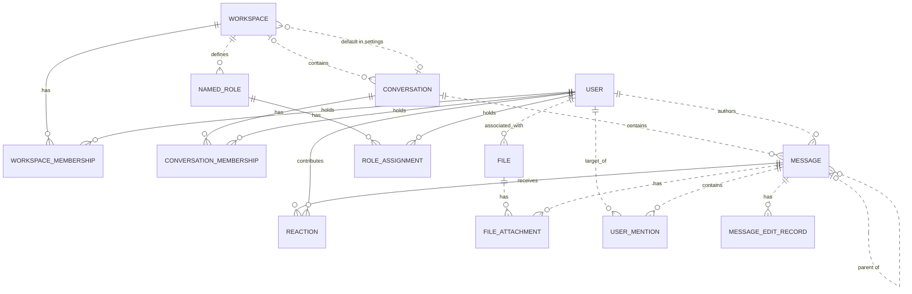

# Reviewing an assistant's work

You review what an AI assistant did for a user in an online service. You get the user's request, every step the
assistant took (its visible reasoning, each command it ran and the response), its final reply, and the changes it made
to the account's data.

Decide one thing: **did the assistant make a mistake?**

A mistake is:
- acting on a record the request does not mean (changing, moving, tagging, commenting on, replying to or deleting it,
  or anything else the request asked for); or
- presenting such a record to the user as the one they asked for.

Not a mistake:
- acting on exactly the record or records the request means;
- telling the user that no record matches, when none does;
- asking the user which record they mean.

Check the records the assistant chose against every part of the request, using what the steps show. Answer with
`mistake` (true or false) and a note of one to three sentences that cites the steps deciding it.

# How Slack's records work

The service's domain model follows. Use it to check whether a record meets the request.

# Slack conceptual model

## 1. Scope

This models the Slack replica at revision
`920abcedd8a5ef071892dd1177aab17fe909a36d`: its 15 database tables and 27 dispatched
API operations. It follows the [meta-model](../../protocols/conceptual_meta_model.md) and
[Slack contextualization](contextualization.md). Evidence identifiers below
refer to the [coverage ledger](model_source_ledger.md).

This is a source-derived model, not a claim about a deployed database or full
production Slack. Tables without an API path remain in scope. Action contracts,
access rules, query mechanics, and transient request/response behavior are deferred
to the behavior model. Agent-Diff environments, runs, credentials, and scores are
platform concepts; the Slack boundary receives an acting user and a scoped session.

## 2. Vocabulary

| Term | Meaning in this model |
|---|---|
| Workspace | Organizational context, called `Team` in storage. |
| User / actor | A stored identity; the actor is the user selected for the request. A bot is a classification of User. |
| Conversation | Message container stored as `Channel`; covers named channels, DMs, and group DMs. |
| Membership | A user's association with a workspace or conversation. These are distinct relationships. |
| Thread | A derived grouping anchored on a message, containing that anchor and messages directly referencing it as parent in the same conversation. |
| Reaction | One user's emoji reaction to one message. |
| Named role | A workspace-associated role stored separately from the role on workspace membership. |
| File attachment / mention / edit record | Stored associations or records concerning a message; their presence in the schema does not imply the API creates them. |
| Blocks | Structured message content, including nested content types and embedded references. |

## 3. Entity–relationship model

### Entities, identity, and attributes

`?` means the stored value may be null. Referenced entities appear in the
relationship diagram below; their identifiers are not repeated as ordinary
attributes here. Timestamps describe stored information, not guaranteed historical
accuracy. D-codes map every stored field and constraint in the ledger.

| Entity | Identity | Attributes | Evidence |
|---|---|---|---|
| Workspace | Workspace ID; name also unique | Name, creation time?, optional settings containing file-upload flag? and a default-conversation reference? | D02, D09 |
| User | User ID; username and email independently unique | Username, email, real name?, display name?, timezone?, title?, creation time?, last login?, active flag?, bot flag?, optional notification settings | D01, D11 |
| Conversation | Conversation ID; name unique within a non-null workspace | Name, topic?, purpose?, private/DM/group-DM flags, archived flag, creation time? | D03 |
| Workspace membership | User + workspace | Membership role? | D13 |
| Conversation membership | User + conversation | Join time? | D05 |
| Message | Message ID; exposed as API `ts` | Text?, stored type?, separate stored timestamp string?, blocks?, creation time? | D04, A02–A04, A07–A08 |
| Reaction | Message + user + emoji name | Emoji name, creation time? | D07 |
| Named role | Role ID | Role name? | D08 |
| Role assignment | User + named role | Assignment time? | D06 |
| File | File ID | Name?, size?, type?, URL?, creation time? | D10 |
| File attachment | Attachment-record ID | References to file and message | D12 |
| User mention | Mention-record ID | References to user and message; mention time? | D14 |
| Message edit record | Edit-record ID | Edited text?, edit time? | D15 |

Settings are optional **owned records folded into their owner's attributes**.
Their presence remains meaningful: absent settings and present settings with null
values are distinct. This removes two diagram nodes without losing their meaning.

### Relationships and cardinalities

The diagram describes stored relationships. `||` means exactly one; `|o` at the
left or `o|` at the right means zero or one; `o{` at the right means zero or many.
Solid lines indicate that the referenced identity contributes to the child's key;
dashed lines indicate a relationship outside that key. Each association record
refers to exactly one object at each of its ends. Identity rules above determine
whether repeated pairs are allowed.

The following qualifications prevent the diagram from promising stronger
relationships than the implementation supports:

- **Workspace links:** a conversation's workspace is nullable. Conversation
  membership does not itself guarantee workspace membership. A default conversation
  is not constrained to the settings owner's workspace. Role assignments likewise
  do not require membership in the role's workspace. (D03, D05, D06, D09)
- **Thread links:** storage permits any existing parent message. Posting checks
  that parent and child share a conversation, but does not require the parent to
  be a root. Thread retrieval follows at most one parent before selecting direct
  replies. Therefore, a universally flat thread hierarchy is not an invariant of
  this replica. (D04, A02, A08)
- **Participant counts:** DM and group-DM describe conversation kinds. Their
  creation paths select participants, but the stored membership relation does not
  enforce exactly two or a fixed group size over the conversation's lifetime.
  (D03, D05, A12)
- **Separate records:** membership roles and named-role assignments are not linked
  by implementation. File attachments and mentions allow multiple records for the
  same pair because their identities are separate IDs. (D06, D08, D12–D14)

The File–User link establishes an associated user. The schema and active API do not
establish that this user performed an upload, so the diagram does not assign that
stronger role. (D10)

### Structured content and derived representations

The chat API validates blocks as an ordered list of structured values owned by a
message. The underlying JSONB column has no constraint enforcing that shape or
its type vocabulary; data written outside these API checks can differ. Validated
content can include text and style, nested elements, user/channel identifiers, links, emoji,
image/file descriptors, labels, fields, accessories, and rows. Embedded identifiers
are not foreign keys. Uninterpreted nested content is retained as data, rather than
expanded into speculative entities. A block mentioning a user does not imply a
`UserMention` record; a file descriptor does not imply a `FileAttachment`. (H03)

| Representation | Conceptual meaning and limit | Evidence |
|---|---|---|
| Thread and reply count | Derived from an anchor and direct parent references within its conversation | A08 |
| Reaction summary | Group reactions by message and emoji; derive user list and count | A22 |
| Conversation member count | Derived from membership records | H01 |
| Latest DM message | A selected message in that conversation, ordered by creation time then ID | H01 |
| User profile | View of user attributes with fallbacks, generated fields, and constants; no independent profile entity | H02 |
| Search match | View of an existing message, author, and conversation; highlighting and generated result IDs do not change message identity | A26–A27 |

The API's message `ts` comes from `message_id`, while `thread_ts` represents a parent
or selected thread anchor. The separate database `Message.ts` is retained as a
stored attribute without assuming these are synchronized. Names and display text
are descriptions or lookup forms, not replacements for identity. (D04, H04)

Attachments echoed by chat operations are transient values, not stored file
attachments. Conversation `creator`, topic author/time, read markers, subscription
flags, sharing flags, and avatar URLs are not evidence of independently maintained
facts: their provenance is qualified in H01–H02 and A08. Named roles, role
assignments, settings, files, file attachments, mentions, and edits have no direct
access in dispatched Slack handlers or their operations at this revision. Their
foreign keys and ORM cascades still matter: deleting a message cascades to its
edit records, although updating it does not write an edit record.
(D06, D08–D12, D14–D15, H05)

## 4. States and classifications

| Subject | Stored or derived classification | Meaning and qualification | Evidence |
|---|---|---|---|
| User | Stored active and bot flags, each nullable | Active/inactive and bot/non-bot; null is unrecorded. The API supplies fallback values rather than exposing every null distinction. | D01, H02 |
| Workspace membership | Stored role, nullable | `owner`, `admin`, `member`, `guest`; API owner/admin flags derive from this role, not named-role assignments. | D13, H02 |
| Conversation | Stored `is_dm`, `is_gc`, `is_private` | Conventional types are public channel, private channel, DM (`im`), group DM (`mpim`). Keep the flags: no database constraint forbids conflicting combinations, and serializer/filter interpretations differ for such combinations. | D03, H01, A06 |
| Conversation | Stored archived flag | Archived/unarchived; independent of kind. API `is_open` is a derived value or constant, not a separate lifecycle. | D03, H01 |
| Membership | Derived existence | Present/absent; no stored pending-invitation state | D05, D13, A11 |
| Message | Derived parent presence; stored type string? | Parentless/reply; stored type is open-ended, while API message payloads commonly hard-code `message`. | D04, A02, A07–A08 |
| Reaction | Stored emoji name | Database string; API add/remove use `COMMON_REACTIONS` and normalize spelling. The finite API vocabulary does not restrict all possible seeded database values. | D07, A20–A21 |
| User settings | Stored notification level, nullable | `all`, `mentions`, `none`; no dispatched API reads it | D11 |
| Workspace settings | Stored file-upload flag, nullable | True/false/unrecorded; no dispatched API enforces it | D09 |
| Named role / file | Stored role name? / file type? | Open strings, not enumerated role permissions or a validated file taxonomy | D08, D10 |
| Message blocks | Stored type tags, checked at API boundary | Block, rich-text container, and inner-element vocabularies below; validation depth varies | H03 |

The implemented block vocabulary is `rich_text`, `markdown`, `section`, `header`,
`divider`, `image`, `context`, `actions`, `input`, `file`, `video`, `table`, and
`context_actions`. Rich-text containers are `rich_text_section`, `rich_text_list`,
`rich_text_preformatted`, and `rich_text_quote`. Inner-element tags are `text`,
`emoji`, `link`, `user`, `usergroup`, `channel`, `broadcast`, `color`, and `date`.
Accepted tags do not imply separate operational capabilities such as user-group
management or video handling. Text generation interprets only part of this vocabulary.
It also distinguishes `plain_text` from `mrkdwn` section text, ordered from other
list styles, and bold/italic/strike/code text styles; these remain content attributes.

`UserPresence` declares `active` and `away` in the source but is neither mapped to a
column nor used by dispatched handlers. It therefore adds no presence state to
this model. State transitions and validation limits belong in the behavior model.

---

# What an assistant did in Slack

## The user's request
Set the topic of the private channel with Diego Alvarez's message about the gateway rollback to Post-release monitoring. If there isn't one, just tell me.

## The assistant's steps
#### Step 1
Reasoning: I need to find Diego Alvarez's message about the gateway rollback in a private channel, then set the topic of that channel to "Post-release monitoring". Let me start by finding Diego Alvarez's user ID.
Command: curl -s -X POST https://slack.com/api/users.list -H "Content-Type: application/json" -d '{"token": "<TOKEN>"}' | python3 -c "
import json, sys
data = json.load(sys.stdin)
for user in data.get('members', []):
    name = user.get('profile', {}).get('display_name', '') or user.get('real_name', '')
    if 'Diego' in name and 'Alvarez' in name:
        print(f\"ID: {user['id']}, Name: {name}\")
"
Response: {"status": "success", "stdout": "", "stderr": "", "exit_code": 0, "workspace_path": "/tmp/agent_diff_32b24e7657c7424e8371cd5f8b8a4ad8_g5w8_rdi"}

#### Step 2
Reasoning: The search for Diego Alvarez returned no results. Let me list all users to see who's in the workspace and find someone that might match.
Command: curl -s -X POST https://slack.com/api/users.list -H "Content-Type: application/json" -d '{"token": "<TOKEN>", "limit": 100}' | python3 -c "
import json, sys
data = json.load(sys.stdin)
for user in data.get('members', []):
    name = user.get('profile', {}).get('display_name', '') or user.get('real_name', '')
    print(f\"ID: {user['id']}, Name: {name}, Email: {user.get('profile', {}).get('email', '')}\")
"
Response: {"status": "success", "stdout": "ID: U01AGENBOT9, Name: AgentBot, Email: agentbot@northwind.example\nID: U_AISHA, Name: Aisha, Email: aisha.khan@northwind.example\nID: U_DIEGO, Name: Diego, Email: diego.alvarez@northwind.example\nID: U_LEO, Name: Leo, Email: leo.park@northwind.example\nID: U_MAYA, Name: Maya, Email: maya.chen@northwind.example\nID: U_OMAR, Name: Omar, Email: omar.haddad@northwind.example\nID: U_PRIYA, Name: Priya, Email: priya.sharma@northwind.example\n", "stderr": "", "exit_code": 0, "workspace_path": "/tmp/agent_diff_32b24e7657c7424e8371cd5f8b8a4ad8_g5w8_rdi"}

#### Step 3
Reasoning: I found Diego Alvarez with user ID U_DIEGO. Now I need to find his message about the gateway rollback in a private channel. Let me search for that message.
Command: curl -s -X POST https://slack.com/api/search.messages -H "Content-Type: application/json" -d '{"token": "<TOKEN>", "query": "from:U_DIEGO gateway rollback", "count": 10}' | python3 -c "
import json, sys
data = json.load(sys.stdin)
print(json.dumps(data, indent=2))
"
Response: {"status": "success", "stdout": "{\n  \"ok\": true,\n  \"query\": \"from:U_DIEGO gateway rollback\",\n  \"messages\": {\n    \"matches\": [],\n    \"pagination\": {\n      \"first\": 0,\n      \"last\": 0,\n      \"page\": 1,\n      \"page_count\": 1,\n      \"per_page\": 10,\n      \"total_count\": 0\n    },\n    \"paging\": {\n      \"count\": 10,\n      \"page\": 1,\n      \"pages\": 1,\n      \"total\": 0\n    },\n    \"total\": 0,\n    \"response_metadata\": {\n      \"next_cursor\": \"\"\n    }\n  }\n}\n", "stderr": "", "exit_code": 0, "workspace_path": "/tmp/agent_diff_32b24e7657c7424e8371cd5f8b8a4ad8_g5w8_rdi"}

#### Step 4
Reasoning: No results for "gateway rollback" from Diego. Let me try a broader search - maybe just "gateway" from Diego, or just "rollback" to see if there are any matching messages.
Command: curl -s -X POST https://slack.com/api/search.messages -H "Content-Type: application/json" -d '{"token": "<TOKEN>", "query": "from:U_DIEGO", "count": 100}' | python3 -c "
import json, sys
data = json.load(sys.stdin)
print(json.dumps(data, indent=2))
"
Response: {"status": "success", "stdout": "{\n  \"ok\": true,\n  \"query\": \"from:U_DIEGO\",\n  \"messages\": {\n    \"matches\": [\n      {\n        \"channel\": {\n          \"id\": \"C_DEP\",\n          \"name\": \"deploy-queue\",\n          \"is_private\": true,\n          \"is_mpim\": false,\n          \"is_ext_shared\": false,\n          \"is_org_shared\": false,\n          \"is_pending_ext_shared\": false,\n          \"is_shared\": false,\n          \"pending_shared\": []\n        },\n        \"iid\": \"9aeea0e6-2214-4a00-9693-40441c866c57\",\n        \"permalink\": \"https://example.slack.com/archives/C_DEP/p1789990800000003\",\n        \"team\": \"T1\",\n        \"text\": \"The checklist for Friday's deploy is pinned, please review it before noon.\",\n        \"ts\": \"1789990800.000003\",\n        \"type\": \"message\",\n        \"user\": \"U_DIEGO\",\n        \"username\": \"diego.alvarez\"\n      }\n    ],\n    \"pagination\": {\n      \"first\": 1,\n      \"last\": 1,\n      \"page\": 1,\n      \"page_count\": 1,\n      \"per_page\": 100,\n      \"total_count\": 1\n    },\n    \"paging\": {\n      \"count\": 100,\n      \"page\": 1,\n      \"pages\": 1,\n      \"total\": 1\n    },\n    \"total\": 1,\n    \"response_metadata\": {\n      \"next_cursor\": \"\"\n    }\n  }\n}\n", "stderr": "", "exit_code": 0, "workspace_path": "/tmp/agent_diff_32b24e7657c7424e8371cd5f8b8a4ad8_g5w8_rdi"}

#### Step 5
Reasoning: Diego only has one message in the workspace, and it's about a deploy checklist, not a gateway rollback. Let me search more broadly for "gateway" or "rollback" messages to see if there's a related message from someone else or with different wording.
Command: curl -s -X POST https://slack.com/api/search.messages -H "Content-Type: application/json" -d '{"token": "<TOKEN>", "query": "gateway rollback", "count": 100}' | python3 -c "
import json, sys
data = json.load(sys.stdin)
print(json.dumps(data, indent=2))
"
Response: {"status": "success", "stdout": "{\n  \"ok\": true,\n  \"query\": \"gateway rollback\",\n  \"messages\": {\n    \"matches\": [\n      {\n        \"channel\": {\n          \"id\": \"C_DEP\",\n          \"name\": \"deploy-queue\",\n          \"is_private\": true,\n          \"is_mpim\": false,\n          \"is_ext_shared\": false,\n          \"is_org_shared\": false,\n          \"is_pending_ext_shared\": false,\n          \"is_shared\": false,\n          \"pending_shared\": []\n        },\n        \"iid\": \"5864f32d-2944-42f3-b0ff-edf848218b1b\",\n        \"permalink\": \"https://example.slack.com/archives/C_DEP/p1789991700000004\",\n        \"team\": \"T1\",\n        \"text\": \"The gateway rollback runbook still needs a second reviewer before Friday.\",\n        \"ts\": \"1789991700.000004\",\n        \"type\": \"message\",\n        \"user\": \"U_LEO\",\n        \"username\": \"leo.park\"\n      }\n    ],\n    \"pagination\": {\n      \"first\": 1,\n      \"last\": 1,\n      \"page\": 1,\n      \"page_count\": 1,\n      \"per_page\": 100,\n      \"total_count\": 1\n    },\n    \"paging\": {\n      \"count\": 100,\n      \"page\": 1,\n      \"pages\": 1,\n      \"total\": 1\n    },\n    \"total\": 1,\n    \"response_metadata\": {\n      \"next_cursor\": \"\"\n    }\n  }\n}\n", "stderr": "", "exit_code": 0, "workspace_path": "/tmp/agent_diff_32b24e7657c7424e8371cd5f8b8a4ad8_g5w8_rdi"}

#### Step 6
Reasoning: The only "gateway rollback" message is from Leo, not Diego. Let me search for just "rollback" to see if Diego mentioned it in a different context, or "gateway" by itself.
Command: curl -s -X POST https://slack.com/api/search.messages -H "Content-Type: application/json" -d '{"token": "<TOKEN>", "query": "rollback", "count": 100}' | python3 -c "
import json, sys
data = json.load(sys.stdin)
print(json.dumps(data, indent=2))
"
Response: {"status": "success", "stdout": "{\n  \"ok\": true,\n  \"query\": \"rollback\",\n  \"messages\": {\n    \"matches\": [\n      {\n        \"channel\": {\n          \"id\": \"C_DEP\",\n          \"name\": \"deploy-queue\",\n          \"is_private\": true,\n          \"is_mpim\": false,\n          \"is_ext_shared\": false,\n          \"is_org_shared\": false,\n          \"is_pending_ext_shared\": false,\n          \"is_shared\": false,\n          \"pending_shared\": []\n        },\n        \"iid\": \"5c632ac3-e763-4047-aac8-40e57a052d70\",\n        \"permalink\": \"https://example.slack.com/archives/C_DEP/p1789991700000004\",\n        \"team\": \"T1\",\n        \"text\": \"The gateway rollback runbook still needs a second reviewer before Friday.\",\n        \"ts\": \"1789991700.000004\",\n        \"type\": \"message\",\n        \"user\": \"U_LEO\",\n        \"username\": \"leo.park\"\n      }\n    ],\n    \"pagination\": {\n      \"first\": 1,\n      \"last\": 1,\n      \"page\": 1,\n      \"page_count\": 1,\n      \"per_page\": 100,\n      \"total_count\": 1\n    },\n    \"paging\": {\n      \"count\": 100,\n      \"page\": 1,\n      \"pages\": 1,\n      \"total\": 1\n    },\n    \"total\": 1,\n    \"response_metadata\": {\n      \"next_cursor\": \"\"\n    }\n  }\n}\n", "stderr": "", "exit_code": 0, "workspace_path": "/tmp/agent_diff_32b24e7657c7424e8371cd5f8b8a4ad8_g5w8_rdi"}

#### Step 7
Reasoning: I've searched thoroughly:
1. Diego Alvarez (U_DIEGO) has only one message in the workspace: "The checklist for Friday's deploy is pinned, please review it before noon." in the private channel "deploy-queue".
2. The only "gateway rollback" message is from Leo Park (U_LEO), not Diego.
3. There is no message from Diego about a gateway rollback.

The task says "If there isn't one, just tell me." So I should report that no such message exists.

<done>
There is no message from Diego Alvarez about a gateway rollback. Diego's only message in the workspace is about a deploy checklist in the private channel "deploy-queue." The gateway rollback message you may be thinking of was posted by **Leo Park** (not Diego) in the same private channel (#deploy-queue): *"The gateway rollback runbook still needs a second reviewer before Friday."*

Since no message from Diego about the gateway rollback exists, I did not set a channel topic. Let me know if you'd like me to set the topic of #deploy-queue to "Post-release monitoring" based on Leo's message instead.
</done>
Command: 
Response: null

## The assistant's final reply
There is no message from Diego Alvarez about a gateway rollback. Diego's only message in the workspace is about a deploy checklist in the private channel "deploy-queue." The gateway rollback message you may be thinking of was posted by **Leo Park** (not Diego) in the same private channel (#deploy-queue): *"The gateway rollback runbook still needs a second reviewer before Friday."*

Since no message from Diego about the gateway rollback exists, I did not set a channel topic. Let me know if you'd like me to set the topic of #deploy-queue to "Post-release monitoring" based on Leo's message instead.

## Changes it made to the account's data
(no changes)

Did the assistant make a mistake?