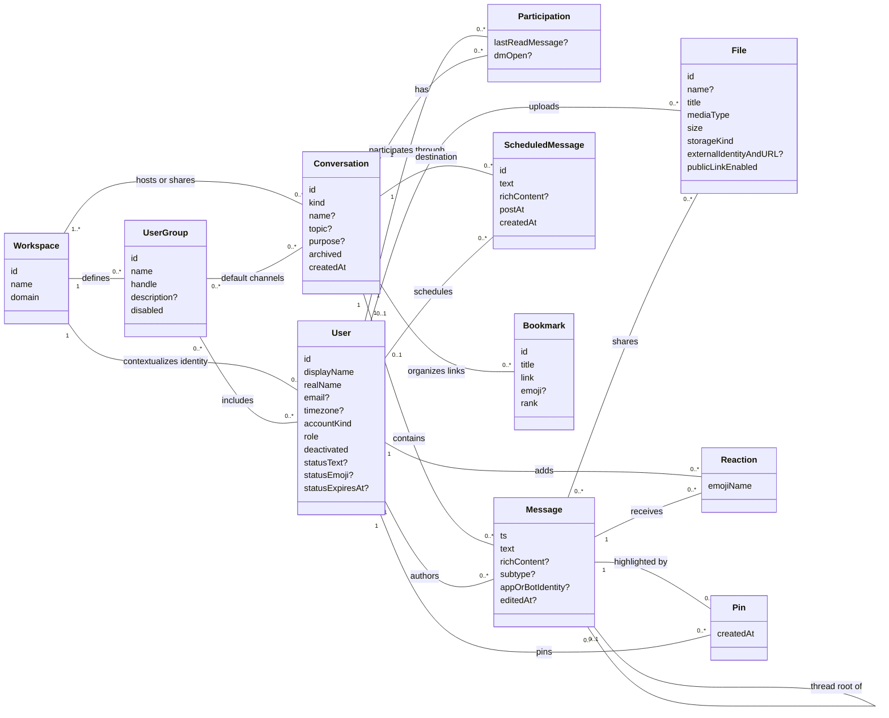

# Slack — conceptual entity–relationship model

Grounded in Slack's public Web API documentation, consulted 2026-09-08. Scope: workspace messaging, membership, file sharing, and channel organization. This describes the public service contract; it makes no claim about Agent-Diff's implemented endpoint coverage. No implementation code or database was consulted.

Cards retain identity, meaningful content, and lifecycle attributes. Relationships carry references rather than repeating them as foreign-key attributes. `?` means optional or conditional; `[]` means a collection; `0..*` means zero or more. Compound values have no independent identity. Cardinalities describe the domain, not how many objects a particular token can retrieve.

## Entity cards and relationships

`accountKind` distinguishes human and bot/app users; `role` summarizes owner/admin/member/guest privileges. User identity is contextualized by workspace; names and email are not identifiers. Enterprise identity can connect memberships across workspaces. [User object](https://docs.slack.dev/reference/objects/user-object/)

`Conversation.kind` covers public channel, private channel, DM, and group DM. Topic and purpose are values with setter/time provenance. Sharing allows a conversation to span workspaces. Participation is the conceptual user–conversation association, unique per pair; it also holds viewer-specific read/open state. [Conversation object](https://docs.slack.dev/reference/objects/conversation-object/), [mark read](https://docs.slack.dev/reference/methods/conversations.mark/)

Message identity is **(conversation, ts)**. A reply references one root message in that conversation; a thread therefore needs no separate card. Human authorship is optional because app/bot and system messages exist. `richContent` groups blocks and attachments as message content. [Retrieving messages](https://docs.slack.dev/messaging/retrieving-messages/), [posting messages](https://docs.slack.dev/reference/methods/chat.postMessage/)

File sharing is many-to-many: a file can exist before being shared and can appear in multiple messages. The containing conversation follows from each message. A file's external identity identifies referenced content, not another Slack file. [File object](https://docs.slack.dev/reference/objects/file-object/), [complete upload](https://docs.slack.dev/reference/methods/files.completeUploadExternal/)

## CRUD evidence and modeling consequences

Operations below are grouped by resource family; availability depends on token scopes and conversation type. `—` means no operation in the cited core family, not that the wider product can never perform it.

| Noun | Create | Read | Update | Delete / lifecycle | Consequence |
|---|---|---|---|---|---|
| Workspace; User | — | `team.info`; `users.info/list`, `users.profile.get` | `users.profile.set` | User administration is outside this Web API scope | Workspace and user outlive individual conversations. [Workspace](https://docs.slack.dev/reference/methods/team.info/), [profile](https://docs.slack.dev/reference/methods/users.profile.set/) |
| Conversation | `conversations.create`; `open` for DMs | `info/list` | `rename`, `setTopic`, `setPurpose` | `archive/unarchive`; `close` for DMs | Archive preserves identity; closing a DM changes its presentation. [Create](https://docs.slack.dev/reference/methods/conversations.create/), [archive](https://docs.slack.dev/reference/methods/conversations.archive/), [open](https://docs.slack.dev/reference/methods/conversations.open/) |
| Participation | `invite/join` | `members` | `mark` | `kick/leave` | Removing a participant is distinct from removing a conversation. [Conversation methods](https://docs.slack.dev/reference/methods/conversations.create/) |
| Message | `chat.postMessage` | `conversations.history/replies` | `chat.update` | `chat.delete` | Replies are messages; editing preserves their identity. [Message operations](https://docs.slack.dev/reference/methods/chat.update/), [retrieval](https://docs.slack.dev/messaging/retrieving-messages/) |
| ScheduledMessage | `chat.scheduleMessage` | `chat.scheduledMessages.list` | Cancel and reschedule | `chat.deleteScheduledMessage` | A pending send has an ID and cancellation lifecycle separate from a posted message. [Scheduling](https://docs.slack.dev/reference/methods/chat.scheduleMessage/) |
| File | `files.getUploadURLExternal` + upload + `completeUploadExternal`; `files.remote.add` | `files.info/list`; `files.remote.info/list` | `files.remote.update` for external references | `files.delete`; `files.remote.remove` | Hosted upload and remote reference have different write capabilities. [File methods](https://docs.slack.dev/reference/methods/files.completeUploadExternal/) |
| Reaction | `reactions.add` | `reactions.get/list` | Remove and add | `reactions.remove` | Identity is (message, user, emoji); modern creation targets messages. [Reactions](https://docs.slack.dev/reference/methods/reactions.add/) |
| Pin | `pins.add` | `pins.list` | — | `pins.remove` | Pinning highlights an existing message in its conversation. [Pins](https://docs.slack.dev/reference/methods/pins.add/) |
| Bookmark | `bookmarks.add` | `bookmarks.list` | `bookmarks.edit` | `bookmarks.remove` | A named channel link has its own lifecycle. [Bookmarks](https://docs.slack.dev/reference/methods/bookmarks.add/) |
| UserGroup | `usergroups.create` | `usergroups.list`, `usergroups.users.list` | `usergroups.update`, `usergroups.users.update` | `usergroups.disable/enable` | A mentionable group is independent of channel membership; membership update replaces its user set. [Groups](https://docs.slack.dev/reference/methods/usergroups.create/), [membership update](https://docs.slack.dev/reference/methods/usergroups.users.update/) |

## Requirements inferred from the contract

- **Identity survives presentation changes.** Rename, archive, and profile edits do not create new domain objects. A DM reopened for the same participants may reuse the existing conversation. [Open](https://docs.slack.dev/reference/methods/conversations.open/)
- **Authorship and membership are different relationships.** A user's departure need not erase their messages. Message editing is constrained by authorship and token permissions, so “can read” does not imply “can edit.” [Update message](https://docs.slack.dev/reference/methods/chat.update/)
- **Read projections are incomplete evidence.** Reaction counts can exceed the returned user list; file visibility depends on sharing and authorization. Missing projected relationships must not be interpreted as domain absence. [File object](https://docs.slack.dev/reference/objects/file-object/)

Boundary: search results and counts are projections; emoji names, profiles, topics, and message formatting are values. Canvas/list authoring, calls/huddles, legacy reminders and stars, app configuration, and enterprise administration are separate subdomains excluded here. This is a bounded messaging model, not an inventory of every Slack feature.
